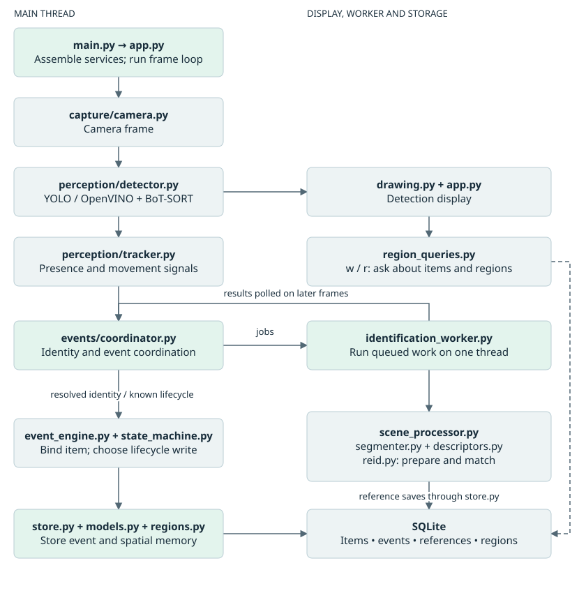
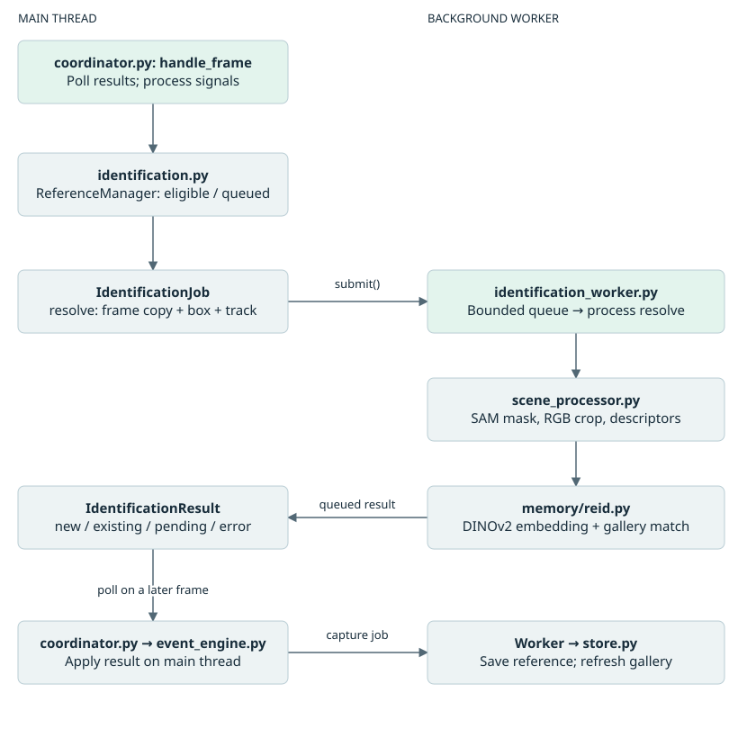

# Architecture and runtime flow

## System boundary

The application is one local Python process with an OpenCV display, one camera source, a main processing thread, one identification worker thread, and a SQLite file. Model acquisition can require network access during preparation. The configured inference devices are CPU; no cloud inference service is called by the application pipeline.

## Startup and shutdown

The console entry point calls `main.main()`, which calls `app.run_app()`. Paths are resolved relative to the source checkout. Startup reads the six YAML configuration files through the app and model constructors, constructs the database store, calls schema creation, constructs perception models and collaborators, and starts the worker. The worker loads its gallery from the store. The camera context then opens capture and the loop begins.

Each iteration reads a frame, detects objects, updates the lifecycle tracker, passes signals and detections to the coordinator, and draws the debug frame. Pressing q exits; w/r trigger blocking terminal queries and temporary polygon highlights. Cleanup destroys OpenCV windows, asks the worker to stop, and disposes the database engine; the camera context releases capture.

Worker startup waits for gallery loading and propagates loading failures to the caller. Shutdown sets a stop event, attempts a nonblocking sentinel enqueue and joins for the requested timeout. Queued work is skipped; active inference cannot be interrupted.

## Responsibility and thread ownership

| Concern | Owner | Execution |
| --- | --- | --- |
| Frame acquisition, YOLO and BoT-SORT | Camera / YoloDetector | Main thread |
| Temporal lifecycle and movement | DetectionTracker | Main thread |
| Submission, retries, bindings, result application | IdentityCoordinator / ReferenceManager | Main thread |
| SAM2, DINOv2, gallery comparison | IdentificationWorker / SceneProcessor / ReidMatcher | Worker thread |
| Reference persistence and gallery refresh | IdentificationWorker / DatabaseStore | Worker thread |
| Item creation, status lookup, lifecycle persistence | Coordinator / EventEngine / DatabaseStore | Main thread |
| Drawing, keyboard and terminal queries | app / region_queries / drawing | Main thread |
| Region resolution and live spatial updates | DatabaseStore calling pure memory.regions | Inside main-thread lifecycle transactions |
| Manual polygon calibration | region_calibration / Camera / DatabaseStore | Separate process launch, no model inference |
| ReID ground-truth recording | reid_diagnostics_app / ReidDiagnostics | Separate process launch of the same pipeline; query IDs and outcomes on the main thread, query/candidate rows and crops on the worker thread |

Queue submission and polling are non-blocking. This does not make the whole frame loop non-blocking: camera reads, detection, drawing, frame copies, and lifecycle database operations still take time on the main thread. CPU inference on the worker can also compete for shared compute resources.

## Identity decisions

1. Tracker ADD means temporally confirmed, not necessarily a new physical object.
2. The coordinator rejects invalid, small, low-confidence, or insufficiently visible candidates (frame-visibility ratio of the predicted box, not an edge-touch rule) before submitting resolve work.
3. A copied frame and box enter the bounded job queue. ReferenceManager prevents overlapping jobs for a track while queued.
4. SAM2 segments the full frame using the box prompt. SceneProcessor extracts the box crop, retains True mask pixels, fills the background, and prepares an RGB image.
5. DINOv2 extracts a normalized CLS-token embedding. Matching shortlists items by prototype, then combines each shortlisted item's top-k DINO score with color/aspect scores when available and checks both score and runner-up margin thresholds.
6. The worker returns new, existing, pending, or error. The main thread creates or associates the item and dispatches the appropriate event.
7. A precomputed reference can be submitted for saving. Further captures are event-driven, not interval-spaced: `ReferencePolicy` schedules a small baseline on item creation, then nothing further until `MOVE_START`/`MOVE_END` runtime transitions (see below) arm bounded candidate nomination; accepted saves refresh the worker's gallery.

The worker gallery includes all statuses for the configured model. The coordinator checks the current item status and active claims before accepting an existing-item result.

## Reference capture: sparse and movement-driven

Continuous/interval-based capture (a flat `capture_interval_seconds` re-capturing a static item indefinitely) has been replaced by `ReferencePolicy` (`events/reference_policy.py`), owned by the coordinator. States: `NEEDS_INITIAL -> IDLE -> ARMED -> EXHAUSTED`.

- **Baseline**: on item creation, the identity-resolve embedding becomes baseline reference 1 at no extra cost; the policy schedules `initial_reference_count - 1` further baseline captures, then the track goes IDLE and captures nothing while static.
- **Movement-triggered**: `DetectionTracker` emits explicit `MOVE_START`/`MOVE_END` signals on each STABLE<->MOVING transition. These are runtime tracking transitions only — never persisted as `ItemEvent`s, never forwarded to `EventEngine`. `MOVE_START` arms up to `max_movement_reference_attempts` candidate nominations, spaced `candidate_retry_frames` apart; the budget is consumed at nomination time, not on result feedback, so in-flight async work cannot cause runaway re-nomination. `MOVE_END` nominates exactly one final "settled pose" candidate, exempt from the attempt budget.
- **Two-stage gating**: Stage A (cheap — crop validity, box area, detector confidence, frame visibility, sharpness) runs on the main thread before a job is ever queued, so SAM/DINO never run on every frame of a tracked object. Stage B (expensive — SAM mask score, mask occupancy, novelty against the item's existing gallery) runs in the worker after SAM/DINO; baseline candidates are exempt from novelty gating (two similar baseline views are expected), movement/settled candidates are not. A rejected candidate returns before `add_reference_if_needed` and never updates the prototype.
- `max_references_per_item` is a hard ceiling; new references are simply refused once reached (no replacement policy yet).

Historical notes report 200 passing offline tests. Additional diagnostics tests are now present; no fresh full-suite or camera run is claimed by this documentation.

The configured two-reference baseline is an intent, not a guaranteed count: feedback for the first precomputed INITIAL save currently consumes the remaining baseline budget. See the [source behavior explanation](12-project-map.md#reference-learning-is-separate-from-event-history).

## Architectural invariants and limits

- Tracking never performs SAM/ReID inference or database writes.
- Permanent identity belongs to `Item.id`; `source_track_id` is diagnostic/session metadata.
- Persistence records meaningful events and references, not every video frame.
- A pending view does not produce an ADDED event.
- Removal releases the event engine's track binding while preserving item history.
- MOVED before identity resolution is currently dropped, not buffered or replayed.
- Results for inactive track IDs are rejected. There is no generation token in job/result contracts, so protection against delayed results after numeric track-ID reuse is not comprehensive.
- MOVE_START/MOVE_END are runtime tracking transitions, never persisted ItemEvents and never routed through EventEngine/decide_track_signal; only MOVED is the persisted "meaningful location change" semantic. A MOVE_START/MOVE_END pair can occur without a corresponding MOVED (e.g. an object nudged back to essentially the same spot).

Sources: [app](../src/project_auto/app.py), [coordinator](../src/project_auto/events/coordinator.py), [worker](../src/project_auto/events/identification_worker.py), [scene processing](../src/project_auto/perception/scene_processor.py).

## Spatial memory boundary

EventEngine passes ADD/RETURNED destination boxes, MOVED source/destination boxes, and REMOVE source evidence to existing store operations. The coordinator supplies actual frame dimensions in memory. DatabaseStore resolves centroid membership via the pure geometry module and commits region IDs, name snapshots, normalized areas, and Item.current_box/current_region_id together. REMOVED clears both live fields; no tracker or per-frame spatial writes are introduced.

The normal app does not automatically run calibration. A separate region_calibration entry point uses the same Camera abstraction and YAML configuration; w/r queries use store APIs and hold highlight state only in app memory. Full contracts and flow: [regions and spatial memory](11-regions.md).

## ReID diagnostic entry point

`python -m project_auto.reid_diagnostics_app` calls the same `app.run_app()` with three overrides read from `configs/reid_diagnostics.yaml`: a `ReidDiagnostics` recorder, `prototype_shortlist_size: 0` (every gallery item scored) and a separate database file. The normal entry point calls `run_app()` with no arguments, so it passes no recorder and keeps the configured shortlist and database; its behaviour is unaffected.

With a recorder present, the coordinator issues a `query_id` for each resolve job and records the outcome it applies (ADDED/RETURNED/ASSOC/DEFER/DEFER_CLAIMED/ERROR/DROPPED/STALE). The worker records one query row, one row per scored candidate, and raw/masked crops, so disk writes stay off the video thread. Capture jobs are not recorded. Recording failures are logged and never fail a job. Labelling is done offline by joining a hand-written ground-truth file on `query_id`.

Sources: [diagnostic entry point](../src/project_auto/reid_diagnostics_app.py), [recorder](../src/project_auto/utils/reid_diagnostics.py), [diagnostic settings](../configs/reid_diagnostics.yaml).

## Separate diagnostic launch

`reid_diagnostics_app.py` reuses `app.run_app()` with a recorder, a separate database and a whole-gallery shortlist override from `configs/reid_diagnostics.yaml`. Normal tracking has no diagnostic recorder. The [complete map](12-project-map.md) connects every Python file to its project function; the [source index](13-source-index.md) lists every definition.
