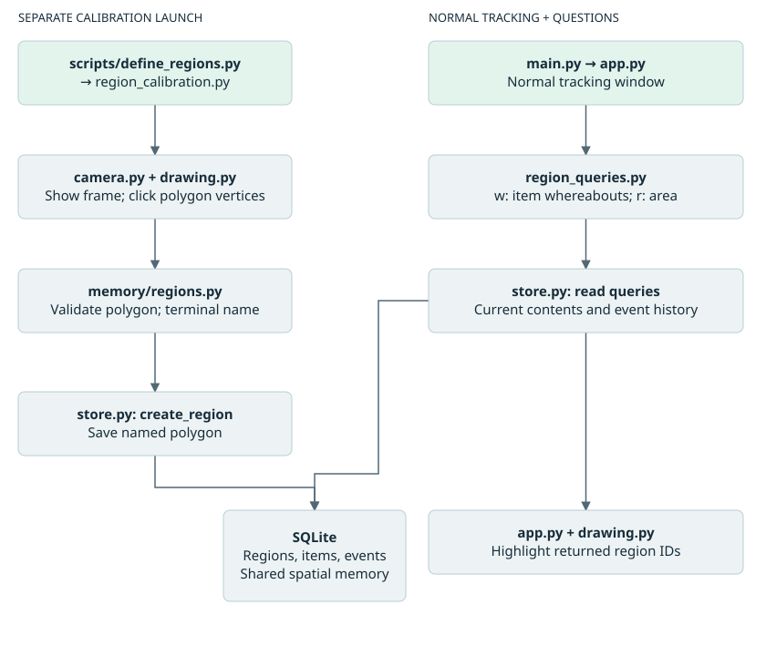

# Region identification and spatial memory

## Purpose and coordinate contract

The fixed camera frame is the spatial coordinate system. Regions are manually calibrated simple polygons with integer [x, y] vertices, stored in SQLite. Concave polygons are supported. No depth, homography, world coordinates, region hierarchy, or geometry versioning is implemented. Moving the camera or changing its actual capture resolution requires recalibration; changing YOLO's inference image size alone does not redefine frame coordinates.

The pure [geometry module](../src/project_auto/memory/regions.py) validates at least three distinct vertices, nonzero area, and nonintersecting edges. It accepts a repeated closing vertex and normalizes it away. Shoelace area is computed at creation and stored as area_px. Ray casting includes edges and vertices as inside. Resolution uses the bbox centroid, selects the containing region with the smallest stored area, and breaks equal-area ties by lowest ID. No match returns None.

## Event-to-state flow

```text
TrackSignal / identity-resolved detection
  -> EventEngine chooses meaningful lifecycle operation and supplies boxes
  -> DatabaseStore opens the existing item/event transaction
  -> load Region rows -> pure resolve_region(box, regions) -> selected ID
  -> event region FKs + name snapshots + box evidence + normalized areas
  -> item current_box/current_region_id and relevant timestamps/status
  -> one commit; track binding changes only after successful persistence
```

The coordinator supplies actual (frame width, frame height) to EventEngine in memory. Resolution and item updates occur in DatabaseStore, not in tracker callbacks or a second app-level write. Region rows are loaded when resolving event evidence or explicit queries; there is no per-frame region persistence.

| Event | Persisted spatial evidence | Live item state |
| --- | --- | --- |
| ADDED | Destination box, region ID/name, area fraction | Destination current_box/current_region_id |
| MOVED | Both boxes, both region IDs/names, both area fractions | Destination current_box/current_region_id |
| REMOVED | Source box, region ID/name, area fraction | Both live fields cleared |
| RETURNED | Destination box, region ID/name, area fraction | Destination current_box/current_region_id |

For removal, EventEngine supplies the signal's last detection box. Direct mark_removed calls without a box fall back to the item's stored current_box. Source membership is resolved against configured geometry at event time. ADD/MOVED/RETURNED update last_seen_at within the same transaction; removal keeps its existing timestamp semantics and clears spatial belief. Box snapshots are event evidence, not a trajectory history.

Each normalized fraction is max(0, x2-x1) * max(0, y2-y1) / (frame_width * frame_height). Fractions remain null when frame dimensions or that side's box are unavailable. Separate fields avoid ambiguity for MOVED. These fractions are not metric object size and are distinct from the ReID aspect-ratio descriptor.

The low-level record_event method appends historical evidence and resolves its boxes, but retains its existing behavior of not changing live item state/status. Use lifecycle store operations for live transitions. Association with an already-present item creates no event and therefore performs no spatial write.

## Relational meaning and deletion

Region.id is canonical. Item.current_region_id means the system currently believes the item occupies that region; removed items have no current region. Event source_region_id/destination_region_id support activity and historical association queries. Event source_region/destination_region are human-readable snapshots that do not change if the Region is renamed.

All three region FKs use ON DELETE SET NULL. Deleting a region retains items, events, boxes, and historical names. Item deletion retains the preexisting cascade to its own events and embeddings. Region aggregates such as last_activity_at and item_count are derived by queries, not duplicated on Region rows. There is no rename/redraw UI or polygon-version history in this implementation.

## Store API reference

| API | Result and semantics |
| --- | --- |
| create_region(name, polygon) | Validates a nonempty unique name and polygon, computes area, commits a Region |
| get_region(region_id), get_region_by_name(name), list_regions() | Region lookup; list in ID order |
| delete_region(region_id) | Boolean indicating deletion; preserves historical evidence |
| resolve_box_region(box) | Matching Region or None; read-only |
| find_items(name) | Exact display/class-name matches, including removed items |
| get_item_current_region(item_id) | Current Region with conservative legacy fallback |
| get_items_in_region(region_id) | Current FK plus PRESENT/OCCLUDED status; no historical inference |
| get_region_recent_events(region_id, limit=20) | Either event region FK matches; descending occurred_at then ID; negative limit rejected |
| get_region_last_activity(region_id) | Newest event or None, not a stored timestamp aggregate |
| get_items_associated_with_region(region_id) | Distinct items linked by source/destination event IDs, regardless of current presence |
| get_item_history(item_id) | Existing chronological history, now including spatial evidence |

Current-location fallback only applies to present/occluded items with neither live location field. It examines the newest ADDED/MOVED/REMOVED/RETURNED event and uses its destination FK if valid. It never skips a removal or unassigned destination to revive an older location. Names alone are not converted into relational associations. A current_box outside every polygon explicitly means an unassigned region, not an invitation to use historical location.

## Calibration and query workflow



From an activated editable checkout, launch calibration separately from normal tracking:

```powershell
python -m project_auto.region_calibration
```

Without an editable install, set the source path first:

```powershell
$env:PYTHONPATH = (Resolve-Path .\src).Path
python scripts/define_regions.py
```

The thin script delegates to run_calibration, which reuses Camera/CameraConfig and DatabaseStore with camera.yaml/table.yaml. Saved polygons have translucent fills, outlines, and names; the active polygon shows vertices and edges. A valid closed polygon is previewed before naming.

| Control | Calibration behavior |
| --- | --- |
| Left click | Append a vertex |
| u | Undo the latest vertex |
| Enter or c | Validate and close; freeze vertex input while prompting for a name in the terminal |
| Blank name | Cancel saving, retaining vertices for editing |
| q | Exit the camera window loop |

Successful saves clear the active polygon and continue calibration. Invalid geometry or duplicate names leave it editable. This is a separate launch mode, not automatic startup calibration and not an in-window text-entry GUI. Calibration does not start YOLO, SAM2, or DINOv2 model inference.

During normal project-auto tracking, w prompts for item ID/exact name; r prompts for region name and prints contents, recent activity, last activity, and associated items. Ambiguous item names print all matches with IDs. Query results highlight regions for table.yaml's regions.highlight_frames (150 by default). Queries and highlights remain in memory/read-only; console input pauses the main capture loop.

## Verification and remaining work

The 14 September implementation run passed 160 tests. Geometry, lifecycle spatial persistence, rollback, deletion/name preservation, read-only queries, fallback, drawing, and simulated calibration controls have automated coverage. Physical-camera polygon calibration and the complete live region lifecycle are not yet verified in this session. No recognition-accuracy or throughput improvement is established by these tests.

Existing SQLite tables require deliberate schema migration; the [manual SQL](manual_schema_update.sql) is a one-time update for a specifically inspected old schema, not a general migration command. Reinspect the intended database before applying it. See [operations](09-operations.md) and [verification](10-verification.md) for the startup incident and validation limits.

Sources: [geometry](../src/project_auto/memory/regions.py), [models](../src/project_auto/memory/models.py), [store](../src/project_auto/memory/store.py), [event engine](../src/project_auto/events/event_engine.py), [calibration](../src/project_auto/region_calibration.py), [console queries](../src/project_auto/region_queries.py), [drawing](../src/project_auto/utils/drawing.py).
