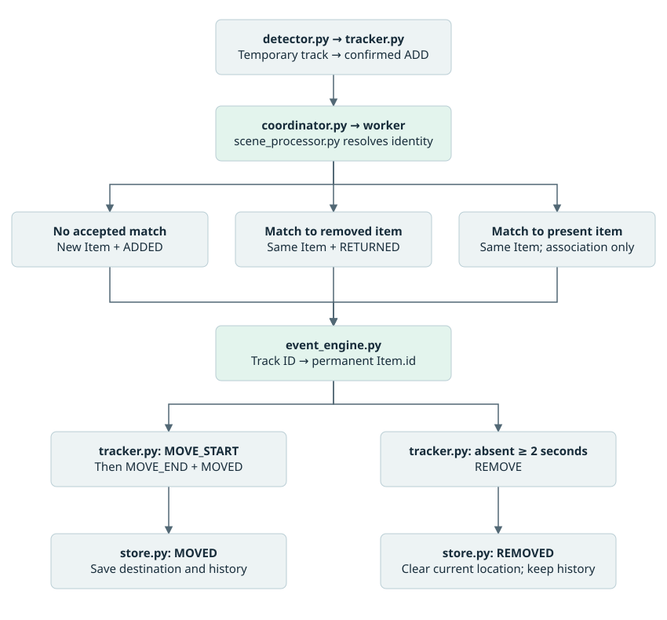
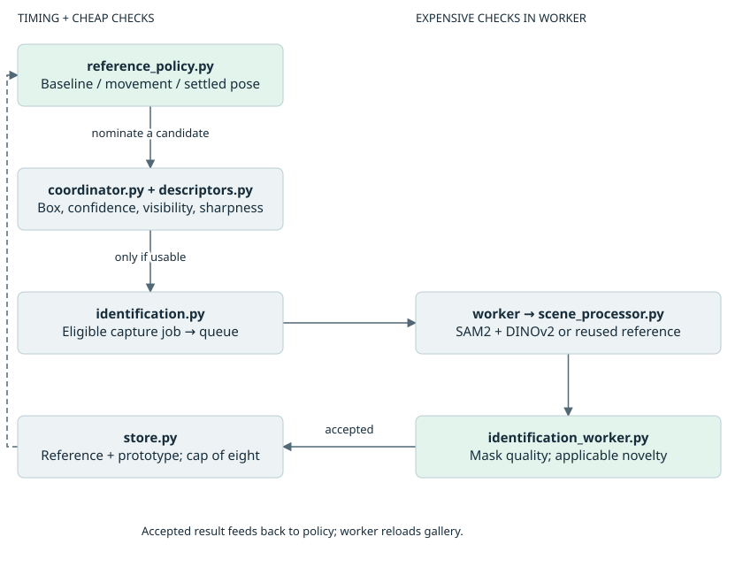
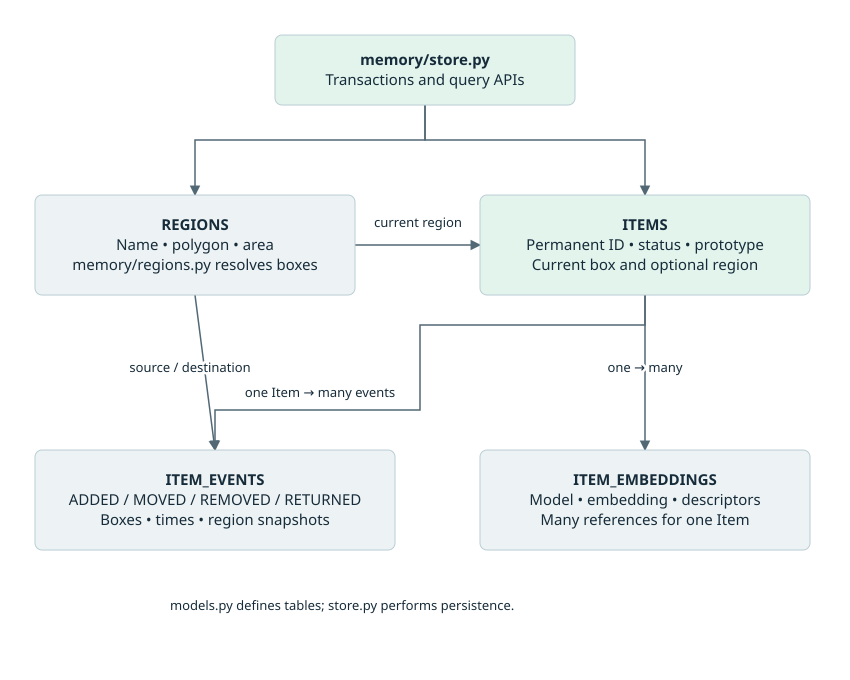
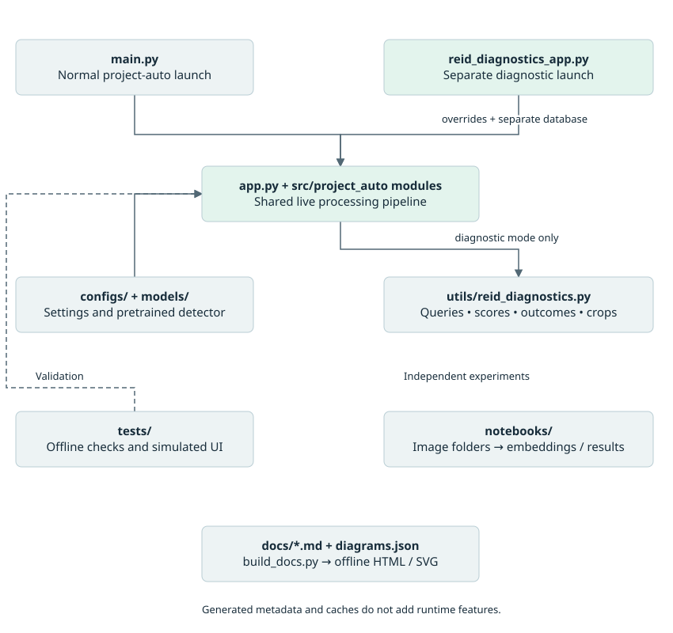

# Complete project map

Source reviewed 26 September 2026. This chapter maps the current working tree; source code takes precedence over historical notes.

Project AUTO watches a fixed camera scene, follows detected objects, compares their appearance with remembered objects, and stores meaningful changes in location and presence. Its main application is a local Python program with an OpenCV window, one identification worker thread, and SQLite storage.

This map covers the project-owned Python files: 26 package files, 18 test files, four launch/utility scripts, two documentation tools, and one standalone camera diagnostic. It also covers the six normal application YAML files plus the separate diagnostic configuration, the two research notebooks, and the roles of model, image, result, documentation, and generated files. Installed libraries, compiled caches, and binary model internals are not project source and were not audited. Binary assets were inventoried, not executed. The live camera application and full test suite were not run for this review. The separate diagnostic entry point is included; normal tracking does not enable diagnostic recording.

Read the overview, file map and object lifecycle sections for the overall picture, the subsystem sections for each subsystem, and the linked Python and file index to locate every Python definition. Arrows in the diagrams mean calls or data flow as labeled, rather than merely Python imports.

## The overall system

The display and lifecycle decisions run on the main thread. SAM2, DINOv2, gallery matching, and reference writes run on the worker. Lifecycle database writes still happen on the main thread; the whole application is not asynchronous.

`app.py` is the assembly point. `coordinator.py` is the runtime decision hub. `store.py` is the persistence hub. These are the three most useful files to understand first.

## Which Python file serves which project function?

Paths in this table are relative to `src/project_auto/`. The [Python and file index](13-source-index.md) supplies source links, definitions, imports and line numbers.

| Project function | Python file | Main class/function | How it fits |
| --- | --- | --- | --- |
| Start the application | main.py | main | Installed `project-auto` command delegates to `run_app`. |
| Assemble and run the system | app.py | run_app | Loads settings, constructs collaborators, opens camera, processes frames, draws output, handles keys and cleanup. |
| Read images | capture/camera.py | CameraConfig; Camera.open/read/close | Tries configured camera indices, sets capture properties before a confirmation read, owns capture lifetime. |
| Detect and assign temporary tracks | perception/detector.py | Detection; YoloDetector.detect | Loads/exports YOLO OpenVINO model, calls Ultralytics BoT-SORT, converts output into class/confidence/box/track ID records. |
| Decide whether an object appeared, moved, or disappeared | perception/tracker.py | DetectionTracker.update; TrackSignal | Holds temporary temporal and placement state. Emits signals; does not access SQLite or identity models. |
| Coordinate permanent identity | events/coordinator.py | IdentityCoordinator.handle_frame | Submits jobs, applies results, retries poor views, prevents double claims, routes events, and schedules learning. |
| Define worker messages and retries | events/identification.py | IdentificationJob; IdentificationResult; ReferenceManager | Carries data between threads and prevents overlapping jobs for one track. |
| Decide when to learn another appearance | events/reference_policy.py | ReferencePolicy.should_nominate | Frame-based baseline/movement/settled-pose scheduling and bounded attempt budgets. |
| Execute expensive work | events/identification_worker.py | IdentificationWorker | Owns queues, thread, gallery snapshot, resolve/capture execution, reference quality gates, persistence and refresh. |
| Prepare a usable object view | perception/scene_processor.py | SceneProcessor.prepare_reference/process | Combines segmentation, masked RGB crop, descriptors and embedding; proposes new/existing/pending identity. |
| Separate object pixels from background | perception/segmenter.py | SamSegmenter.segment | Box-prompted SAM2; selects a nonempty mask with the best score; True means foreground to retain. |
| Measure visual properties | perception/descriptors.py | aspect_ratio; hsv_histogram; sharpness; similarity/geometry helpers | Shared pure measurements for matching and cheap quality gates. No identity decisions or writes. |
| Recognize a remembered object | memory/reid.py | ReidMatcher.create_embedding/match_candidate | DINOv2 embeddings, prototype shortlist, top-k reference comparison, weighted color/aspect scoring and decision logging. |
| Turn identity/lifecycle decisions into stored changes | events/event_engine.py | EventEngine.process_signal/process_return | Owns session track-to-item bindings, validates event inputs, invokes atomic store operations. |
| Translate event meaning | memory/state_machine.py | decide_track_signal; decide_return_signal | Pure mappings to `StateDecision(status, event_type)`. It does not recognize objects. |
| Describe persistent records | memory/models.py | Item; ItemEmbedding; ItemEvent; Region | SQLAlchemy table schemas, enums, indexes and relationships. |
| Read and write memory | memory/store.py | DatabaseStore | Creates missing tables, owns sessions, stores events/references/prototypes, resolves event locations, answers queries. |
| Work out which named area contains an object | memory/regions.py | validate_polygon; resolve_region | Pure pixel geometry; resolves bounding-box centroid, choosing smallest containing polygon then lowest ID. |
| Define named areas | region_calibration.py | run_calibration | Separate camera tool: click vertices, validate polygon, name it in terminal, save via store. |
| Ask about objects and areas | region_queries.py | query_regions | `w`: ID/exact-name lookup. `r`: contents, activity and historical associations. Returns highlight IDs. |
| Draw visual feedback | utils/drawing.py | draw_detections; draw_regions | Annotates frame copies with class/confidence boxes or named polygons. |
| Explain runtime actions in terminal | utils/logging.py | Category; log_action | Prints action categories such as MATCH, NEW, EVENT, DEFER and CAPTURE. Worker also uses standard logging for exceptions/timing. |
| Collect evidence for identity calibration | utils/reid_diagnostics.py | ReidDiagnostics; QueryRecord; CandidateRecord | Records per-run queries, ranked candidate scores, raw/masked crops and applied outcomes linked by query ID. |
| Run an isolated identity experiment | reid_diagnostics_app.py | run_diagnostics; main | Loads diagnostic settings, overrides the shortlist, supplies a separate database and recorder to run_app. |
| Package initialization | __init__.py | None | Empty package marker. |
| Dedicated viewer | display/viewer.py | None | Empty placeholder. Actual window handling is in `app.py`. |

## Follow one object from camera to memory

Configured temporal rules: 2 seconds to confirm a candidate, at most 15 cumulative missing frames during that attempt, a 1.2× placement buffer, and 1 second within a 5-pixel center tolerance to confirm a stop. Confirmed tracks absent for 2 seconds produce removal. These rules are evaluated as frames are processed.

Three different identities must stay separate:

| Value | Example | Meaning / lifetime |
| --- | --- | --- |
| Detection class | cup | A category; many physical items can share it. |
| Track ID | 7 | Temporary BoT-SORT identifier for the current tracking session. |
| Item ID | 42 | Persistent physical-object identity stored in SQLite and reused after recognized returns. |

`ADD` from the tracker means “confirmed observation.” Only identity resolution determines whether it becomes a new `ADDED` record, a `RETURNED` record, or a silent association.

## The background identification path

`identification.py` defines two job kinds: `resolve` establishes identity, while `capture` saves another appearance of an already identified item. Capture can reuse the reference computed during resolution, avoiding another segmentation pass for that save. The worker's gallery is a private in-memory snapshot loaded from SQLite, not the notebook's `.pt` gallery.

The configured queue holds eight waiting jobs, plus one potentially executing job. Results are placed in an unbounded queue. `ReferenceManager` prevents another job for a track while it is queued. Resolve failures/conflicts use a five-second cooldown; a full resolve queue uses 0.5 seconds. Capture scheduling instead follows the reference policy and does not share every resolve retry rule.

Current worker startup waits for initial gallery loading and propagates a loading failure to the caller. Shutdown requests a stop, skips queued work, and waits up to the supplied timeout for the active thread. It cannot interrupt an inference call already in progress.

### What matching actually does

1. `segmenter.py` produces a foreground mask in original frame coordinates.
2. `scene_processor.py` rejects unusable masks, crops the box, converts BGR to RGB, measures foreground color/aspect, replaces the background, and asks DINOv2 for an embedding.
3. Normal tracking shortlists three ranked prototypes, with entries lacking prototypes additionally retained. The separate diagnostic launcher overrides the shortlist to zero so every gallery item is scored.
4. Each shortlisted item's strongest three available reference similarities are averaged.
5. With both supplementary descriptors available: score = 0.65 × DINO + 0.20 × color + 0.15 × aspect. Otherwise the score uses DINO alone.
6. Acceptance needs score ≥ 0.55 and best-minus-runner-up ≥ 0.15. A single candidate has no runner-up margin requirement.

Weights are constants in `reid.py`; thresholds are YAML settings. They are configured values, not measured probabilities or accuracy guarantees. The current nonempty-gallery resolve path embeds the prepared crop twice: once in SceneProcessor's `_prepare` helper (also used by `prepare_reference`), again in `match_candidate`.

## Reference learning is separate from event history

The policy is designed to stop learning while an item stays still after its initial references. Movement arms up to three candidate nominations, with a five-frame initial delay and ten-frame retry spacing. Settling offers one final candidate outside that movement-attempt budget. Quality rejection can mean no reference is saved. The worker limits saved references to eight per item; reaching the cap does not itself prevent all future candidate inference.

`MOVE_START` and `MOVE_END` are runtime learning signals, not database events. `MOVED` is the completed placement change stored in history.

**Source discrepancy to keep in mind:** configuration and notes say two baseline references. `on_item_created()` initializes one remaining reference, but the coordinator sends the already-computed first reference as `CandidateKind.INITIAL`. Successful feedback for that first save decrements the remaining count to zero. For the normal successful static path, this can leave one saved baseline reference rather than two. This is a source-traced behavior, not a live-camera measurement. Existing-item resolution also submits its prepared view as an INITIAL capture even though the policy starts that track idle; it can therefore save a view on re-association without movement, subject to mask quality and the cap.

## Persistent memory and named regions

The diagram shows selected fields; `models.py` is the full schema. `store.py` implements access and transactions; `regions.py` supplies pure geometry. Every meaningful lifecycle transaction can resolve source/destination boxes to regions and update the item's current location atomically with the event.

| Stored event | Event evidence | Current item state |
| --- | --- | --- |
| ADDED | Destination box and region | New present item at destination. |
| MOVED | Source and destination boxes/regions, timing | Destination becomes latest stored location. |
| REMOVED | Source box and region | Removed; current box and region cleared. |
| RETURNED | Destination box and region | Same permanent item present at new destination. |

The live path does not save every frame or a continuous trajectory. A current box means the latest meaningful-event snapshot. An association to an already-present item creates no event and does not refresh its stored location. Event history can still contain the previous location after removal, but the `w` query reports that the item is outside the scene rather than returning that historical location.

Evidence image/video path fields exist in the schema, but reference-save operations populate vectors and descriptors without linking crop files to those database records. The new diagnostics recorder separately writes raw/masked resolve crops under a per-run logs directory. It does not implement general event evidence recording or video capture. Region deletion sets references to null while preserving historical event names. Creating missing tables is supported; altering an old schema automatically is not.

The configured database destination is `data/project_auto.db`. Its presence and live contents were not revalidated for this documentation integration. The map describes the code's persistence design, not an inspected live database or recovered item history.

### Calibration and queries

Calibration is a separate launch and does not start YOLO, SAM2 or DINOv2 inference. Naming and queries use terminal input, which pauses that launch's main loop. The camera position and actual frame size define polygon coordinates; there is no 3D/world-coordinate system.

## Configuration, models and outputs

| File / folder | Reader / writer | Role |
| --- | --- | --- |
| configs/camera.yaml | app.py and region_calibration.py → CameraConfig | Device order 0 then 1; requests 1280 × 720 at 30 FPS. |
| configs/perception.yaml | app.py; YoloDetector | YOLO paths/settings and tracker timing. Confidence 0.18; inference size 960; CPU. |
| configs/segmenter.yaml | SegmenterConfig.from_yaml | SAM2 `facebook/sam2-hiera-base-plus`, CPU. |
| configs/reid.yaml | ReidConfig.from_yaml; app.py | Normal DINOv2 configuration; CPU, score 0.55, margin 0.15, top-k 3 and prototype shortlist 3. |
| configs/reid_diagnostics.yaml | reid_diagnostics_app.py | Diagnostic-only output directory, shortlist override 0 and separate data/diagnostics/project_auto_diagnostics.db database. |
| configs/scene_processor.yaml | app.py; SceneProcessorConfig | Crop/mask settings, worker queue, retries, reference scheduling and quality thresholds. |
| configs/table.yaml | app.py; region_calibration.py | Database destination and 150-frame query highlights. |
| models/yolo11s.pt | YoloDetector._load_model | Source detector weights used if an OpenVINO export is needed. |
| models/yolo11s_openvino_model/ | Ultralytics/OpenVINO | Exported `.xml` graph, `.bin` weights and `metadata.yaml`. Model artifacts, not Python logic. |
| Transformer model cache | SamSegmenter and ReidMatcher constructors | SAM2/DINOv2 weights loaded through `from_pretrained`; not the repository's notebook gallery. |
| data/ | DatabaseStore | Configured home of persistent memory; inspected directory had no database file. |
| logs/reid_match_log.csv | Historical output | Legacy summary CSV remains in the tree; current matcher no longer appends to it. |
| logs/reid_runs/run_id/ | ReidDiagnostics, called by worker/coordinator | New per-run queries.csv, candidates.csv, outcomes.csv and raw/masked crops. Configured destination; no live run was performed for this map. |
| Terminal | utils/logging.py; query/calibration functions | Action diagnostics, query answers and region naming. |
| OpenCV window | app.py; region_calibration.py | Detection overlays and polygon feedback. |

Database, camera/model config, detector assets and the new diagnostics directory are resolved from the source checkout. A 30 FPS capture request is not a measured application processing rate.

### New diagnostic evidence flow

`reid_diagnostics_app.py` constructs `ReidDiagnostics`, overrides the normal shortlist to zero and supplies its own database path to `app.run_app()`. Launch with `project-auto-diagnostics` or `python -m project_auto.reid_diagnostics_app`. Normal `project-auto` calls `run_app()` without a recorder and does not read the diagnostic YAML.

The coordinator assigns a query ID and frame index to each submitted resolve job. The matcher returns candidate scores/reasons through `IdentityDecision`; the worker records query evidence and raw/masked crops; the coordinator records applied results such as ADDED, RETURNED, ASSOC or DEFER. Query IDs join those tables. The recorder hashes the ReID, diagnostic, scene and segmenter configuration files and records Git provenance. Query/outcome write errors are caught and logged. Directory creation during recorder construction is outside those write-error handlers.

Ground-truth labels still require human input; no automatic ground_truth.csv writer is present in the inspected module. Query/crop writes run on the worker, while applied-outcome CSV writes run on the main thread. Reference-capture jobs are excluded from these diagnostic tables.

## Scripts, research, documentation and generated files

| Python file outside the package | Role / connection |
| --- | --- |
| scripts/run_camera.py | Calls `project_auto.main.main()`. |
| scripts/define_regions.py | Calls `project_auto.region_calibration.run_calibration()`. |
| scripts/run_video.py | Empty; no implemented video-file launch path. |
| scripts/benchmark_local.py | Empty; no implemented local benchmark. |
| cmaera_no_identifier.py | Standalone diagnostic, spelling as stored: tries camera indices 0–4 and displays each working feed. Runs its loop at module top level. |
| docs/build_docs.py | Original Markdown renderer and portal generator, retained unchanged as legacy tooling. |
| docs/build_docs.mjs | Current portal builder: renders chapters and SVG diagrams and reads Python syntax for the full source index. Shared CSS/JS live in docs/assets. |
| docs/check_docs.py | Parses generated pages; checks local links, anchors, titles, main landmark and chapter coverage. |

The two notebooks are `notebooks/ProjectAUTO_ReID_corrected (2).ipynb` and `notebooks/ReID_Tuning/ProjectAUTO_ReID_corrected.ipynb`. Their code differs by the first notebook's Colab drive-mount setup; the remaining code is the same. They use YOLOv8n, SAM2 tiny and DINOv2 for a separate folder-based experiment, rather than the live application's YOLO11s and SAM2 base-plus configuration.

Notebook flow: `get_image_paths` → `detect_object` / `_crop_image_with_bbox` → `apply_sam_mask` → `create_embedding` → `build_reference_gallery` / `compare_query` → `show_query_match` → CSVs and match figures. The research images include mugs, a book, headphones and unknown queries. There are 76 JPG and 12 PNG assets under the inspected research directories. Notebook output is not automatically imported into SQLite.

The notebooks' current `apply_sam_mask` assigns background color at True foreground positions, despite the surrounding comment saying to replace False positions. The live `segmenter.py` / `scene_processor.py` path retains True foreground correctly. The notebooks should therefore not be treated as interchangeable with current live preprocessing. Saved CSV variants also differ in whether they contain top-k columns; no new accuracy claim is inferred from them.

Other supporting files:

| Path | Purpose |
| --- | --- |
| README.md | Project overview and launch instructions. |
| pyproject.toml | Python >=3.10,<3.14; package dependencies; `project-auto = project_auto.main:main`; test discovery source path and Ruff settings. |
| .env.example | Empty placeholder; no active settings defined there. |
| .gitignore | Currently ignores `data/recordings/`; this does not imply recording is implemented. |
| src/project_auto/AGENTS.md | Contributor/agent guidance; reviewed as project context, not a request to implement its backlog. |
| src/project_auto/PROJECT_CONTEXT.md | Compact architecture handoff; some details lag current worker code. |
| src/project_auto/TASKS.md | Current priorities and historical implementation notes; old milestones are not current runtime truth. |
| docs/01–11 numbered Markdown chapters | Maintained overview, architecture, modules, stack, data, config, performance, scope, operations, verification and regions. |
| docs/*.html; docs/assets/docs.css and docs.js | Generated offline documentation portal; not the application UI. |
| docs/regions.md | Compatibility pointer to the maintained region chapter. |
| docs/manual_schema_update.sql | One-time SQL for a previously inspected old schema; not invoked by normal startup. |
| models/README.md | Explains generated/downloaded detector assets. |
| src/project_auto.egg-info/ | Generated package metadata: dependencies, entry point, file list, package description. |
| src/project_auto_live_tracking.egg-info/ | Older generated package metadata; `pyproject.toml` is authoritative for current packaging. |
| .venv/ | Installed Python environment and third-party libraries, not project-owned source. |
| __pycache__/; .pytest_cache/ | Generated bytecode/test caches; do not add application functionality. |
| .git/ | Version history and working-tree metadata. |

## Tests mapped to behavior

| Test file | What it exercises |
| --- | --- |
| test_camera.py | Device order/fallback, property-before-read ordering, open/close behavior. |
| test_detector.py | Conversion of mocked detector output into a structured Detection. |
| test_tracker.py | Confirmation, dropout tolerance, removal, movement start/stop and timing validation. |
| test_state_machine.py | MOVED/RETURNED status decisions and required permanent identity. |
| test_event_engine.py | Item/event creation, binding conflicts, released bindings, recognized returns and silent associations. |
| test_identification.py | Job deduplication, cooldowns, eligibility and forgetting retired tracks. |
| test_identification_worker.py | Job/result mapping, queue capacity, startup failure propagation, startup readiness, shutdown and precomputed-reference saves. |
| test_coordinator.py | Fake-worker integration with real in-memory store: resolve/retry/result application, claim protection, movement routing and reference nomination. |
| test_reference_policy.py | Baseline/idle/movement states, delays, attempt budgets, final settled candidate. |
| test_scene_processor.py | Mocked segmentation/matching, retained foreground/RGB conversion, pending/new/existing results. |
| test_reid.py | Synthetic embedding similarity, top-k, acceptance threshold and prototype shortlisting. |
| test_reid_diagnostics_app.py | Separate launcher settings, recorder construction and run_app overrides. |
| test_reid_diagnostics.py | Per-run directories, query IDs, CSV headers/ranking, raw/masked crop files, outcome joins and handled write failures. |
| test_descriptors.py | Box clipping/visibility and sharpness; does not establish full color/aspect match accuracy. |
| test_memory_database.py | Tables/relationships/enums, persistence/status/history, embedding counts/caps and gallery prototypes. |
| test_regions.py | Polygon validation/area/containment, centroid resolution, overlap ties and normalized box area. |
| test_region_memory.py | Spatial lifecycle, atomic rollback, deletion snapshots, legacy fallback and read-only queries. |
| test_region_ui.py | Frame-copy drawing, console queries and simulated calibration clicks/undo/save. |

These are offline tests with fakes, synthetic data and isolated databases. Historical notes report 200 passing tests; that is not a fresh result from this review, and additional diagnostic tests are now present. New cases also check matcher candidate/reason reporting, whole-gallery scoring, message query IDs and coordinator outcome recording. There is no dedicated `test_segmenter.py`, and inspected tests do not establish physical-camera accuracy or calibrated matching thresholds. In particular, the worker test file does not comprehensively exercise the newer quality/novelty gates merely because documentation says that it does.

## Important distinctions when using this map

| Distinction | Current source behavior |
| --- | --- |
| Implemented code vs documentation history | Current worker startup/shutdown differs from old architecture/performance notes; old six-reference timing examples are stale. |
| Current diagnostics vs legacy CSV | Per-run diagnostic tables and crop files replace the matcher's legacy CSV writer; normal tracking uses shortlist 3; diagnostic mode overrides it to 0. |
| Configured intent vs actual scheduling | Two-reference baseline intent has the feedback-counting discrepancy described in the reference learning section. |
| Ambiguous match vs new object | A failed runner-up margin is logged as ambiguous but still becomes NEW through SceneProcessor. |
| Movement vs stored movement | MOVED before permanent identity resolution is dropped, not replayed later. |
| Current location vs historical location | Removal clears current location; history retains event evidence. |
| Occlusion model vs automatic occlusion behavior | OCCLUDED and store operations exist; live occlusion decisions are not wired. |
| Reference gallery vs research gallery | Live matching loads SQLite references; notebook `.pt` references are separate. |
| Background inference vs uninterrupted video | Main-thread detection, terminal input, database writes and lock retries can still delay capture/display. |
| Existence of model files vs readiness | Model binaries were inventoried; inference and cache readiness were not tested. |
| Existing local edits vs this review | The repository already had uncommitted changes, including worker code/tests. This report describes the inspected working tree, not just its last commit. |

## Suggested reading order

1. `main.py` → `app.py`: see construction and the frame loop.
2. `detector.py` → `tracker.py`: see detections become temporal signals.
3. `coordinator.py` → `identification.py` → `identification_worker.py`: see how identity work crosses threads.
4. `scene_processor.py` → `segmenter.py` → `descriptors.py` → `reid.py`: see how an image becomes an identity proposal.
5. `event_engine.py` → `state_machine.py` → `store.py` → `models.py`: see how that proposal becomes permanent memory.
6. `regions.py` → `region_calibration.py` → `region_queries.py` → `drawing.py`: see location names, questions and feedback.
7. `reference_policy.py` and its coordinator/worker callers: see when additional appearances are learned.

Continue to the [Python and file index](13-source-index.md). It regenerates directly from the source tree, including private helpers, nested functions and test fixtures. Docstring summaries are navigation aids; the behavior descriptions here take precedence where a docstring is stale.
