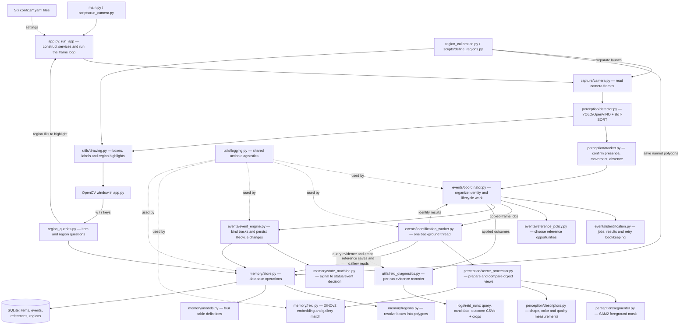
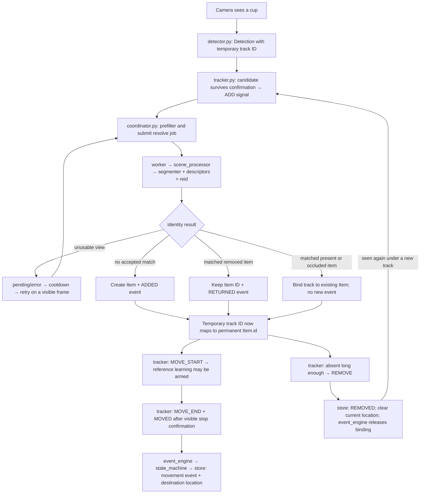
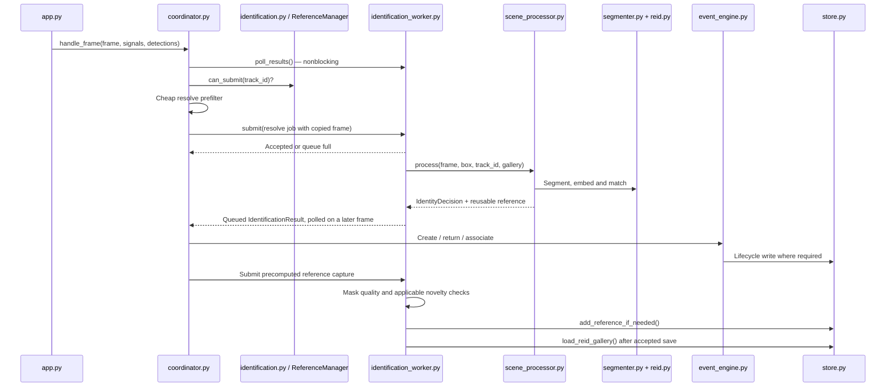
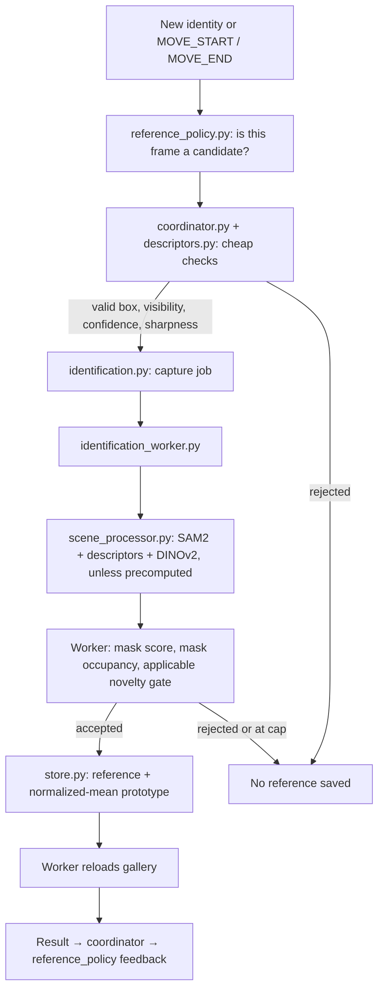
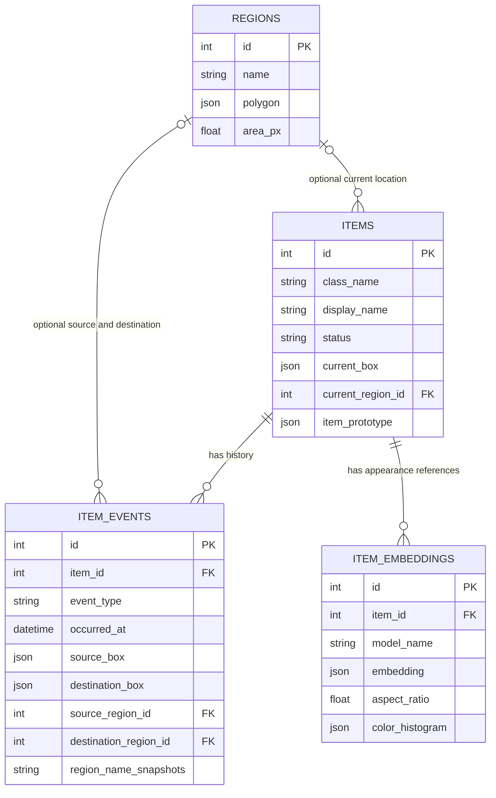
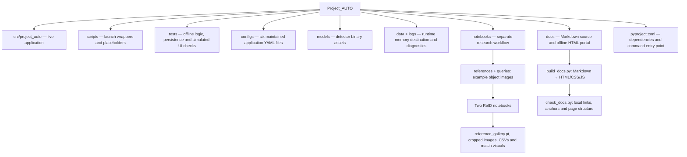

# Project AUTO — complete code and file map

Reviewed 26 September 2026 against the working tree at `C:/Users/jaska/OneDrive/SourceRepository/Project_AUTO`.

Project AUTO watches a fixed camera scene, follows detected objects, compares their appearance with remembered objects, and stores meaningful changes in location and presence. Its main application is a local Python program with an OpenCV window, one identification worker thread, and SQLite storage.

This map covers all 49 project-owned Python files: 25 package files, 17 test files, four launch/utility scripts, two documentation tools, and one standalone camera diagnostic. It also covers the six application YAML files, the two research notebooks, and the roles of model, image, result, documentation, and generated files. Installed libraries, compiled caches, and binary model internals are not project source and were not audited. Binary assets were inventoried, not executed. The live camera application and full test suite were not run for this review. Concurrent working-tree updates appeared during review; this report incorporates the new ReID diagnostics pipeline visible at the final source check.

Read sections 1–3 for the overall picture, sections 4–8 for each subsystem, and the source-linked inventories at the end to locate every Python definition. Arrows in the diagrams mean calls or data flow as labeled, rather than merely Python imports.

## 1. The overall system



The display and lifecycle decisions run on the main thread. SAM2, DINOv2, gallery matching, and reference writes run on the worker. Lifecycle database writes still happen on the main thread; the whole application is not asynchronous.

`app.py` is the assembly point. `coordinator.py` is the runtime decision hub. `store.py` is the persistence hub. These are the three most useful files to understand first.

## 2. Which Python file serves which project function?

Paths in this table are relative to `src/project_auto/`. The detailed inventory later supplies absolute source links and line numbers.

| Project function | Python file | Main class/function | How it fits |
| --- | --- | --- | --- |
| Start the application | main.py | main | Installed `project-auto` command delegates to `run_app`. |
| Assemble and run the system | app.py | run_app | Loads settings, constructs collaborators, opens camera, processes frames, draws output, handles keys and cleanup. |
| Read images | capture/camera.py | CameraConfig; Camera.open/read/close | Tries configured camera indices, sets capture properties before a confirmation read, owns capture lifetime. |
| Detect and assign temporary tracks | perception/detector.py | Detection; YoloDetector.detect | Loads/exports YOLO OpenVINO model, calls Ultralytics BoT-SORT, converts output into class/confidence/box/track ID records. |
| Decide whether an object appeared, moved, or disappeared | perception/tracker.py | DetectionTracker.update; TrackSignal | Holds temporary temporal and placement state. Emits signals; does not access SQLite or identity models. |
| Coordinate permanent identity | events/coordinator.py | IdentityCoordinator.handle_frame | Submits jobs, applies results, retries poor views, prevents double claims, routes events, and schedules learning. |
| Define worker messages and retries | events/identification.py | IdentificationJob; IdentificationResult; ReferenceManager | Carries data between threads and prevents overlapping jobs for one track. |
| Decide when to learn another appearance | events/reference_policy.py | ReferencePolicy.should_nominate | Frame-based baseline/movement/settled-pose scheduling and bounded attempt budgets. |
| Execute expensive work | events/identification_worker.py | IdentificationWorker | Owns queues, thread, gallery snapshot, resolve/capture execution, reference quality gates, persistence and refresh. |
| Prepare a usable object view | perception/scene_processor.py | SceneProcessor.prepare_reference/process | Combines segmentation, masked RGB crop, descriptors and embedding; proposes new/existing/pending identity. |
| Separate object pixels from background | perception/segmenter.py | SamSegmenter.segment | Box-prompted SAM2; selects a nonempty mask with the best score; True means foreground to retain. |
| Measure visual properties | perception/descriptors.py | aspect_ratio; hsv_histogram; sharpness; similarity/geometry helpers | Shared pure measurements for matching and cheap quality gates. No identity decisions or writes. |
| Recognize a remembered object | memory/reid.py | ReidMatcher.create_embedding/match_candidate | DINOv2 embeddings, prototype shortlist, top-k reference comparison, weighted color/aspect scoring and decision logging. |
| Turn identity/lifecycle decisions into stored changes | events/event_engine.py | EventEngine.process_signal/process_return | Owns session track-to-item bindings, validates event inputs, invokes atomic store operations. |
| Translate event meaning | memory/state_machine.py | decide_track_signal; decide_return_signal | Pure mappings to `StateDecision(status, event_type)`. It does not recognize objects. |
| Describe persistent records | memory/models.py | Item; ItemEmbedding; ItemEvent; Region | SQLAlchemy table schemas, enums, indexes and relationships. |
| Read and write memory | memory/store.py | DatabaseStore | Creates missing tables, owns sessions, stores events/references/prototypes, resolves event locations, answers queries. |
| Work out which named area contains an object | memory/regions.py | validate_polygon; resolve_region | Pure pixel geometry; resolves bounding-box centroid, choosing smallest containing polygon then lowest ID. |
| Define named areas | region_calibration.py | run_calibration | Separate camera tool: click vertices, validate polygon, name it in terminal, save via store. |
| Ask about objects and areas | region_queries.py | query_regions | `w`: ID/exact-name lookup. `r`: contents, activity and historical associations. Returns highlight IDs. |
| Draw visual feedback | utils/drawing.py | draw_detections; draw_regions | Annotates frame copies with class/confidence boxes or named polygons. |
| Explain runtime actions in terminal | utils/logging.py | Category; log_action | Prints action categories such as MATCH, NEW, EVENT, DEFER and CAPTURE. Worker also uses standard logging for exceptions/timing. |
| Collect evidence for identity calibration | utils/reid_diagnostics.py | ReidDiagnostics; QueryRecord; CandidateRecord | Records per-run queries, ranked candidate scores, raw/masked crops and applied outcomes linked by query ID. |
| Package initialization | __init__.py | None | Empty package marker. |
| Dedicated viewer | display/viewer.py | None | Empty placeholder. Actual window handling is in `app.py`. |

## 3. Follow one object from camera to memory



Configured temporal rules: 2 seconds to confirm a candidate, at most 15 cumulative missing frames during that attempt, a 1.2× placement buffer, and 1 second within a 5-pixel center tolerance to confirm a stop. Confirmed tracks absent for 2 seconds produce removal. These rules are evaluated as frames are processed.

Three different identities must stay separate:

| Value | Example | Meaning / lifetime |
| --- | --- | --- |
| Detection class | cup | A category; many physical items can share it. |
| Track ID | 7 | Temporary BoT-SORT identifier for the current tracking session. |
| Item ID | 42 | Persistent physical-object identity stored in SQLite and reused after recognized returns. |

`ADD` from the tracker means “confirmed observation.” Only identity resolution determines whether it becomes a new `ADDED` record, a `RETURNED` record, or a silent association.

## 4. The background identification path



`identification.py` defines two job kinds: `resolve` establishes identity, while `capture` saves another appearance of an already identified item. Capture can reuse the reference computed during resolution, avoiding another segmentation pass for that save. The worker's gallery is a private in-memory snapshot loaded from SQLite, not the notebook's `.pt` gallery.

The configured queue holds eight waiting jobs, plus one potentially executing job. Results are placed in an unbounded queue. `ReferenceManager` prevents another job for a track while it is queued. Resolve failures/conflicts use a five-second cooldown; a full resolve queue uses 0.5 seconds. Capture scheduling instead follows the reference policy and does not share every resolve retry rule.

Current worker startup waits for initial gallery loading and propagates a loading failure to the caller. Shutdown requests a stop, skips queued work, and waits up to the supplied timeout for the active thread. It cannot interrupt an inference call already in progress.

### What matching actually does

1. `segmenter.py` produces a foreground mask in original frame coordinates.
2. `scene_processor.py` rejects unusable masks, crops the box, converts BGR to RGB, measures foreground color/aspect, replaces the background, and asks DINOv2 for an embedding.
3. `reid.py` supports prototype shortlisting, but the latest YAML sets `prototype_shortlist_size: 0`, so every gallery item is scored for diagnostic collection. A positive setting enables shortlisting, with entries lacking prototypes additionally retained.
4. Each shortlisted item's strongest three available reference similarities are averaged.
5. With both supplementary descriptors available: score = 0.65 × DINO + 0.20 × color + 0.15 × aspect. Otherwise the score uses DINO alone.
6. Acceptance needs score ≥ 0.55 and best-minus-runner-up ≥ 0.15. A single candidate has no runner-up margin requirement.

Weights are constants in `reid.py`; thresholds are YAML settings. They are configured values, not measured probabilities or accuracy guarantees. The current nonempty-gallery resolve path embeds the prepared crop twice: once in SceneProcessor's `_prepare` helper (also used by `prepare_reference`), again in `match_candidate`.

## 5. Reference learning is separate from event history



The policy is designed to stop learning while an item stays still after its initial references. Movement arms up to three candidate nominations, with a five-frame initial delay and ten-frame retry spacing. Settling offers one final candidate outside that movement-attempt budget. Quality rejection can mean no reference is saved. The worker limits saved references to eight per item; reaching the cap does not itself prevent all future candidate inference.

`MOVE_START` and `MOVE_END` are runtime learning signals, not database events. `MOVED` is the completed placement change stored in history.

**Source discrepancy to keep in mind:** configuration and notes say two baseline references. `on_item_created()` initializes one remaining reference, but the coordinator sends the already-computed first reference as `CandidateKind.INITIAL`. Successful feedback for that first save decrements the remaining count to zero. For the normal successful static path, this can leave one saved baseline reference rather than two. This is a source-traced behavior, not a live-camera measurement. Existing-item resolution also submits its prepared view as an INITIAL capture even though the policy starts that track idle; it can therefore save a view on re-association without movement, subject to mask quality and the cap.

## 6. Persistent memory and named regions



The diagram shows selected fields; `models.py` is the full schema. `store.py` implements access and transactions; `regions.py` supplies pure geometry. Every meaningful lifecycle transaction can resolve source/destination boxes to regions and update the item's current location atomically with the event.

| Stored event | Event evidence | Current item state |
| --- | --- | --- |
| ADDED | Destination box and region | New present item at destination. |
| MOVED | Source and destination boxes/regions, timing | Destination becomes latest stored location. |
| REMOVED | Source box and region | Removed; current box and region cleared. |
| RETURNED | Destination box and region | Same permanent item present at new destination. |

The live path does not save every frame or a continuous trajectory. A current box means the latest meaningful-event snapshot. An association to an already-present item creates no event and does not refresh its stored location. Event history can still contain the previous location after removal, but the `w` query reports that the item is outside the scene rather than returning that historical location.

Evidence image/video path fields exist in the schema, but reference-save operations populate vectors and descriptors without linking crop files to those database records. The new diagnostics recorder separately writes raw/masked resolve crops under a per-run logs directory. It does not implement general event evidence recording or video capture. Region deletion sets references to null while preserving historical event names. Creating missing tables is supported; altering an old schema automatically is not.

The configured database destination is `data/project_auto.db`. **That file was absent in this checkout at review time.** The map describes the code's persistence design, not an inspected live database or recovered item history.

### Calibration and queries

```mermaid
flowchart LR
    launch["scripts/define_regions.py"] --> cal["region_calibration.py"]
    settings["camera.yaml + table.yaml"] --> cal
    cal --> camera["camera.py: live image"]
    camera --> click["Click polygon vertices; enter a name"]
    click --> geometry["regions.py: validate_polygon"]
    geometry --> store["store.py: create_region"]
    store --> db[("regions table")]
    keys["Normal app: w or r"] --> queries["region_queries.py"]
    queries --> reads["store.py: current location / contents / activity / history"]
    db --> reads
    queries -->|region IDs| app["app.py"]
    app --> drawing["drawing.py: temporary polygon highlights"]
```

Calibration is a separate launch and does not start YOLO, SAM2 or DINOv2 inference. Naming and queries use terminal input, which pauses that launch's main loop. The camera position and actual frame size define polygon coordinates; there is no 3D/world-coordinate system.

## 7. Configuration, models and outputs

| File / folder | Reader / writer | Role |
| --- | --- | --- |
| configs/camera.yaml | app.py and region_calibration.py → CameraConfig | Device order 0 then 1; requests 1280 × 720 at 30 FPS. |
| configs/perception.yaml | app.py; YoloDetector | YOLO paths/settings and tracker timing. Confidence 0.18; inference size 960; CPU. |
| configs/segmenter.yaml | SegmenterConfig.from_yaml | SAM2 `facebook/sam2-hiera-base-plus`, CPU. |
| configs/reid.yaml | ReidConfig.from_yaml; app.py | DINOv2 `facebook/dinov2-base`, CPU; score/margin/top-k; shortlist disabled with 0; diagnostics directory. |
| configs/scene_processor.yaml | app.py; SceneProcessorConfig | Crop/mask settings, worker queue, retries, reference scheduling and quality thresholds. |
| configs/table.yaml | app.py; region_calibration.py | Database destination and 150-frame query highlights. |
| models/yolo11s.pt | YoloDetector._load_model | Source detector weights used if an OpenVINO export is needed. |
| models/yolo11s_openvino_model/ | Ultralytics/OpenVINO | Exported `.xml` graph, `.bin` weights and `metadata.yaml`. Model artifacts, not Python logic. |
| Transformer model cache | SamSegmenter and ReidMatcher constructors | SAM2/DINOv2 weights loaded through `from_pretrained`; not the repository's notebook gallery. |
| data/ | DatabaseStore | Configured home of persistent memory; inspected directory had no database file. |
| logs/reid_match_log.csv | Historical output | Legacy summary CSV remains in the tree; current matcher no longer appends to it. |
| logs/reid_runs/run_id/ | ReidDiagnostics, called by worker/coordinator | New per-run queries.csv, candidates.csv, outcomes.csv and raw/masked crops. Configured destination; no live run was performed for this map. |
| Terminal | utils/logging.py; query/calibration functions | Action diagnostics, query answers and region naming. |
| OpenCV window | app.py; region_calibration.py | Detection overlays and polygon feedback. |

Database, camera/model config, detector assets and the new diagnostics directory are resolved from the source checkout. A 30 FPS capture request is not a measured application processing rate.

### New diagnostic evidence flow

`app.py` constructs `ReidDiagnostics` when `diagnostics_dir` is configured. The coordinator assigns a query ID and frame index to each submitted resolve job. The matcher returns candidate scores/reasons through `IdentityDecision`; the worker records query evidence and raw/masked crops; the coordinator records the applied result such as ADDED, RETURNED, ASSOC or DEFER. Query IDs join those tables. The recorder hashes the ReID, scene and segmenter configuration files and records Git provenance. Query/outcome write errors are caught and logged. Directory creation during recorder construction is outside those write-error handlers.

Ground-truth labels still require human input; no automatic ground_truth.csv writer is present in the inspected module. Query/crop writes run on the worker, while applied-outcome CSV writes run on the main thread. Reference-capture jobs are excluded from these diagnostic tables.

## 8. Scripts, research, documentation and generated files



| Python file outside the package | Role / connection |
| --- | --- |
| scripts/run_camera.py | Calls `project_auto.main.main()`. |
| scripts/define_regions.py | Calls `project_auto.region_calibration.run_calibration()`. |
| scripts/run_video.py | Empty; no implemented video-file launch path. |
| scripts/benchmark_local.py | Empty; no implemented local benchmark. |
| cmaera_no_identifier.py | Standalone diagnostic, spelling as stored: tries camera indices 0–4 and displays each working feed. Runs its loop at module top level. |
| docs/build_docs.py | Small Markdown renderer and portal generator; contains the shared CSS/JS templates. |
| docs/check_docs.py | Parses generated pages; checks local links, anchors, titles, main landmark and chapter coverage. |

The two notebooks are `notebooks/ProjectAUTO_ReID_corrected (2).ipynb` and `notebooks/ReID_Tuning/ProjectAUTO_ReID_corrected.ipynb`. Their code differs by the first notebook's Colab drive-mount setup; the remaining code is the same. They use YOLOv8n, SAM2 tiny and DINOv2 for a separate folder-based experiment, rather than the live application's YOLO11s and SAM2 base-plus configuration.

Notebook flow: `get_image_paths` → `detect_object` / `_crop_image_with_bbox` → `apply_sam_mask` → `create_embedding` → `build_reference_gallery` / `compare_query` → `show_query_match` → CSVs and match figures. The research images include mugs, a book, headphones and unknown queries. There are 76 JPG and 12 PNG assets under the inspected research directories. Notebook output is not automatically imported into SQLite.

The notebooks' current `apply_sam_mask` assigns background color at True foreground positions, despite the surrounding comment saying to replace False positions. The live `segmenter.py` / `scene_processor.py` path retains True foreground correctly. The notebooks should therefore not be treated as interchangeable with current live preprocessing. Saved CSV variants also differ in whether they contain top-k columns; no new accuracy claim is inferred from them.

Other supporting files:

| Path | Purpose |
| --- | --- |
| README.md | Project overview and launch instructions. |
| pyproject.toml | Python >=3.10,<3.14; package dependencies; `project-auto = project_auto.main:main`; test discovery source path and Ruff settings. |
| .env.example | Empty placeholder; no active settings defined there. |
| .gitignore | Currently ignores `data/recordings/`; this does not imply recording is implemented. |
| src/project_auto/AGENTS.md | Contributor/agent guidance; reviewed as project context, not a request to implement its backlog. |
| src/project_auto/PROJECT_CONTEXT.md | Compact architecture handoff; some details lag current worker code. |
| src/project_auto/TASKS.md | Current priorities and historical implementation notes; old milestones are not current runtime truth. |
| docs/01–11 numbered Markdown chapters | Maintained overview, architecture, modules, stack, data, config, performance, scope, operations, verification and regions. |
| docs/*.html; docs/assets/docs.css and docs.js | Generated offline documentation portal; not the application UI. |
| docs/regions.md | Compatibility pointer to the maintained region chapter. |
| docs/manual_schema_update.sql | One-time SQL for a previously inspected old schema; not invoked by normal startup. |
| models/README.md | Explains generated/downloaded detector assets. |
| src/project_auto.egg-info/ | Generated package metadata: dependencies, entry point, file list, package description. |
| src/project_auto_live_tracking.egg-info/ | Older generated package metadata; `pyproject.toml` is authoritative for current packaging. |
| .venv/ | Installed Python environment and third-party libraries, not project-owned source. |
| __pycache__/; .pytest_cache/ | Generated bytecode/test caches; do not add application functionality. |
| .git/ | Version history and working-tree metadata. |

## 9. Tests mapped to behavior

| Test file | What it exercises |
| --- | --- |
| test_camera.py | Device order/fallback, property-before-read ordering, open/close behavior. |
| test_detector.py | Conversion of mocked detector output into a structured Detection. |
| test_tracker.py | Confirmation, dropout tolerance, removal, movement start/stop and timing validation. |
| test_state_machine.py | MOVED/RETURNED status decisions and required permanent identity. |
| test_event_engine.py | Item/event creation, binding conflicts, released bindings, recognized returns and silent associations. |
| test_identification.py | Job deduplication, cooldowns, eligibility and forgetting retired tracks. |
| test_identification_worker.py | Job/result mapping, queue capacity, startup failure propagation, startup readiness, shutdown and precomputed-reference saves. |
| test_coordinator.py | Fake-worker integration with real in-memory store: resolve/retry/result application, claim protection, movement routing and reference nomination. |
| test_reference_policy.py | Baseline/idle/movement states, delays, attempt budgets, final settled candidate. |
| test_scene_processor.py | Mocked segmentation/matching, retained foreground/RGB conversion, pending/new/existing results. |
| test_reid.py | Synthetic embedding similarity, top-k, acceptance threshold and prototype shortlisting. |
| test_reid_diagnostics.py | Per-run directories, query IDs, CSV headers/ranking, raw/masked crop files, outcome joins and handled write failures. |
| test_descriptors.py | Box clipping/visibility and sharpness; does not establish full color/aspect match accuracy. |
| test_memory_database.py | Tables/relationships/enums, persistence/status/history, embedding counts/caps and gallery prototypes. |
| test_regions.py | Polygon validation/area/containment, centroid resolution, overlap ties and normalized box area. |
| test_region_memory.py | Spatial lifecycle, atomic rollback, deletion snapshots, legacy fallback and read-only queries. |
| test_region_ui.py | Frame-copy drawing, console queries and simulated calibration clicks/undo/save. |

These are offline tests with fakes, synthetic data and isolated databases. Historical notes report 200 passing tests; that is not a fresh result from this review, and additional diagnostic tests are now present. New cases also check matcher candidate/reason reporting, whole-gallery scoring, message query IDs and coordinator outcome recording. There is no dedicated `test_segmenter.py`, and inspected tests do not establish physical-camera accuracy or calibrated matching thresholds. In particular, the worker test file does not comprehensively exercise the newer quality/novelty gates merely because documentation says that it does.

## 10. Important distinctions when using this map

| Distinction | Current source behavior |
| --- | --- |
| Implemented code vs documentation history | Current worker startup/shutdown differs from old architecture/performance notes; old six-reference timing examples are stale. |
| Current diagnostics vs legacy CSV | Per-run diagnostic tables and crop files replace the matcher's legacy CSV writer; latest YAML disables prototype shortlisting. |
| Configured intent vs actual scheduling | Two-reference baseline intent has the feedback-counting discrepancy described in section 5. |
| Ambiguous match vs new object | A failed runner-up margin is logged as ambiguous but still becomes NEW through SceneProcessor. |
| Movement vs stored movement | MOVED before permanent identity resolution is dropped, not replayed later. |
| Current location vs historical location | Removal clears current location; history retains event evidence. |
| Occlusion model vs automatic occlusion behavior | OCCLUDED and store operations exist; live occlusion decisions are not wired. |
| Reference gallery vs research gallery | Live matching loads SQLite references; notebook `.pt` references are separate. |
| Background inference vs uninterrupted video | Main-thread detection, terminal input, database writes and lock retries can still delay capture/display. |
| Existence of model files vs readiness | Model binaries were inventoried; inference and cache readiness were not tested. |
| Existing local edits vs this review | The repository already had uncommitted changes, including worker code/tests. This report describes the inspected working tree, not just its last commit. |

## 11. Suggested reading order

1. `main.py` → `app.py`: see construction and the frame loop.
2. `detector.py` → `tracker.py`: see detections become temporal signals.
3. `coordinator.py` → `identification.py` → `identification_worker.py`: see how identity work crosses threads.
4. `scene_processor.py` → `segmenter.py` → `descriptors.py` → `reid.py`: see how an image becomes an identity proposal.
5. `event_engine.py` → `state_machine.py` → `store.py` → `models.py`: see how that proposal becomes permanent memory.
6. `regions.py` → `region_calibration.py` → `region_queries.py` → `drawing.py`: see location names, questions and feedback.
7. `reference_policy.py` and its coordinator/worker callers: see when additional appearances are learned.

The appendices below are generated from Python syntax trees to include every defined class, function and method, including private helpers and test fixtures. Descriptions extracted from docstrings are navigation aids; the behavior explanations above take precedence where a docstring is stale.

## 12. Complete Python definition index

Every explicitly defined class, function and method is linked below. This includes constructors, private helpers, fixtures and nested functions. Dataclass-generated methods are not source definitions. Docstring summaries are navigation aids, not independently verified guarantees.

### cmaera_no_identifier.py

[Open source](<C:/Users/jaska/OneDrive/SourceRepository/Project_AUTO/cmaera_no_identifier.py>)

Top-level script with no local function/class definitions.

### docs/build_docs.py

[Open source](<C:/Users/jaska/OneDrive/SourceRepository/Project_AUTO/docs/build_docs.py>)

| Definition | Kind | Purpose / source description |
| --- | --- | --- |
| [inline](<C:/Users/jaska/OneDrive/SourceRepository/Project_AUTO/docs/build_docs.py:15>) | Function/method | Type, helper, fixture or adapter; see source and subsystem map. |
| [render](<C:/Users/jaska/OneDrive/SourceRepository/Project_AUTO/docs/build_docs.py:32>) | Function/method | Type, helper, fixture or adapter; see source and subsystem map. |
| [build](<C:/Users/jaska/OneDrive/SourceRepository/Project_AUTO/docs/build_docs.py:131>) | Function/method | Type, helper, fixture or adapter; see source and subsystem map. |
| [build.shell](<C:/Users/jaska/OneDrive/SourceRepository/Project_AUTO/docs/build_docs.py:153>) | Function/method | Type, helper, fixture or adapter; see source and subsystem map. |

### docs/check_docs.py

[Open source](<C:/Users/jaska/OneDrive/SourceRepository/Project_AUTO/docs/check_docs.py>)

| Definition | Kind | Purpose / source description |
| --- | --- | --- |
| [Page](<C:/Users/jaska/OneDrive/SourceRepository/Project_AUTO/docs/check_docs.py:10>) | Class | Type, helper, fixture or adapter; see source and subsystem map. |
| [Page.__init__](<C:/Users/jaska/OneDrive/SourceRepository/Project_AUTO/docs/check_docs.py:11>) | Function/method | Type, helper, fixture or adapter; see source and subsystem map. |
| [Page.handle_starttag](<C:/Users/jaska/OneDrive/SourceRepository/Project_AUTO/docs/check_docs.py:21>) | Function/method | Type, helper, fixture or adapter; see source and subsystem map. |
| [check](<C:/Users/jaska/OneDrive/SourceRepository/Project_AUTO/docs/check_docs.py:36>) | Function/method | Type, helper, fixture or adapter; see source and subsystem map. |

### scripts/benchmark_local.py

[Open source](<C:/Users/jaska/OneDrive/SourceRepository/Project_AUTO/scripts/benchmark_local.py>)

Empty package marker or placeholder.

### scripts/define_regions.py

[Open source](<C:/Users/jaska/OneDrive/SourceRepository/Project_AUTO/scripts/define_regions.py>)

Project imports (including local/type-only imports, not runtime call order): `project_auto.region_calibration`.

Top-level script with no local function/class definitions.

### scripts/run_camera.py

[Open source](<C:/Users/jaska/OneDrive/SourceRepository/Project_AUTO/scripts/run_camera.py>)

Project imports (including local/type-only imports, not runtime call order): `project_auto.main`.

Top-level script with no local function/class definitions.

### scripts/run_video.py

[Open source](<C:/Users/jaska/OneDrive/SourceRepository/Project_AUTO/scripts/run_video.py>)

Empty package marker or placeholder.

### src/project_auto/__init__.py

[Open source](<C:/Users/jaska/OneDrive/SourceRepository/Project_AUTO/src/project_auto/__init__.py>)

Empty package marker or placeholder.

### src/project_auto/app.py

[Open source](<C:/Users/jaska/OneDrive/SourceRepository/Project_AUTO/src/project_auto/app.py>)

Project imports (including local/type-only imports, not runtime call order): `project_auto.capture.camera`, `project_auto.events.coordinator`, `project_auto.events.event_engine`, `project_auto.memory.reid`, `project_auto.memory.store`, `project_auto.perception.detector`, `project_auto.perception.scene_processor`, `project_auto.perception.segmenter`, `project_auto.perception.tracker`, `project_auto.region_queries`, `project_auto.utils.drawing`, `project_auto.utils.logging`, `project_auto.utils.reid_diagnostics`.

| Definition | Kind | Purpose / source description |
| --- | --- | --- |
| [run_app](<C:/Users/jaska/OneDrive/SourceRepository/Project_AUTO/src/project_auto/app.py:41>) | Function/method | Run capture, perception, lifecycle decisions, persistence, and display. |

### src/project_auto/capture/camera.py

[Open source](<C:/Users/jaska/OneDrive/SourceRepository/Project_AUTO/src/project_auto/capture/camera.py>)

| Definition | Kind | Purpose / source description |
| --- | --- | --- |
| [CameraConfig](<C:/Users/jaska/OneDrive/SourceRepository/Project_AUTO/src/project_auto/capture/camera.py:18>) | Class | Type, helper, fixture or adapter; see source and subsystem map. |
| [CameraConfig.device_candidates](<C:/Users/jaska/OneDrive/SourceRepository/Project_AUTO/src/project_auto/capture/camera.py:26>) | Function/method | Return device indices in try-first-to-try-last order, without duplicates. |
| [Camera](<C:/Users/jaska/OneDrive/SourceRepository/Project_AUTO/src/project_auto/capture/camera.py:33>) | Class | Own one OpenCV video capture and release it reliably. |
| [Camera.__init__](<C:/Users/jaska/OneDrive/SourceRepository/Project_AUTO/src/project_auto/capture/camera.py:36>) | Function/method | Type, helper, fixture or adapter; see source and subsystem map. |
| [Camera.open](<C:/Users/jaska/OneDrive/SourceRepository/Project_AUTO/src/project_auto/capture/camera.py:41>) | Function/method | Open the first working candidate device; the USB camera is tried first. |
| [Camera.read](<C:/Users/jaska/OneDrive/SourceRepository/Project_AUTO/src/project_auto/capture/camera.py:72>) | Function/method | Type, helper, fixture or adapter; see source and subsystem map. |
| [Camera.close](<C:/Users/jaska/OneDrive/SourceRepository/Project_AUTO/src/project_auto/capture/camera.py:80>) | Function/method | Type, helper, fixture or adapter; see source and subsystem map. |
| [Camera.__enter__](<C:/Users/jaska/OneDrive/SourceRepository/Project_AUTO/src/project_auto/capture/camera.py:86>) | Function/method | Type, helper, fixture or adapter; see source and subsystem map. |
| [Camera.__exit__](<C:/Users/jaska/OneDrive/SourceRepository/Project_AUTO/src/project_auto/capture/camera.py:90>) | Function/method | Type, helper, fixture or adapter; see source and subsystem map. |

### src/project_auto/display/viewer.py

[Open source](<C:/Users/jaska/OneDrive/SourceRepository/Project_AUTO/src/project_auto/display/viewer.py>)

Empty package marker or placeholder.

### src/project_auto/events/coordinator.py

[Open source](<C:/Users/jaska/OneDrive/SourceRepository/Project_AUTO/src/project_auto/events/coordinator.py>)

Project imports (including local/type-only imports, not runtime call order): `project_auto.events.event_engine`, `project_auto.events.identification`, `project_auto.events.identification_worker`, `project_auto.events.reference_policy`, `project_auto.memory.models`, `project_auto.memory.store`, `project_auto.perception.descriptors`, `project_auto.perception.detector`, `project_auto.perception.scene_processor`, `project_auto.perception.tracker`, `project_auto.utils.logging`, `project_auto.utils.reid_diagnostics`.

| Definition | Kind | Purpose / source description |
| --- | --- | --- |
| [IdentityCoordinator](<C:/Users/jaska/OneDrive/SourceRepository/Project_AUTO/src/project_auto/events/coordinator.py:66>) | Class | Submit identification work asynchronously and apply results as they land. |
| [IdentityCoordinator.__post_init__](<C:/Users/jaska/OneDrive/SourceRepository/Project_AUTO/src/project_auto/events/coordinator.py:105>) | Function/method | Type, helper, fixture or adapter; see source and subsystem map. |
| [IdentityCoordinator.shutdown](<C:/Users/jaska/OneDrive/SourceRepository/Project_AUTO/src/project_auto/events/coordinator.py:128>) | Function/method | Stop the background worker cleanly; safe to call once at app exit. |
| [IdentityCoordinator.handle_frame](<C:/Users/jaska/OneDrive/SourceRepository/Project_AUTO/src/project_auto/events/coordinator.py:133>) | Function/method | Apply pending results, dispatch this frame's signals, and submit/retry work. |
| [IdentityCoordinator._passes_prefilter](<C:/Users/jaska/OneDrive/SourceRepository/Project_AUTO/src/project_auto/events/coordinator.py:204>) | Function/method | Cheap reject before ever invoking SAM/DINO; returns (usable, reason). |
| [IdentityCoordinator._passes_cheap_reference_checks](<C:/Users/jaska/OneDrive/SourceRepository/Project_AUTO/src/project_auto/events/coordinator.py:226>) | Function/method | Stage A gate: measurable, inexpensive checks only, no SAM and no DINO. |
| [IdentityCoordinator._try_submit_resolve](<C:/Users/jaska/OneDrive/SourceRepository/Project_AUTO/src/project_auto/events/coordinator.py:248>) | Function/method | Submit one identity-resolution job if this track is currently eligible. |
| [IdentityCoordinator._maybe_nominate_reference](<C:/Users/jaska/OneDrive/SourceRepository/Project_AUTO/src/project_auto/events/coordinator.py:282>) | Function/method | Ask the policy whether this frame is worth expensive reference work. |
| [IdentityCoordinator._apply_results](<C:/Users/jaska/OneDrive/SourceRepository/Project_AUTO/src/project_auto/events/coordinator.py:340>) | Function/method | Turn completed background work into item/track state, on this thread. |
| [IdentityCoordinator._record_outcome](<C:/Users/jaska/OneDrive/SourceRepository/Project_AUTO/src/project_auto/events/coordinator.py:360>) | Function/method | Record what this thread did with one resolve result, if diagnostics are on. |
| [IdentityCoordinator._apply_resolve_result](<C:/Users/jaska/OneDrive/SourceRepository/Project_AUTO/src/project_auto/events/coordinator.py:366>) | Function/method | Type, helper, fixture or adapter; see source and subsystem map. |
| [IdentityCoordinator._submit_capture](<C:/Users/jaska/OneDrive/SourceRepository/Project_AUTO/src/project_auto/events/coordinator.py:444>) | Function/method | Persist a reference already computed by a resolve job, off this thread. |
| [IdentityCoordinator._apply_capture_result](<C:/Users/jaska/OneDrive/SourceRepository/Project_AUTO/src/project_auto/events/coordinator.py:459>) | Function/method | Type, helper, fixture or adapter; see source and subsystem map. |

### src/project_auto/events/event_engine.py

[Open source](<C:/Users/jaska/OneDrive/SourceRepository/Project_AUTO/src/project_auto/events/event_engine.py>)

Project imports (including local/type-only imports, not runtime call order): `project_auto.memory.models`, `project_auto.memory.state_machine`, `project_auto.memory.store`, `project_auto.perception.tracker`, `project_auto.utils.logging`.

| Definition | Kind | Purpose / source description |
| --- | --- | --- |
| [EventEngine](<C:/Users/jaska/OneDrive/SourceRepository/Project_AUTO/src/project_auto/events/event_engine.py:26>) | Class | Connect meaningful tracker decisions to permanent item identities. |
| [EventEngine.__init__](<C:/Users/jaska/OneDrive/SourceRepository/Project_AUTO/src/project_auto/events/event_engine.py:29>) | Function/method | Retain the store and start with no track-to-item associations. |
| [EventEngine.item_id_for_track](<C:/Users/jaska/OneDrive/SourceRepository/Project_AUTO/src/project_auto/events/event_engine.py:36>) | Function/method | Return the permanent item currently bound to one visible track, if any. |
| [EventEngine.is_item_claimed](<C:/Users/jaska/OneDrive/SourceRepository/Project_AUTO/src/project_auto/events/event_engine.py:40>) | Function/method | Return whether some other visible track already claims this permanent item. |
| [EventEngine.associate_existing_item](<C:/Users/jaska/OneDrive/SourceRepository/Project_AUTO/src/project_auto/events/event_engine.py:51>) | Function/method | Bind a visible track to an already-present matched item; no event recorded. |
| [EventEngine.process_signal](<C:/Users/jaska/OneDrive/SourceRepository/Project_AUTO/src/project_auto/events/event_engine.py:61>) | Function/method | Decide what one tracker signal means and dispatch its side effect. |
| [EventEngine.process_add](<C:/Users/jaska/OneDrive/SourceRepository/Project_AUTO/src/project_auto/events/event_engine.py:77>) | Function/method | Persist one confirmed new item and remember its provisional track binding. |
| [EventEngine.process_move](<C:/Users/jaska/OneDrive/SourceRepository/Project_AUTO/src/project_auto/events/event_engine.py:105>) | Function/method | Persist one completed relocation for an associated permanent item. |
| [EventEngine.process_remove](<C:/Users/jaska/OneDrive/SourceRepository/Project_AUTO/src/project_auto/events/event_engine.py:139>) | Function/method | Persist removal for an associated item and release its track binding. |
| [EventEngine.process_return](<C:/Users/jaska/OneDrive/SourceRepository/Project_AUTO/src/project_auto/events/event_engine.py:174>) | Function/method | Persist a scene-processor-resolved return and bind the track afterward. |

### src/project_auto/events/identification.py

[Open source](<C:/Users/jaska/OneDrive/SourceRepository/Project_AUTO/src/project_auto/events/identification.py>)

Project imports (including local/type-only imports, not runtime call order): `project_auto.events.reference_policy`, `project_auto.perception.detector`, `project_auto.perception.scene_processor`.

| Definition | Kind | Purpose / source description |
| --- | --- | --- |
| [IdentificationState](<C:/Users/jaska/OneDrive/SourceRepository/Project_AUTO/src/project_auto/events/identification.py:34>) | Class | Lifecycle of one temporary track's identification/reference work. |
| [IdentificationJob](<C:/Users/jaska/OneDrive/SourceRepository/Project_AUTO/src/project_auto/events/identification.py:46>) | Class | One unit of background work; carries only what the worker needs. |
| [IdentificationResult](<C:/Users/jaska/OneDrive/SourceRepository/Project_AUTO/src/project_auto/events/identification.py:72>) | Class | One completed job's outcome; the main thread applies all side effects. |
| [ReferenceManager](<C:/Users/jaska/OneDrive/SourceRepository/Project_AUTO/src/project_auto/events/identification.py:94>) | Class | Track per-track identification state so jobs are never duplicated. |
| [ReferenceManager.state](<C:/Users/jaska/OneDrive/SourceRepository/Project_AUTO/src/project_auto/events/identification.py:107>) | Function/method | Return one track's current identification state. |
| [ReferenceManager.reason](<C:/Users/jaska/OneDrive/SourceRepository/Project_AUTO/src/project_auto/events/identification.py:111>) | Function/method | Return the recorded reason a track was deferred, if any. |
| [ReferenceManager.can_submit](<C:/Users/jaska/OneDrive/SourceRepository/Project_AUTO/src/project_auto/events/identification.py:115>) | Function/method | Return whether a new job may be submitted for this track right now. |
| [ReferenceManager.mark_queued](<C:/Users/jaska/OneDrive/SourceRepository/Project_AUTO/src/project_auto/events/identification.py:125>) | Function/method | Record that a job for this track was accepted onto the queue. |
| [ReferenceManager.mark_identified](<C:/Users/jaska/OneDrive/SourceRepository/Project_AUTO/src/project_auto/events/identification.py:129>) | Function/method | Record that this track now has a resolved permanent identity. |
| [ReferenceManager.mark_deferred](<C:/Users/jaska/OneDrive/SourceRepository/Project_AUTO/src/project_auto/events/identification.py:135>) | Function/method | Defer retry after a failed attempt (e.g. a bad mask); ends this attempt. |
| [ReferenceManager.mark_queue_full](<C:/Users/jaska/OneDrive/SourceRepository/Project_AUTO/src/project_auto/events/identification.py:141>) | Function/method | Record a skipped submission because the bounded job queue was full. |
| [ReferenceManager.forget](<C:/Users/jaska/OneDrive/SourceRepository/Project_AUTO/src/project_auto/events/identification.py:147>) | Function/method | Drop all state for a track that retired or was reused. |
| [ReferenceManager.pending_track_ids](<C:/Users/jaska/OneDrive/SourceRepository/Project_AUTO/src/project_auto/events/identification.py:153>) | Function/method | Return tracks currently cooling down, eligible for a retry check. |

### src/project_auto/events/identification_worker.py

[Open source](<C:/Users/jaska/OneDrive/SourceRepository/Project_AUTO/src/project_auto/events/identification_worker.py>)

Project imports (including local/type-only imports, not runtime call order): `project_auto.events.identification`, `project_auto.events.reference_policy`, `project_auto.memory.store`, `project_auto.perception.scene_processor`, `project_auto.utils.logging`, `project_auto.utils.reid_diagnostics`.

| Definition | Kind | Purpose / source description |
| --- | --- | --- |
| [IdentificationWorkerProtocol](<C:/Users/jaska/OneDrive/SourceRepository/Project_AUTO/src/project_auto/events/identification_worker.py:47>) | Class | What IdentityCoordinator needs from a worker; real or test double. |
| [IdentificationWorkerProtocol.start](<C:/Users/jaska/OneDrive/SourceRepository/Project_AUTO/src/project_auto/events/identification_worker.py:50>) | Function/method | Type, helper, fixture or adapter; see source and subsystem map. |
| [IdentificationWorkerProtocol.stop](<C:/Users/jaska/OneDrive/SourceRepository/Project_AUTO/src/project_auto/events/identification_worker.py:52>) | Function/method | Type, helper, fixture or adapter; see source and subsystem map. |
| [IdentificationWorkerProtocol.submit](<C:/Users/jaska/OneDrive/SourceRepository/Project_AUTO/src/project_auto/events/identification_worker.py:54>) | Function/method | Type, helper, fixture or adapter; see source and subsystem map. |
| [IdentificationWorkerProtocol.poll_results](<C:/Users/jaska/OneDrive/SourceRepository/Project_AUTO/src/project_auto/events/identification_worker.py:56>) | Function/method | Type, helper, fixture or adapter; see source and subsystem map. |
| [IdentificationWorker](<C:/Users/jaska/OneDrive/SourceRepository/Project_AUTO/src/project_auto/events/identification_worker.py:60>) | Class | Run identification/reference jobs on one background thread. |
| [IdentificationWorker.__post_init__](<C:/Users/jaska/OneDrive/SourceRepository/Project_AUTO/src/project_auto/events/identification_worker.py:88>) | Function/method | Type, helper, fixture or adapter; see source and subsystem map. |
| [IdentificationWorker.start](<C:/Users/jaska/OneDrive/SourceRepository/Project_AUTO/src/project_auto/events/identification_worker.py:92>) | Function/method | Wait for worker-owned gallery loading; propagate startup failure to the caller. |
| [IdentificationWorker.stop](<C:/Users/jaska/OneDrive/SourceRepository/Project_AUTO/src/project_auto/events/identification_worker.py:113>) | Function/method | Finish the current job, discard queued work, and wait at most timeout seconds. |
| [IdentificationWorker.submit](<C:/Users/jaska/OneDrive/SourceRepository/Project_AUTO/src/project_auto/events/identification_worker.py:131>) | Function/method | Enqueue without blocking; reject a full queue or an unavailable worker. |
| [IdentificationWorker.poll_results](<C:/Users/jaska/OneDrive/SourceRepository/Project_AUTO/src/project_auto/events/identification_worker.py:147>) | Function/method | Drain every result currently available, without blocking. |
| [IdentificationWorker.refresh_gallery](<C:/Users/jaska/OneDrive/SourceRepository/Project_AUTO/src/project_auto/events/identification_worker.py:157>) | Function/method | Reload the in-memory gallery snapshot used for identity matching. |
| [IdentificationWorker._run](<C:/Users/jaska/OneDrive/SourceRepository/Project_AUTO/src/project_auto/events/identification_worker.py:161>) | Function/method | Type, helper, fixture or adapter; see source and subsystem map. |
| [IdentificationWorker._process_safely](<C:/Users/jaska/OneDrive/SourceRepository/Project_AUTO/src/project_auto/events/identification_worker.py:175>) | Function/method | Type, helper, fixture or adapter; see source and subsystem map. |
| [IdentificationWorker._process](<C:/Users/jaska/OneDrive/SourceRepository/Project_AUTO/src/project_auto/events/identification_worker.py:200>) | Function/method | Type, helper, fixture or adapter; see source and subsystem map. |
| [IdentificationWorker._process_resolve](<C:/Users/jaska/OneDrive/SourceRepository/Project_AUTO/src/project_auto/events/identification_worker.py:205>) | Function/method | Type, helper, fixture or adapter; see source and subsystem map. |
| [IdentificationWorker._record_resolve](<C:/Users/jaska/OneDrive/SourceRepository/Project_AUTO/src/project_auto/events/identification_worker.py:231>) | Function/method | Write one resolve job's query row, candidate rows and crops, if enabled. |
| [IdentificationWorker._reject_capture](<C:/Users/jaska/OneDrive/SourceRepository/Project_AUTO/src/project_auto/events/identification_worker.py:279>) | Function/method | Report one candidate that will not become a reference. |
| [IdentificationWorker._best_existing_similarity](<C:/Users/jaska/OneDrive/SourceRepository/Project_AUTO/src/project_auto/events/identification_worker.py:305>) | Function/method | Return the highest similarity to this item's stored references, or 0.0. |
| [IdentificationWorker._process_capture](<C:/Users/jaska/OneDrive/SourceRepository/Project_AUTO/src/project_auto/events/identification_worker.py:317>) | Function/method | Type, helper, fixture or adapter; see source and subsystem map. |

### src/project_auto/events/reference_policy.py

[Open source](<C:/Users/jaska/OneDrive/SourceRepository/Project_AUTO/src/project_auto/events/reference_policy.py>)

| Definition | Kind | Purpose / source description |
| --- | --- | --- |
| [ReferencePolicyState](<C:/Users/jaska/OneDrive/SourceRepository/Project_AUTO/src/project_auto/events/reference_policy.py:31>) | Class | Where one track stands in the sparse reference-learning lifecycle. |
| [CandidateKind](<C:/Users/jaska/OneDrive/SourceRepository/Project_AUTO/src/project_auto/events/reference_policy.py:40>) | Class | Why a frame was nominated; decides how strictly it is later judged. |
| [CandidateDecision](<C:/Users/jaska/OneDrive/SourceRepository/Project_AUTO/src/project_auto/events/reference_policy.py:49>) | Class | One nomination verdict for one frame. |
| [_TrackPolicyState](<C:/Users/jaska/OneDrive/SourceRepository/Project_AUTO/src/project_auto/events/reference_policy.py:60>) | Class | Per-track bookkeeping; frame numbers are supplied by the caller. |
| [ReferencePolicy](<C:/Users/jaska/OneDrive/SourceRepository/Project_AUTO/src/project_auto/events/reference_policy.py:72>) | Class | Own when each track may nominate a reference candidate. |
| [ReferencePolicy.state](<C:/Users/jaska/OneDrive/SourceRepository/Project_AUTO/src/project_auto/events/reference_policy.py:89>) | Function/method | Return one track's current policy state. |
| [ReferencePolicy.on_item_created](<C:/Users/jaska/OneDrive/SourceRepository/Project_AUTO/src/project_auto/events/reference_policy.py:94>) | Function/method | Schedule the remaining baseline references for a newly created item. |
| [ReferencePolicy.on_item_associated](<C:/Users/jaska/OneDrive/SourceRepository/Project_AUTO/src/project_auto/events/reference_policy.py:111>) | Function/method | Start a track bound to an already-known item at rest. |
| [ReferencePolicy.on_move_start](<C:/Users/jaska/OneDrive/SourceRepository/Project_AUTO/src/project_auto/events/reference_policy.py:119>) | Function/method | Arm movement learning; the first candidate waits out the delay. |
| [ReferencePolicy.on_move_end](<C:/Users/jaska/OneDrive/SourceRepository/Project_AUTO/src/project_auto/events/reference_policy.py:129>) | Function/method | Queue exactly one final candidate for the newly settled appearance. |
| [ReferencePolicy.should_nominate](<C:/Users/jaska/OneDrive/SourceRepository/Project_AUTO/src/project_auto/events/reference_policy.py:139>) | Function/method | Decide whether this frame becomes a candidate, consuming an attempt. |
| [ReferencePolicy.on_candidate_accepted](<C:/Users/jaska/OneDrive/SourceRepository/Project_AUTO/src/project_auto/events/reference_policy.py:183>) | Function/method | Record that a nominated candidate was actually saved as a reference. |
| [ReferencePolicy.on_candidate_rejected](<C:/Users/jaska/OneDrive/SourceRepository/Project_AUTO/src/project_auto/events/reference_policy.py:193>) | Function/method | Record a nominated candidate that never became a reference. |
| [ReferencePolicy.forget](<C:/Users/jaska/OneDrive/SourceRepository/Project_AUTO/src/project_auto/events/reference_policy.py:202>) | Function/method | Drop all policy state for a retired or reused track. |

### src/project_auto/main.py

[Open source](<C:/Users/jaska/OneDrive/SourceRepository/Project_AUTO/src/project_auto/main.py>)

Project imports (including local/type-only imports, not runtime call order): `project_auto.app`.

| Definition | Kind | Purpose / source description |
| --- | --- | --- |
| [main](<C:/Users/jaska/OneDrive/SourceRepository/Project_AUTO/src/project_auto/main.py:6>) | Function/method | Start the Project AUTO application. |

### src/project_auto/memory/models.py

[Open source](<C:/Users/jaska/OneDrive/SourceRepository/Project_AUTO/src/project_auto/memory/models.py>)

| Definition | Kind | Purpose / source description |
| --- | --- | --- |
| [utc_now](<C:/Users/jaska/OneDrive/SourceRepository/Project_AUTO/src/project_auto/memory/models.py:32>) | Function/method | Return the current time as a timezone-aware UTC datetime. |
| [ItemStatus](<C:/Users/jaska/OneDrive/SourceRepository/Project_AUTO/src/project_auto/memory/models.py:37>) | Class | Type, helper, fixture or adapter; see source and subsystem map. |
| [ItemEventType](<C:/Users/jaska/OneDrive/SourceRepository/Project_AUTO/src/project_auto/memory/models.py:43>) | Class | Type, helper, fixture or adapter; see source and subsystem map. |
| [Base](<C:/Users/jaska/OneDrive/SourceRepository/Project_AUTO/src/project_auto/memory/models.py:51>) | Class | Type, helper, fixture or adapter; see source and subsystem map. |
| [Region](<C:/Users/jaska/OneDrive/SourceRepository/Project_AUTO/src/project_auto/memory/models.py:74>) | Class | A manually calibrated polygon in the fixed camera's pixel coordinates. |
| [Item](<C:/Users/jaska/OneDrive/SourceRepository/Project_AUTO/src/project_auto/memory/models.py:86>) | Class | One permanent physical object known to Project AUTO. |
| [Item.is_present](<C:/Users/jaska/OneDrive/SourceRepository/Project_AUTO/src/project_auto/memory/models.py:134>) | Function/method | Return whether the item is present or temporarily occluded. |
| [Item.__repr__](<C:/Users/jaska/OneDrive/SourceRepository/Project_AUTO/src/project_auto/memory/models.py:138>) | Function/method | Type, helper, fixture or adapter; see source and subsystem map. |
| [ItemEmbedding](<C:/Users/jaska/OneDrive/SourceRepository/Project_AUTO/src/project_auto/memory/models.py:146>) | Class | One reference embedding for a permanent item, stored as a JSON vector. |
| [ItemEvent](<C:/Users/jaska/OneDrive/SourceRepository/Project_AUTO/src/project_auto/memory/models.py:174>) | Class | One meaningful state or location event for a permanent item. |
| [ItemEvent.__repr__](<C:/Users/jaska/OneDrive/SourceRepository/Project_AUTO/src/project_auto/memory/models.py:221>) | Function/method | Type, helper, fixture or adapter; see source and subsystem map. |

### src/project_auto/memory/regions.py

[Open source](<C:/Users/jaska/OneDrive/SourceRepository/Project_AUTO/src/project_auto/memory/regions.py>)

| Definition | Kind | Purpose / source description |
| --- | --- | --- |
| [RegionGeometry](<C:/Users/jaska/OneDrive/SourceRepository/Project_AUTO/src/project_auto/memory/regions.py:11>) | Class | Geometry resolver's database-independent view of a configured region. |
| [polygon_area](<C:/Users/jaska/OneDrive/SourceRepository/Project_AUTO/src/project_auto/memory/regions.py:19>) | Function/method | Return absolute shoelace area in squared pixels (zero below 3 vertices). |
| [point_in_polygon](<C:/Users/jaska/OneDrive/SourceRepository/Project_AUTO/src/project_auto/memory/regions.py:29>) | Function/method | Ray casting for concave or convex polygons; edges and vertices are inside. |
| [validate_polygon](<C:/Users/jaska/OneDrive/SourceRepository/Project_AUTO/src/project_auto/memory/regions.py:45>) | Function/method | Copy a simple, nonzero-area integer polygon, rejecting crossing edges. |
| [validate_polygon.orientation](<C:/Users/jaska/OneDrive/SourceRepository/Project_AUTO/src/project_auto/memory/regions.py:59>) | Function/method | Type, helper, fixture or adapter; see source and subsystem map. |
| [validate_polygon.on_segment](<C:/Users/jaska/OneDrive/SourceRepository/Project_AUTO/src/project_auto/memory/regions.py:62>) | Function/method | Type, helper, fixture or adapter; see source and subsystem map. |
| [resolve_region](<C:/Users/jaska/OneDrive/SourceRepository/Project_AUTO/src/project_auto/memory/regions.py:90>) | Function/method | Resolve the bbox centroid; smallest stored area wins, then lowest ID. |
| [box_area_fraction](<C:/Users/jaska/OneDrive/SourceRepository/Project_AUTO/src/project_auto/memory/regions.py:98>) | Function/method | Return box area / frame area; frame_size is (width, height). |

### src/project_auto/memory/reid.py

[Open source](<C:/Users/jaska/OneDrive/SourceRepository/Project_AUTO/src/project_auto/memory/reid.py>)

Project imports (including local/type-only imports, not runtime call order): `project_auto.perception.descriptors`, `project_auto.utils.logging`.

| Definition | Kind | Purpose / source description |
| --- | --- | --- |
| [ReidConfig](<C:/Users/jaska/OneDrive/SourceRepository/Project_AUTO/src/project_auto/memory/reid.py:44>) | Class | Configuration for embedding extraction and match acceptance. |
| [ReidConfig.from_yaml](<C:/Users/jaska/OneDrive/SourceRepository/Project_AUTO/src/project_auto/memory/reid.py:61>) | Function/method | Type, helper, fixture or adapter; see source and subsystem map. |
| [GalleryEntry](<C:/Users/jaska/OneDrive/SourceRepository/Project_AUTO/src/project_auto/memory/reid.py:76>) | Class | Known reference embeddings for one permanently identified item. |
| [CandidateScore](<C:/Users/jaska/OneDrive/SourceRepository/Project_AUTO/src/project_auto/memory/reid.py:89>) | Class | One scored gallery item for one query; color/aspect None means DINO-only fallback. |
| [ReidMatch](<C:/Users/jaska/OneDrive/SourceRepository/Project_AUTO/src/project_auto/memory/reid.py:101>) | Class | Result of comparing one detection crop against the gallery. |
| [ReidMatcher](<C:/Users/jaska/OneDrive/SourceRepository/Project_AUTO/src/project_auto/memory/reid.py:116>) | Class | Extract embeddings and match detection crops against known items. |
| [ReidMatcher.__init__](<C:/Users/jaska/OneDrive/SourceRepository/Project_AUTO/src/project_auto/memory/reid.py:119>) | Function/method | Type, helper, fixture or adapter; see source and subsystem map. |
| [ReidMatcher.create_embedding](<C:/Users/jaska/OneDrive/SourceRepository/Project_AUTO/src/project_auto/memory/reid.py:127>) | Function/method | Return a normalized embedding vector for one object crop. |
| [ReidMatcher._shortlist_by_prototype](<C:/Users/jaska/OneDrive/SourceRepository/Project_AUTO/src/project_auto/memory/reid.py:140>) | Function/method | Return the closest entries by prototype similarity, capped at the config size. |
| [ReidMatcher._top_k_mean](<C:/Users/jaska/OneDrive/SourceRepository/Project_AUTO/src/project_auto/memory/reid.py:165>) | Function/method | Return the mean of the top-k values, k capped at how many are available. |
| [ReidMatcher._color_score](<C:/Users/jaska/OneDrive/SourceRepository/Project_AUTO/src/project_auto/memory/reid.py:170>) | Function/method | Top-k mean color similarity across an entry's references, or None. |
| [ReidMatcher._aspect_score](<C:/Users/jaska/OneDrive/SourceRepository/Project_AUTO/src/project_auto/memory/reid.py:195>) | Function/method | Top-k mean size similarity across an entry's references, or None. |
| [ReidMatcher.match_candidate](<C:/Users/jaska/OneDrive/SourceRepository/Project_AUTO/src/project_auto/memory/reid.py:209>) | Function/method | Compare a detection crop against eligible items and decide a match. |

### src/project_auto/memory/state_machine.py

[Open source](<C:/Users/jaska/OneDrive/SourceRepository/Project_AUTO/src/project_auto/memory/state_machine.py>)

Project imports (including local/type-only imports, not runtime call order): `project_auto.memory.models`, `project_auto.perception.tracker`.

| Definition | Kind | Purpose / source description |
| --- | --- | --- |
| [StateDecision](<C:/Users/jaska/OneDrive/SourceRepository/Project_AUTO/src/project_auto/memory/state_machine.py:20>) | Class | The state and event that persistence should record for one decision. |
| [decide_item_added](<C:/Users/jaska/OneDrive/SourceRepository/Project_AUTO/src/project_auto/memory/state_machine.py:27>) | Function/method | Return the initial state and event for a newly recognized item. |
| [decide_item_removed](<C:/Users/jaska/OneDrive/SourceRepository/Project_AUTO/src/project_auto/memory/state_machine.py:35>) | Function/method | Return the state and event for a confirmed item that timed out. |
| [decide_item_moved](<C:/Users/jaska/OneDrive/SourceRepository/Project_AUTO/src/project_auto/memory/state_machine.py:43>) | Function/method | Return the unchanged present state and event for a completed relocation. |
| [decide_item_returned](<C:/Users/jaska/OneDrive/SourceRepository/Project_AUTO/src/project_auto/memory/state_machine.py:51>) | Function/method | Return the state and event for a permanently identified returned item. |
| [decide_return_signal](<C:/Users/jaska/OneDrive/SourceRepository/Project_AUTO/src/project_auto/memory/state_machine.py:61>) | Function/method | Decide an explicitly ReID-resolved return signal. |
| [decide_track_signal](<C:/Users/jaska/OneDrive/SourceRepository/Project_AUTO/src/project_auto/memory/state_machine.py:73>) | Function/method | Translate one meaningful tracker signal into a persistence decision. |

### src/project_auto/memory/store.py

[Open source](<C:/Users/jaska/OneDrive/SourceRepository/Project_AUTO/src/project_auto/memory/store.py>)

Project imports (including local/type-only imports, not runtime call order): `project_auto.memory.models`, `project_auto.memory.regions`, `project_auto.memory.reid`, `project_auto.utils.logging`.

| Definition | Kind | Purpose / source description |
| --- | --- | --- |
| [_retry_on_locked](<C:/Users/jaska/OneDrive/SourceRepository/Project_AUTO/src/project_auto/memory/store.py:44>) | Function/method | Retry a whole write method on a transient SQLite lock (e.g. OneDrive syncing the file). |
| [_retry_on_locked.decorator](<C:/Users/jaska/OneDrive/SourceRepository/Project_AUTO/src/project_auto/memory/store.py:52>) | Function/method | Type, helper, fixture or adapter; see source and subsystem map. |
| [_retry_on_locked.decorator.wrapper](<C:/Users/jaska/OneDrive/SourceRepository/Project_AUTO/src/project_auto/memory/store.py:54>) | Function/method | Type, helper, fixture or adapter; see source and subsystem map. |
| [DatabaseStore](<C:/Users/jaska/OneDrive/SourceRepository/Project_AUTO/src/project_auto/memory/store.py:71>) | Class | Own the database engine and create short-lived sessions. |
| [DatabaseStore.__init__](<C:/Users/jaska/OneDrive/SourceRepository/Project_AUTO/src/project_auto/memory/store.py:74>) | Function/method | Type, helper, fixture or adapter; see source and subsystem map. |
| [DatabaseStore.__init__.enable_sqlite_pragmas](<C:/Users/jaska/OneDrive/SourceRepository/Project_AUTO/src/project_auto/memory/store.py:81>) | Function/method | Type, helper, fixture or adapter; see source and subsystem map. |
| [DatabaseStore.create_schema](<C:/Users/jaska/OneDrive/SourceRepository/Project_AUTO/src/project_auto/memory/store.py:109>) | Function/method | Create any missing Project AUTO database tables. |
| [DatabaseStore.create_region](<C:/Users/jaska/OneDrive/SourceRepository/Project_AUTO/src/project_auto/memory/store.py:127>) | Function/method | Validate and persist a simple polygon and its precomputed area. |
| [DatabaseStore.get_region](<C:/Users/jaska/OneDrive/SourceRepository/Project_AUTO/src/project_auto/memory/store.py:139>) | Function/method | Return one configured region by its canonical ID. |
| [DatabaseStore.get_region_by_name](<C:/Users/jaska/OneDrive/SourceRepository/Project_AUTO/src/project_auto/memory/store.py:144>) | Function/method | Return a region by its current unique name. |
| [DatabaseStore.list_regions](<C:/Users/jaska/OneDrive/SourceRepository/Project_AUTO/src/project_auto/memory/store.py:149>) | Function/method | Return configured regions in stable ID order. |
| [DatabaseStore.delete_region](<C:/Users/jaska/OneDrive/SourceRepository/Project_AUTO/src/project_auto/memory/store.py:155>) | Function/method | Delete geometry; SET NULL retains events and their historical names. |
| [DatabaseStore._resolve_box_region](<C:/Users/jaska/OneDrive/SourceRepository/Project_AUTO/src/project_auto/memory/store.py:166>) | Function/method | Type, helper, fixture or adapter; see source and subsystem map. |
| [DatabaseStore.resolve_box_region](<C:/Users/jaska/OneDrive/SourceRepository/Project_AUTO/src/project_auto/memory/store.py:174>) | Function/method | Load region geometry and resolve a centroid without writing state. |
| [DatabaseStore._set_event_regions](<C:/Users/jaska/OneDrive/SourceRepository/Project_AUTO/src/project_auto/memory/store.py:179>) | Function/method | Resolve both evidence boxes using the caller's transaction. |
| [DatabaseStore._set_event_spatial_state](<C:/Users/jaska/OneDrive/SourceRepository/Project_AUTO/src/project_auto/memory/store.py:204>) | Function/method | Resolve evidence and update live location inside the caller's transaction. |
| [DatabaseStore.find_items](<C:/Users/jaska/OneDrive/SourceRepository/Project_AUTO/src/project_auto/memory/store.py:220>) | Function/method | Find exact display/class-name matches, including removed items. |
| [DatabaseStore.get_item_current_region](<C:/Users/jaska/OneDrive/SourceRepository/Project_AUTO/src/project_auto/memory/store.py:227>) | Function/method | Return current location, with conservative fallback for legacy items only. |
| [DatabaseStore.get_items_in_region](<C:/Users/jaska/OneDrive/SourceRepository/Project_AUTO/src/project_auto/memory/store.py:255>) | Function/method | Return current contents from live item state, never historical events. |
| [DatabaseStore.get_region_recent_events](<C:/Users/jaska/OneDrive/SourceRepository/Project_AUTO/src/project_auto/memory/store.py:263>) | Function/method | Return recent events involving either region FK, newest first. |
| [DatabaseStore.get_region_last_activity](<C:/Users/jaska/OneDrive/SourceRepository/Project_AUTO/src/project_auto/memory/store.py:275>) | Function/method | Return the newest meaningful event involving this region. |
| [DatabaseStore.get_items_associated_with_region](<C:/Users/jaska/OneDrive/SourceRepository/Project_AUTO/src/project_auto/memory/store.py:280>) | Function/method | Return distinct items historically associated through event region IDs. |
| [DatabaseStore._normalized_reference](<C:/Users/jaska/OneDrive/SourceRepository/Project_AUTO/src/project_auto/memory/store.py:289>) | Function/method | Validate a numeric vector and return an independent unit-length list. |
| [DatabaseStore._reference_prototype](<C:/Users/jaska/OneDrive/SourceRepository/Project_AUTO/src/project_auto/memory/store.py:305>) | Function/method | Calculate without committing so reference and prototype writes stay atomic. |
| [DatabaseStore.update_item_prototype](<C:/Users/jaska/OneDrive/SourceRepository/Project_AUTO/src/project_auto/memory/store.py:321>) | Function/method | Rebuild a prototype from unit-normalized references; clear it when empty. |
| [DatabaseStore._normalized_color_histogram](<C:/Users/jaska/OneDrive/SourceRepository/Project_AUTO/src/project_auto/memory/store.py:333>) | Function/method | Validate and flatten an optional histogram for JSON storage. |
| [DatabaseStore.save_item_embedding](<C:/Users/jaska/OneDrive/SourceRepository/Project_AUTO/src/project_auto/memory/store.py:345>) | Function/method | Save one normalized reference and its item's prototype atomically. |
| [DatabaseStore.count_item_embeddings](<C:/Users/jaska/OneDrive/SourceRepository/Project_AUTO/src/project_auto/memory/store.py:391>) | Function/method | Return the number of compatible references saved for a permanent item. |
| [DatabaseStore.add_reference_if_needed](<C:/Users/jaska/OneDrive/SourceRepository/Project_AUTO/src/project_auto/memory/store.py:403>) | Function/method | Save one reference only while below target_count; update the prototype atomically. |
| [DatabaseStore.load_reid_gallery](<C:/Users/jaska/OneDrive/SourceRepository/Project_AUTO/src/project_auto/memory/store.py:455>) | Function/method | Load an independent in-memory snapshot of normalized reference arrays. |
| [DatabaseStore._validate_event_interval](<C:/Users/jaska/OneDrive/SourceRepository/Project_AUTO/src/project_auto/memory/store.py:528>) | Function/method | Validate an optional complete, timezone-aware event interval. |
| [DatabaseStore._serialize_box](<C:/Users/jaska/OneDrive/SourceRepository/Project_AUTO/src/project_auto/memory/store.py:543>) | Function/method | Convert an optional bbox tuple into JSON-compatible coordinates. |
| [DatabaseStore.create_item](<C:/Users/jaska/OneDrive/SourceRepository/Project_AUTO/src/project_auto/memory/store.py:555>) | Function/method | Create and return one permanent physical-object record. |
| [DatabaseStore.add_item_with_event](<C:/Users/jaska/OneDrive/SourceRepository/Project_AUTO/src/project_auto/memory/store.py:577>) | Function/method | Create an item and its initial ADDED event in one transaction. |
| [DatabaseStore.record_event](<C:/Users/jaska/OneDrive/SourceRepository/Project_AUTO/src/project_auto/memory/store.py:610>) | Function/method | Append historical evidence; use lifecycle methods to change live item state. |
| [DatabaseStore.get_item](<C:/Users/jaska/OneDrive/SourceRepository/Project_AUTO/src/project_auto/memory/store.py:654>) | Function/method | Return one permanent item and its event history, if it exists. |
| [DatabaseStore.list_present_items](<C:/Users/jaska/OneDrive/SourceRepository/Project_AUTO/src/project_auto/memory/store.py:665>) | Function/method | Return present and occluded items from newest to oldest. |
| [DatabaseStore.count_items](<C:/Users/jaska/OneDrive/SourceRepository/Project_AUTO/src/project_auto/memory/store.py:677>) | Function/method | Return the number of all permanent items in inventory history. |
| [DatabaseStore.mark_removed](<C:/Users/jaska/OneDrive/SourceRepository/Project_AUTO/src/project_auto/memory/store.py:685>) | Function/method | Mark an item removed, recording the meaningful transition once. |
| [DatabaseStore.mark_occluded](<C:/Users/jaska/OneDrive/SourceRepository/Project_AUTO/src/project_auto/memory/store.py:724>) | Function/method | Mark an item occluded and record the status transition once. |
| [DatabaseStore.mark_present](<C:/Users/jaska/OneDrive/SourceRepository/Project_AUTO/src/project_auto/memory/store.py:755>) | Function/method | Mark an item present and record the corresponding transition once. |
| [DatabaseStore.mark_returned](<C:/Users/jaska/OneDrive/SourceRepository/Project_AUTO/src/project_auto/memory/store.py:801>) | Function/method | Mark a permanently identified removed item as returned. |
| [DatabaseStore.record_movement](<C:/Users/jaska/OneDrive/SourceRepository/Project_AUTO/src/project_auto/memory/store.py:835>) | Function/method | Record a visible relocation without changing the item's status. |
| [DatabaseStore.get_item_history](<C:/Users/jaska/OneDrive/SourceRepository/Project_AUTO/src/project_auto/memory/store.py:884>) | Function/method | Return an item's meaningful events from oldest to newest. |

### src/project_auto/perception/descriptors.py

[Open source](<C:/Users/jaska/OneDrive/SourceRepository/Project_AUTO/src/project_auto/perception/descriptors.py>)

| Definition | Kind | Purpose / source description |
| --- | --- | --- |
| [aspect_ratio](<C:/Users/jaska/OneDrive/SourceRepository/Project_AUTO/src/project_auto/perception/descriptors.py:36>) | Function/method | Return the orientation-agnostic aspect ratio max(w/h, h/w) for a box. |
| [clip_box_to_frame](<C:/Users/jaska/OneDrive/SourceRepository/Project_AUTO/src/project_auto/perception/descriptors.py:52>) | Function/method | Return the part of a predicted box inside the image, or None when outside. |
| [frame_visibility_ratio](<C:/Users/jaska/OneDrive/SourceRepository/Project_AUTO/src/project_auto/perception/descriptors.py:73>) | Function/method | Return the fraction of a predicted box's area that lies inside the image. |
| [sharpness](<C:/Users/jaska/OneDrive/SourceRepository/Project_AUTO/src/project_auto/perception/descriptors.py:97>) | Function/method | Return the variance of the image's Laplacian; higher means better focus. |
| [hsv_histogram](<C:/Users/jaska/OneDrive/SourceRepository/Project_AUTO/src/project_auto/perception/descriptors.py:117>) | Function/method | Return a normalized Hue+Saturation histogram over masked pixels only. |
| [color_similarity](<C:/Users/jaska/OneDrive/SourceRepository/Project_AUTO/src/project_auto/perception/descriptors.py:138>) | Function/method | Return 1 - Bhattacharyya distance between two histograms; 1.0 means identical. |
| [size_similarity](<C:/Users/jaska/OneDrive/SourceRepository/Project_AUTO/src/project_auto/perception/descriptors.py:144>) | Function/method | Return a Gaussian-falloff similarity in (0, 1] for two aspect ratios. |

### src/project_auto/perception/detector.py

[Open source](<C:/Users/jaska/OneDrive/SourceRepository/Project_AUTO/src/project_auto/perception/detector.py>)

| Definition | Kind | Purpose / source description |
| --- | --- | --- |
| [Detection](<C:/Users/jaska/OneDrive/SourceRepository/Project_AUTO/src/project_auto/perception/detector.py:23>) | Class | One structured object prediction. |
| [YoloDetector](<C:/Users/jaska/OneDrive/SourceRepository/Project_AUTO/src/project_auto/perception/detector.py:33>) | Class | Run a YOLO model on frames without owning the camera. |
| [YoloDetector.__init__](<C:/Users/jaska/OneDrive/SourceRepository/Project_AUTO/src/project_auto/perception/detector.py:36>) | Function/method | Type, helper, fixture or adapter; see source and subsystem map. |
| [YoloDetector._load_model](<C:/Users/jaska/OneDrive/SourceRepository/Project_AUTO/src/project_auto/perception/detector.py:54>) | Function/method | Load an existing OpenVINO model, or export it on the first run. |
| [YoloDetector.detect](<C:/Users/jaska/OneDrive/SourceRepository/Project_AUTO/src/project_auto/perception/detector.py:62>) | Function/method | Run inference on one frame and return structured detections. |

### src/project_auto/perception/scene_processor.py

[Open source](<C:/Users/jaska/OneDrive/SourceRepository/Project_AUTO/src/project_auto/perception/scene_processor.py>)

Project imports (including local/type-only imports, not runtime call order): `project_auto.memory.reid`, `project_auto.perception.descriptors`, `project_auto.perception.segmenter`, `project_auto.utils.logging`.

| Definition | Kind | Purpose / source description |
| --- | --- | --- |
| [SceneProcessorConfig](<C:/Users/jaska/OneDrive/SourceRepository/Project_AUTO/src/project_auto/perception/scene_processor.py:41>) | Class | Background fill colour and minimum usable mask size, supplied by the caller. |
| [SceneProcessorConfig.from_yaml](<C:/Users/jaska/OneDrive/SourceRepository/Project_AUTO/src/project_auto/perception/scene_processor.py:48>) | Function/method | Type, helper, fixture or adapter; see source and subsystem map. |
| [PreparedReference](<C:/Users/jaska/OneDrive/SourceRepository/Project_AUTO/src/project_auto/perception/scene_processor.py:59>) | Class | A usable, background-replaced RGB crop plus its normalized embedding. |
| [IdentityDecision](<C:/Users/jaska/OneDrive/SourceRepository/Project_AUTO/src/project_auto/perception/scene_processor.py:81>) | Class | Proposed identity outcome for one detection; the caller owns persistence. |
| [SceneProcessor](<C:/Users/jaska/OneDrive/SourceRepository/Project_AUTO/src/project_auto/perception/scene_processor.py:97>) | Class | Prepare masked detection crops and propose identity decisions. |
| [SceneProcessor.__init__](<C:/Users/jaska/OneDrive/SourceRepository/Project_AUTO/src/project_auto/perception/scene_processor.py:104>) | Function/method | Type, helper, fixture or adapter; see source and subsystem map. |
| [SceneProcessor.prepare_reference](<C:/Users/jaska/OneDrive/SourceRepository/Project_AUTO/src/project_auto/perception/scene_processor.py:114>) | Function/method | Crop, mask, and embed one detection box; None when it is unusable. |
| [SceneProcessor._prepare](<C:/Users/jaska/OneDrive/SourceRepository/Project_AUTO/src/project_auto/perception/scene_processor.py:130>) | Function/method | prepare_reference plus the unusable-view reason ("" when usable). |
| [SceneProcessor.process](<C:/Users/jaska/OneDrive/SourceRepository/Project_AUTO/src/project_auto/perception/scene_processor.py:180>) | Function/method | Prepare one detection and propose NEW, EXISTING, or PENDING. |

### src/project_auto/perception/segmenter.py

[Open source](<C:/Users/jaska/OneDrive/SourceRepository/Project_AUTO/src/project_auto/perception/segmenter.py>)

| Definition | Kind | Purpose / source description |
| --- | --- | --- |
| [SegmenterConfig](<C:/Users/jaska/OneDrive/SourceRepository/Project_AUTO/src/project_auto/perception/segmenter.py:33>) | Class | SAM2 checkpoint and runtime settings, supplied by the caller. |
| [SegmenterConfig.from_yaml](<C:/Users/jaska/OneDrive/SourceRepository/Project_AUTO/src/project_auto/perception/segmenter.py:40>) | Function/method | Type, helper, fixture or adapter; see source and subsystem map. |
| [Segmentation](<C:/Users/jaska/OneDrive/SourceRepository/Project_AUTO/src/project_auto/perception/segmenter.py:47>) | Class | Keep-mask in frame coordinates (True retains); score belongs to the raw SAM mask. |
| [SamSegmenter](<C:/Users/jaska/OneDrive/SourceRepository/Project_AUTO/src/project_auto/perception/segmenter.py:55>) | Class | Load SAM2 once and segment existing detection boxes together per frame. |
| [SamSegmenter.__init__](<C:/Users/jaska/OneDrive/SourceRepository/Project_AUTO/src/project_auto/perception/segmenter.py:61>) | Function/method | Type, helper, fixture or adapter; see source and subsystem map. |
| [SamSegmenter.segment](<C:/Users/jaska/OneDrive/SourceRepository/Project_AUTO/src/project_auto/perception/segmenter.py:73>) | Function/method | Return one result per box, preserving order; None means no usable mask. |

### src/project_auto/perception/tracker.py

[Open source](<C:/Users/jaska/OneDrive/SourceRepository/Project_AUTO/src/project_auto/perception/tracker.py>)

Project imports (including local/type-only imports, not runtime call order): `project_auto.perception.detector`.

| Definition | Kind | Purpose / source description |
| --- | --- | --- |
| [_utc_now](<C:/Users/jaska/OneDrive/SourceRepository/Project_AUTO/src/project_auto/perception/tracker.py:24>) | Function/method | Return a timezone-aware UTC timestamp for persisted lifecycle events. |
| [_make_buffer_box](<C:/Users/jaska/OneDrive/SourceRepository/Project_AUTO/src/project_auto/perception/tracker.py:29>) | Function/method | Return a centered buffer scaled from one detection bounding box. |
| [_is_box_inside](<C:/Users/jaska/OneDrive/SourceRepository/Project_AUTO/src/project_auto/perception/tracker.py:51>) | Function/method | Return whether every edge of a detection is inside its placement buffer. |
| [_box_center_displacement](<C:/Users/jaska/OneDrive/SourceRepository/Project_AUTO/src/project_auto/perception/tracker.py:67>) | Function/method | Return the Euclidean distance between two bounding-box centers. |
| [TrackStatus](<C:/Users/jaska/OneDrive/SourceRepository/Project_AUTO/src/project_auto/perception/tracker.py:85>) | Class | Lifecycle states for a temporary track. |
| [TrackSignalType](<C:/Users/jaska/OneDrive/SourceRepository/Project_AUTO/src/project_auto/perception/tracker.py:95>) | Class | Meaningful lifecycle signals emitted for downstream decisions. |
| [TrackSignal](<C:/Users/jaska/OneDrive/SourceRepository/Project_AUTO/src/project_auto/perception/tracker.py:115>) | Class | One meaningful tracker result for the state machine. |
| [_ActiveTrack](<C:/Users/jaska/OneDrive/SourceRepository/Project_AUTO/src/project_auto/perception/tracker.py:131>) | Class | Mutable frame-to-frame state for one temporary track. |
| [DetectionTracker](<C:/Users/jaska/OneDrive/SourceRepository/Project_AUTO/src/project_auto/perception/tracker.py:149>) | Class | Hold lifecycle state for BoT-SORT tracks across video frames. |
| [DetectionTracker._index_detections](<C:/Users/jaska/OneDrive/SourceRepository/Project_AUTO/src/project_auto/perception/tracker.py:166>) | Function/method | Return tracked detections keyed by their BoT-SORT IDs. |
| [DetectionTracker._check_return](<C:/Users/jaska/OneDrive/SourceRepository/Project_AUTO/src/project_auto/perception/tracker.py:174>) | Function/method | Reserve a ReID-backed return check without activating it yet. |
| [DetectionTracker._update_add_lifecycle](<C:/Users/jaska/OneDrive/SourceRepository/Project_AUTO/src/project_auto/perception/tracker.py:181>) | Function/method | Emit ADD after one visible candidate completes its timed attempt. |
| [DetectionTracker._update_stable_track](<C:/Users/jaska/OneDrive/SourceRepository/Project_AUTO/src/project_auto/perception/tracker.py:231>) | Function/method | Refresh a stable track and begin movement after its buffer is exited. |
| [DetectionTracker._update_moving_track](<C:/Users/jaska/OneDrive/SourceRepository/Project_AUTO/src/project_auto/perception/tracker.py:256>) | Function/method | Emit MOVE_END then MOVED after a visible moving track stops long enough. |
| [DetectionTracker._restore_missing_track](<C:/Users/jaska/OneDrive/SourceRepository/Project_AUTO/src/project_auto/perception/tracker.py:318>) | Function/method | Restore a visible track to the lifecycle state preceding its absence. |
| [DetectionTracker._update_missing_lifecycle](<C:/Users/jaska/OneDrive/SourceRepository/Project_AUTO/src/project_auto/perception/tracker.py:342>) | Function/method | Update one absent track and emit REMOVE after its confirmed timeout. |
| [DetectionTracker.update](<C:/Users/jaska/OneDrive/SourceRepository/Project_AUTO/src/project_auto/perception/tracker.py:385>) | Function/method | Update track lifecycles and return newly confirmed meaningful signals. |

### src/project_auto/region_calibration.py

[Open source](<C:/Users/jaska/OneDrive/SourceRepository/Project_AUTO/src/project_auto/region_calibration.py>)

Project imports (including local/type-only imports, not runtime call order): `project_auto.capture.camera`, `project_auto.memory.models`, `project_auto.memory.regions`, `project_auto.memory.store`, `project_auto.utils.drawing`.

| Definition | Kind | Purpose / source description |
| --- | --- | --- |
| [run_calibration](<C:/Users/jaska/OneDrive/SourceRepository/Project_AUTO/src/project_auto/region_calibration.py:21>) | Function/method | Display live regions; click vertices, u undo, Enter/c save, q quit. |
| [run_calibration.on_mouse](<C:/Users/jaska/OneDrive/SourceRepository/Project_AUTO/src/project_auto/region_calibration.py:33>) | Function/method | Type, helper, fixture or adapter; see source and subsystem map. |

### src/project_auto/region_queries.py

[Open source](<C:/Users/jaska/OneDrive/SourceRepository/Project_AUTO/src/project_auto/region_queries.py>)

Project imports (including local/type-only imports, not runtime call order): `project_auto.memory.store`.

| Definition | Kind | Purpose / source description |
| --- | --- | --- |
| [query_regions](<C:/Users/jaska/OneDrive/SourceRepository/Project_AUTO/src/project_auto/region_queries.py:6>) | Function/method | Print item whereabouts or region contents/activity; return IDs to highlight. |

### src/project_auto/utils/drawing.py

[Open source](<C:/Users/jaska/OneDrive/SourceRepository/Project_AUTO/src/project_auto/utils/drawing.py>)

Project imports (including local/type-only imports, not runtime call order): `project_auto.perception.detector`.

| Definition | Kind | Purpose / source description |
| --- | --- | --- |
| [DrawableRegion](<C:/Users/jaska/OneDrive/SourceRepository/Project_AUTO/src/project_auto/utils/drawing.py:14>) | Class | Type, helper, fixture or adapter; see source and subsystem map. |
| [draw_regions](<C:/Users/jaska/OneDrive/SourceRepository/Project_AUTO/src/project_auto/utils/drawing.py:20>) | Function/method | Return a copy with translucent fills, outlines and labels, using BGR colors. |
| [draw_detections](<C:/Users/jaska/OneDrive/SourceRepository/Project_AUTO/src/project_auto/utils/drawing.py:40>) | Function/method | Return a copy of the frame annotated with boxes and labels. |

### src/project_auto/utils/logging.py

[Open source](<C:/Users/jaska/OneDrive/SourceRepository/Project_AUTO/src/project_auto/utils/logging.py>)

| Definition | Kind | Purpose / source description |
| --- | --- | --- |
| [Category](<C:/Users/jaska/OneDrive/SourceRepository/Project_AUTO/src/project_auto/utils/logging.py:44>) | Class | Fixed set of action classifications; use these, not ad-hoc strings. |
| [log_action](<C:/Users/jaska/OneDrive/SourceRepository/Project_AUTO/src/project_auto/utils/logging.py:84>) | Function/method | Print exactly one formatted diagnostic line for one classified action. |
| [_format_value](<C:/Users/jaska/OneDrive/SourceRepository/Project_AUTO/src/project_auto/utils/logging.py:101>) | Function/method | Type, helper, fixture or adapter; see source and subsystem map. |

### src/project_auto/utils/reid_diagnostics.py

[Open source](<C:/Users/jaska/OneDrive/SourceRepository/Project_AUTO/src/project_auto/utils/reid_diagnostics.py>)

Project imports (including local/type-only imports, not runtime call order): `project_auto.utils.logging`.

| Definition | Kind | Purpose / source description |
| --- | --- | --- |
| [QueryRecord](<C:/Users/jaska/OneDrive/SourceRepository/Project_AUTO/src/project_auto/utils/reid_diagnostics.py:87>) | Class | Per-job evidence for one identity-resolve attempt. |
| [CandidateRecord](<C:/Users/jaska/OneDrive/SourceRepository/Project_AUTO/src/project_auto/utils/reid_diagnostics.py:104>) | Class | One gallery item's component scores for one query. |
| [ReidDiagnostics](<C:/Users/jaska/OneDrive/SourceRepository/Project_AUTO/src/project_auto/utils/reid_diagnostics.py:115>) | Class | Append ReID query/candidate/outcome rows and crops for one application run. |
| [ReidDiagnostics.__init__](<C:/Users/jaska/OneDrive/SourceRepository/Project_AUTO/src/project_auto/utils/reid_diagnostics.py:118>) | Function/method | run_settings supplies the constant per-run columns: acceptance_threshold, |
| [ReidDiagnostics.new_query_id](<C:/Users/jaska/OneDrive/SourceRepository/Project_AUTO/src/project_auto/utils/reid_diagnostics.py:149>) | Function/method | Return a run-unique ID for one resolve job (safe from any thread). |
| [ReidDiagnostics.record_query](<C:/Users/jaska/OneDrive/SourceRepository/Project_AUTO/src/project_auto/utils/reid_diagnostics.py:154>) | Function/method | Save the crops and append the query row plus its ranked candidate rows. |
| [ReidDiagnostics.record_outcome](<C:/Users/jaska/OneDrive/SourceRepository/Project_AUTO/src/project_auto/utils/reid_diagnostics.py:210>) | Function/method | Append what the main thread actually did with one resolve result. |
| [ReidDiagnostics._save_raw_crop](<C:/Users/jaska/OneDrive/SourceRepository/Project_AUTO/src/project_auto/utils/reid_diagnostics.py:224>) | Function/method | Type, helper, fixture or adapter; see source and subsystem map. |
| [ReidDiagnostics._save_masked_crop](<C:/Users/jaska/OneDrive/SourceRepository/Project_AUTO/src/project_auto/utils/reid_diagnostics.py:231>) | Function/method | Type, helper, fixture or adapter; see source and subsystem map. |
| [ReidDiagnostics._report_failure](<C:/Users/jaska/OneDrive/SourceRepository/Project_AUTO/src/project_auto/utils/reid_diagnostics.py:238>) | Function/method | Type, helper, fixture or adapter; see source and subsystem map. |
| [_append_rows](<C:/Users/jaska/OneDrive/SourceRepository/Project_AUTO/src/project_auto/utils/reid_diagnostics.py:243>) | Function/method | Append rows to a CSV, writing the header only when the file is new. |
| [_utc_now](<C:/Users/jaska/OneDrive/SourceRepository/Project_AUTO/src/project_auto/utils/reid_diagnostics.py:253>) | Function/method | Type, helper, fixture or adapter; see source and subsystem map. |
| [_hash_files](<C:/Users/jaska/OneDrive/SourceRepository/Project_AUTO/src/project_auto/utils/reid_diagnostics.py:257>) | Function/method | Short content hash of the given config files, so runs can be grouped by config. |
| [_git_commit](<C:/Users/jaska/OneDrive/SourceRepository/Project_AUTO/src/project_auto/utils/reid_diagnostics.py:270>) | Function/method | Current commit, suffixed -dirty for uncommitted changes; 'unknown' without git. |

### tests/test_camera.py

[Open source](<C:/Users/jaska/OneDrive/SourceRepository/Project_AUTO/tests/test_camera.py>)

Project imports (including local/type-only imports, not runtime call order): `project_auto.capture.camera`.

| Definition | Kind | Purpose / source description |
| --- | --- | --- |
| [make_capture](<C:/Users/jaska/OneDrive/SourceRepository/Project_AUTO/tests/test_camera.py:14>) | Function/method | Type, helper, fixture or adapter; see source and subsystem map. |
| [test_device_candidates_try_usb_before_webcam](<C:/Users/jaska/OneDrive/SourceRepository/Project_AUTO/tests/test_camera.py:22>) | Function/method | Device candidates try usb before webcam |
| [test_device_candidates_deduplicate_when_equal](<C:/Users/jaska/OneDrive/SourceRepository/Project_AUTO/tests/test_camera.py:28>) | Function/method | Device candidates deduplicate when equal |
| [test_open_prefers_the_usb_camera_when_available](<C:/Users/jaska/OneDrive/SourceRepository/Project_AUTO/tests/test_camera.py:34>) | Function/method | Open prefers the usb camera when available |
| [test_open_configures_resolution_before_the_confirmation_read](<C:/Users/jaska/OneDrive/SourceRepository/Project_AUTO/tests/test_camera.py:45>) | Function/method | Open configures resolution before the confirmation read |
| [test_open_falls_back_to_webcam_when_usb_camera_is_absent](<C:/Users/jaska/OneDrive/SourceRepository/Project_AUTO/tests/test_camera.py:60>) | Function/method | Open falls back to webcam when usb camera is absent |
| [test_open_falls_back_when_usb_device_opens_but_produces_no_frames](<C:/Users/jaska/OneDrive/SourceRepository/Project_AUTO/tests/test_camera.py:73>) | Function/method | Open falls back when usb device opens but produces no frames |
| [test_open_raises_when_no_candidate_device_works](<C:/Users/jaska/OneDrive/SourceRepository/Project_AUTO/tests/test_camera.py:85>) | Function/method | Open raises when no candidate device works |
| [test_open_is_idempotent_and_does_not_reopen](<C:/Users/jaska/OneDrive/SourceRepository/Project_AUTO/tests/test_camera.py:95>) | Function/method | Open is idempotent and does not reopen |
| [test_close_releases_and_resets_device](<C:/Users/jaska/OneDrive/SourceRepository/Project_AUTO/tests/test_camera.py:105>) | Function/method | Close releases and resets device |

### tests/test_coordinator.py

[Open source](<C:/Users/jaska/OneDrive/SourceRepository/Project_AUTO/tests/test_coordinator.py>)

Project imports (including local/type-only imports, not runtime call order): `project_auto.events.coordinator`, `project_auto.events.event_engine`, `project_auto.events.identification`, `project_auto.events.reference_policy`, `project_auto.memory.models`, `project_auto.memory.store`, `project_auto.perception.detector`, `project_auto.perception.scene_processor`, `project_auto.perception.tracker`.

| Definition | Kind | Purpose / source description |
| --- | --- | --- |
| [FakeWorker](<C:/Users/jaska/OneDrive/SourceRepository/Project_AUTO/tests/test_coordinator.py:27>) | Class | A deterministic worker double: records submissions, returns queued results. |
| [FakeWorker.__init__](<C:/Users/jaska/OneDrive/SourceRepository/Project_AUTO/tests/test_coordinator.py:30>) | Function/method | Type, helper, fixture or adapter; see source and subsystem map. |
| [FakeWorker.start](<C:/Users/jaska/OneDrive/SourceRepository/Project_AUTO/tests/test_coordinator.py:38>) | Function/method | Type, helper, fixture or adapter; see source and subsystem map. |
| [FakeWorker.stop](<C:/Users/jaska/OneDrive/SourceRepository/Project_AUTO/tests/test_coordinator.py:41>) | Function/method | Type, helper, fixture or adapter; see source and subsystem map. |
| [FakeWorker.submit](<C:/Users/jaska/OneDrive/SourceRepository/Project_AUTO/tests/test_coordinator.py:44>) | Function/method | Type, helper, fixture or adapter; see source and subsystem map. |
| [FakeWorker.poll_results](<C:/Users/jaska/OneDrive/SourceRepository/Project_AUTO/tests/test_coordinator.py:51>) | Function/method | Type, helper, fixture or adapter; see source and subsystem map. |
| [FakeWorker.push_result](<C:/Users/jaska/OneDrive/SourceRepository/Project_AUTO/tests/test_coordinator.py:55>) | Function/method | Type, helper, fixture or adapter; see source and subsystem map. |
| [store](<C:/Users/jaska/OneDrive/SourceRepository/Project_AUTO/tests/test_coordinator.py:60>) | Function/method | Type, helper, fixture or adapter; see source and subsystem map. |
| [worker](<C:/Users/jaska/OneDrive/SourceRepository/Project_AUTO/tests/test_coordinator.py:75>) | Function/method | Type, helper, fixture or adapter; see source and subsystem map. |
| [reference](<C:/Users/jaska/OneDrive/SourceRepository/Project_AUTO/tests/test_coordinator.py:79>) | Function/method | Type, helper, fixture or adapter; see source and subsystem map. |
| [make_detection](<C:/Users/jaska/OneDrive/SourceRepository/Project_AUTO/tests/test_coordinator.py:83>) | Function/method | Type, helper, fixture or adapter; see source and subsystem map. |
| [add_signal](<C:/Users/jaska/OneDrive/SourceRepository/Project_AUTO/tests/test_coordinator.py:87>) | Function/method | Type, helper, fixture or adapter; see source and subsystem map. |
| [remove_signal](<C:/Users/jaska/OneDrive/SourceRepository/Project_AUTO/tests/test_coordinator.py:91>) | Function/method | Type, helper, fixture or adapter; see source and subsystem map. |
| [move_start_signal](<C:/Users/jaska/OneDrive/SourceRepository/Project_AUTO/tests/test_coordinator.py:95>) | Function/method | Type, helper, fixture or adapter; see source and subsystem map. |
| [move_end_signal](<C:/Users/jaska/OneDrive/SourceRepository/Project_AUTO/tests/test_coordinator.py:99>) | Function/method | Type, helper, fixture or adapter; see source and subsystem map. |
| [moved_signal](<C:/Users/jaska/OneDrive/SourceRepository/Project_AUTO/tests/test_coordinator.py:103>) | Function/method | Type, helper, fixture or adapter; see source and subsystem map. |
| [coordinator](<C:/Users/jaska/OneDrive/SourceRepository/Project_AUTO/tests/test_coordinator.py:120>) | Function/method | Type, helper, fixture or adapter; see source and subsystem map. |
| [frame](<C:/Users/jaska/OneDrive/SourceRepository/Project_AUTO/tests/test_coordinator.py:138>) | Function/method | Type, helper, fixture or adapter; see source and subsystem map. |
| [test_worker_is_started_on_construction](<C:/Users/jaska/OneDrive/SourceRepository/Project_AUTO/tests/test_coordinator.py:142>) | Function/method | Worker is started on construction |
| [test_shutdown_stops_the_worker](<C:/Users/jaska/OneDrive/SourceRepository/Project_AUTO/tests/test_coordinator.py:146>) | Function/method | Shutdown stops the worker |
| [test_a_new_track_submits_exactly_one_resolve_job](<C:/Users/jaska/OneDrive/SourceRepository/Project_AUTO/tests/test_coordinator.py:151>) | Function/method | A new track submits exactly one resolve job |
| [test_repeated_frames_for_a_queued_track_do_not_resubmit](<C:/Users/jaska/OneDrive/SourceRepository/Project_AUTO/tests/test_coordinator.py:161>) | Function/method | Repeated frames for a queued track do not resubmit |
| [test_submission_does_not_block_when_the_queue_is_full](<C:/Users/jaska/OneDrive/SourceRepository/Project_AUTO/tests/test_coordinator.py:173>) | Function/method | Submission does not block when the queue is full |
| [test_queue_full_track_becomes_eligible_again_after_its_short_cooldown](<C:/Users/jaska/OneDrive/SourceRepository/Project_AUTO/tests/test_coordinator.py:184>) | Function/method | Queue full track becomes eligible again after its short cooldown |
| [test_new_result_creates_item_and_queues_the_first_reference_capture](<C:/Users/jaska/OneDrive/SourceRepository/Project_AUTO/tests/test_coordinator.py:218>) | Function/method | New result creates item and queues the first reference capture |
| [test_pending_result_defers_the_track_instead_of_retrying_immediately](<C:/Users/jaska/OneDrive/SourceRepository/Project_AUTO/tests/test_coordinator.py:236>) | Function/method | Pending result defers the track instead of retrying immediately |
| [test_deferred_track_is_resubmitted_only_after_its_cooldown](<C:/Users/jaska/OneDrive/SourceRepository/Project_AUTO/tests/test_coordinator.py:251>) | Function/method | Deferred track is resubmitted only after its cooldown |
| [test_a_bad_mask_never_causes_an_immediate_retry_loop](<C:/Users/jaska/OneDrive/SourceRepository/Project_AUTO/tests/test_coordinator.py:283>) | Function/method | A bad mask never causes an immediate retry loop |
| [test_removed_track_is_forgotten_so_a_reused_id_starts_fresh](<C:/Users/jaska/OneDrive/SourceRepository/Project_AUTO/tests/test_coordinator.py:296>) | Function/method | Removed track is forgotten so a reused id starts fresh |
| [test_existing_match_against_removed_item_returns_it](<C:/Users/jaska/OneDrive/SourceRepository/Project_AUTO/tests/test_coordinator.py:310>) | Function/method | Existing match against removed item returns it |
| [test_existing_match_against_present_item_only_associates](<C:/Users/jaska/OneDrive/SourceRepository/Project_AUTO/tests/test_coordinator.py:327>) | Function/method | Existing match against present item only associates |
| [test_double_claim_on_same_item_defers_the_second_track](<C:/Users/jaska/OneDrive/SourceRepository/Project_AUTO/tests/test_coordinator.py:342>) | Function/method | Double claim on same item defers the second track |
| [test_a_result_for_a_track_that_disappeared_is_handled_safely](<C:/Users/jaska/OneDrive/SourceRepository/Project_AUTO/tests/test_coordinator.py:362>) | Function/method | A result for a track that disappeared is handled safely |
| [test_capture_job_is_not_duplicated_while_one_is_outstanding](<C:/Users/jaska/OneDrive/SourceRepository/Project_AUTO/tests/test_coordinator.py:377>) | Function/method | Capture job is not duplicated while one is outstanding |
| [test_static_item_stops_capturing_once_its_baseline_is_complete](<C:/Users/jaska/OneDrive/SourceRepository/Project_AUTO/tests/test_coordinator.py:407>) | Function/method | A still object must not keep producing near-identical references forever. |
| [test_move_start_arms_capture_and_is_never_persisted_as_an_event](<C:/Users/jaska/OneDrive/SourceRepository/Project_AUTO/tests/test_coordinator.py:440>) | Function/method | Move start arms capture and is never persisted as an event |
| [test_movement_candidates_are_bounded_per_movement_event](<C:/Users/jaska/OneDrive/SourceRepository/Project_AUTO/tests/test_coordinator.py:477>) | Function/method | Movement candidates are bounded per movement event |
| [test_move_end_nominates_exactly_one_final_candidate_then_idles](<C:/Users/jaska/OneDrive/SourceRepository/Project_AUTO/tests/test_coordinator.py:511>) | Function/method | Move end nominates exactly one final candidate then idles |
| [test_moved_signal_before_identity_resolves_is_dropped_not_crashed](<C:/Users/jaska/OneDrive/SourceRepository/Project_AUTO/tests/test_coordinator.py:555>) | Function/method | Moved signal before identity resolves is dropped not crashed |
| [test_moved_signal_after_identity_resolves_is_recorded_normally](<C:/Users/jaska/OneDrive/SourceRepository/Project_AUTO/tests/test_coordinator.py:568>) | Function/method | Moved signal after identity resolves is recorded normally |
| [test_resolve_jobs_carry_query_id_detection_and_frame_index_when_diagnostics_are_on](<C:/Users/jaska/OneDrive/SourceRepository/Project_AUTO/tests/test_coordinator.py:583>) | Function/method | Resolve jobs carry query id detection and frame index when diagnostics are on |
| [test_resolve_jobs_have_no_query_id_when_diagnostics_are_off](<C:/Users/jaska/OneDrive/SourceRepository/Project_AUTO/tests/test_coordinator.py:598>) | Function/method | Resolve jobs have no query id when diagnostics are off |
| [test_applied_outcomes_are_recorded_against_their_query](<C:/Users/jaska/OneDrive/SourceRepository/Project_AUTO/tests/test_coordinator.py:606>) | Function/method | Applied outcomes are recorded against their query |

### tests/test_descriptors.py

[Open source](<C:/Users/jaska/OneDrive/SourceRepository/Project_AUTO/tests/test_descriptors.py>)

Project imports (including local/type-only imports, not runtime call order): `project_auto.perception.descriptors`.

| Definition | Kind | Purpose / source description |
| --- | --- | --- |
| [test_box_fully_inside_frame_is_fully_visible](<C:/Users/jaska/OneDrive/SourceRepository/Project_AUTO/tests/test_descriptors.py:18>) | Function/method | Box fully inside frame is fully visible |
| [test_box_touching_an_edge_is_still_fully_visible](<C:/Users/jaska/OneDrive/SourceRepository/Project_AUTO/tests/test_descriptors.py:22>) | Function/method | The old rule rejected these outright; only the visible fraction matters now. |
| [test_box_partially_outside_left_edge](<C:/Users/jaska/OneDrive/SourceRepository/Project_AUTO/tests/test_descriptors.py:28>) | Function/method | Box partially outside left edge |
| [test_box_partially_outside_right_edge](<C:/Users/jaska/OneDrive/SourceRepository/Project_AUTO/tests/test_descriptors.py:33>) | Function/method | Box partially outside right edge |
| [test_box_partially_outside_top_and_bottom_edges](<C:/Users/jaska/OneDrive/SourceRepository/Project_AUTO/tests/test_descriptors.py:38>) | Function/method | Box partially outside top and bottom edges |
| [test_approximately_eighty_percent_visible_box_clears_a_080_threshold](<C:/Users/jaska/OneDrive/SourceRepository/Project_AUTO/tests/test_descriptors.py:43>) | Function/method | Approximately eighty percent visible box clears a 080 threshold |
| [test_mostly_outside_box_is_rejected_by_a_080_threshold](<C:/Users/jaska/OneDrive/SourceRepository/Project_AUTO/tests/test_descriptors.py:51>) | Function/method | Mostly outside box is rejected by a 080 threshold |
| [test_box_entirely_outside_the_frame_has_zero_visibility](<C:/Users/jaska/OneDrive/SourceRepository/Project_AUTO/tests/test_descriptors.py:58>) | Function/method | Box entirely outside the frame has zero visibility |
| [test_zero_area_and_reversed_boxes_are_handled_safely](<C:/Users/jaska/OneDrive/SourceRepository/Project_AUTO/tests/test_descriptors.py:67>) | Function/method | Zero area and reversed boxes are handled safely |
| [test_clip_box_keeps_the_predicted_box_separate_from_the_visible_one](<C:/Users/jaska/OneDrive/SourceRepository/Project_AUTO/tests/test_descriptors.py:71>) | Function/method | Clip box keeps the predicted box separate from the visible one |
| [test_clip_box_returns_none_when_no_overlap](<C:/Users/jaska/OneDrive/SourceRepository/Project_AUTO/tests/test_descriptors.py:81>) | Function/method | Clip box returns none when no overlap |
| [_noisy_image](<C:/Users/jaska/OneDrive/SourceRepository/Project_AUTO/tests/test_descriptors.py:85>) | Function/method | Type, helper, fixture or adapter; see source and subsystem map. |
| [test_sharp_image_scores_higher_than_its_blurred_version](<C:/Users/jaska/OneDrive/SourceRepository/Project_AUTO/tests/test_descriptors.py:90>) | Function/method | Sharp image scores higher than its blurred version |
| [test_heavily_blurred_image_falls_below_a_threshold_a_sharp_one_clears](<C:/Users/jaska/OneDrive/SourceRepository/Project_AUTO/tests/test_descriptors.py:97>) | Function/method | Heavily blurred image falls below a threshold a sharp one clears |
| [test_flat_image_has_effectively_no_detail](<C:/Users/jaska/OneDrive/SourceRepository/Project_AUTO/tests/test_descriptors.py:106>) | Function/method | Flat image has effectively no detail |
| [test_grayscale_input_is_accepted](<C:/Users/jaska/OneDrive/SourceRepository/Project_AUTO/tests/test_descriptors.py:110>) | Function/method | Grayscale input is accepted |
| [test_empty_or_tiny_crops_are_handled_safely](<C:/Users/jaska/OneDrive/SourceRepository/Project_AUTO/tests/test_descriptors.py:124>) | Function/method | Empty or tiny crops are handled safely |

### tests/test_detector.py

[Open source](<C:/Users/jaska/OneDrive/SourceRepository/Project_AUTO/tests/test_detector.py>)

Project imports (including local/type-only imports, not runtime call order): `project_auto.perception.detector`.

| Definition | Kind | Purpose / source description |
| --- | --- | --- |
| [Scalar](<C:/Users/jaska/OneDrive/SourceRepository/Project_AUTO/tests/test_detector.py:8>) | Class | Type, helper, fixture or adapter; see source and subsystem map. |
| [Scalar.__init__](<C:/Users/jaska/OneDrive/SourceRepository/Project_AUTO/tests/test_detector.py:9>) | Function/method | Type, helper, fixture or adapter; see source and subsystem map. |
| [Scalar.item](<C:/Users/jaska/OneDrive/SourceRepository/Project_AUTO/tests/test_detector.py:12>) | Function/method | Type, helper, fixture or adapter; see source and subsystem map. |
| [Coordinates](<C:/Users/jaska/OneDrive/SourceRepository/Project_AUTO/tests/test_detector.py:16>) | Class | Type, helper, fixture or adapter; see source and subsystem map. |
| [Coordinates.__init__](<C:/Users/jaska/OneDrive/SourceRepository/Project_AUTO/tests/test_detector.py:17>) | Function/method | Type, helper, fixture or adapter; see source and subsystem map. |
| [Coordinates.__getitem__](<C:/Users/jaska/OneDrive/SourceRepository/Project_AUTO/tests/test_detector.py:20>) | Function/method | Type, helper, fixture or adapter; see source and subsystem map. |
| [Coordinates.tolist](<C:/Users/jaska/OneDrive/SourceRepository/Project_AUTO/tests/test_detector.py:23>) | Function/method | Type, helper, fixture or adapter; see source and subsystem map. |
| [test_detect_returns_structured_detections](<C:/Users/jaska/OneDrive/SourceRepository/Project_AUTO/tests/test_detector.py:27>) | Function/method | Detect returns structured detections |

### tests/test_event_engine.py

[Open source](<C:/Users/jaska/OneDrive/SourceRepository/Project_AUTO/tests/test_event_engine.py>)

Project imports (including local/type-only imports, not runtime call order): `project_auto.events.event_engine`, `project_auto.memory.models`, `project_auto.memory.store`, `project_auto.perception.detector`, `project_auto.perception.tracker`.

| Definition | Kind | Purpose / source description |
| --- | --- | --- |
| [store](<C:/Users/jaska/OneDrive/SourceRepository/Project_AUTO/tests/test_event_engine.py:15>) | Function/method | Type, helper, fixture or adapter; see source and subsystem map. |
| [make_add_signal](<C:/Users/jaska/OneDrive/SourceRepository/Project_AUTO/tests/test_event_engine.py:29>) | Function/method | Type, helper, fixture or adapter; see source and subsystem map. |
| [make_return_signal](<C:/Users/jaska/OneDrive/SourceRepository/Project_AUTO/tests/test_event_engine.py:44>) | Function/method | Type, helper, fixture or adapter; see source and subsystem map. |
| [make_remove_signal](<C:/Users/jaska/OneDrive/SourceRepository/Project_AUTO/tests/test_event_engine.py:64>) | Function/method | Type, helper, fixture or adapter; see source and subsystem map. |
| [test_remove_signal_marks_item_removed_and_releases_the_track_binding](<C:/Users/jaska/OneDrive/SourceRepository/Project_AUTO/tests/test_event_engine.py:79>) | Function/method | Remove signal marks item removed and releases the track binding |
| [test_a_new_track_can_return_an_item_after_its_old_track_was_removed](<C:/Users/jaska/OneDrive/SourceRepository/Project_AUTO/tests/test_event_engine.py:97>) | Function/method | Regression test: a stale track binding used to make is_item_claimed report |
| [test_add_signal_creates_linked_item_and_event](<C:/Users/jaska/OneDrive/SourceRepository/Project_AUTO/tests/test_event_engine.py:117>) | Function/method | Add signal creates linked item and event |
| [test_add_signal_for_associated_track_is_rejected](<C:/Users/jaska/OneDrive/SourceRepository/Project_AUTO/tests/test_event_engine.py:132>) | Function/method | Add signal for associated track is rejected |
| [test_mismatched_signal_and_detection_track_ids_are_rejected](<C:/Users/jaska/OneDrive/SourceRepository/Project_AUTO/tests/test_event_engine.py:143>) | Function/method | Mismatched signal and detection track ids are rejected |
| [test_explicit_return_persists_against_resolved_permanent_item](<C:/Users/jaska/OneDrive/SourceRepository/Project_AUTO/tests/test_event_engine.py:154>) | Function/method | Explicit return persists against resolved permanent item |
| [test_explicit_return_requires_permanent_item_id](<C:/Users/jaska/OneDrive/SourceRepository/Project_AUTO/tests/test_event_engine.py:172>) | Function/method | Explicit return requires permanent item id |
| [test_explicit_return_rejects_already_associated_track](<C:/Users/jaska/OneDrive/SourceRepository/Project_AUTO/tests/test_event_engine.py:179>) | Function/method | Explicit return rejects already associated track |
| [test_explicit_return_rejects_item_claimed_by_another_track](<C:/Users/jaska/OneDrive/SourceRepository/Project_AUTO/tests/test_event_engine.py:189>) | Function/method | Explicit return rejects item claimed by another track |
| [test_associate_existing_item_binds_track_without_event](<C:/Users/jaska/OneDrive/SourceRepository/Project_AUTO/tests/test_event_engine.py:198>) | Function/method | Associate existing item binds track without event |
| [test_associate_existing_item_rejects_reused_track](<C:/Users/jaska/OneDrive/SourceRepository/Project_AUTO/tests/test_event_engine.py:208>) | Function/method | Associate existing item rejects reused track |
| [test_associate_existing_item_rejects_double_claim](<C:/Users/jaska/OneDrive/SourceRepository/Project_AUTO/tests/test_event_engine.py:218>) | Function/method | Associate existing item rejects double claim |
| [test_explicit_return_rejects_mismatched_track_ids](<C:/Users/jaska/OneDrive/SourceRepository/Project_AUTO/tests/test_event_engine.py:227>) | Function/method | Explicit return rejects mismatched track ids |

### tests/test_identification.py

[Open source](<C:/Users/jaska/OneDrive/SourceRepository/Project_AUTO/tests/test_identification.py>)

Project imports (including local/type-only imports, not runtime call order): `project_auto.events.identification`.

| Definition | Kind | Purpose / source description |
| --- | --- | --- |
| [make_manager](<C:/Users/jaska/OneDrive/SourceRepository/Project_AUTO/tests/test_identification.py:8>) | Function/method | Type, helper, fixture or adapter; see source and subsystem map. |
| [test_unidentified_track_can_submit](<C:/Users/jaska/OneDrive/SourceRepository/Project_AUTO/tests/test_identification.py:14>) | Function/method | Unidentified track can submit |
| [test_queued_track_cannot_be_resubmitted](<C:/Users/jaska/OneDrive/SourceRepository/Project_AUTO/tests/test_identification.py:20>) | Function/method | Queued track cannot be resubmitted |
| [test_identified_track_can_still_submit_a_capture_job](<C:/Users/jaska/OneDrive/SourceRepository/Project_AUTO/tests/test_identification.py:28>) | Function/method | Identified track can still submit a capture job |
| [test_deferred_track_is_ineligible_until_cooldown_elapses](<C:/Users/jaska/OneDrive/SourceRepository/Project_AUTO/tests/test_identification.py:35>) | Function/method | Deferred track is ineligible until cooldown elapses |
| [test_queue_full_uses_its_own_shorter_cooldown](<C:/Users/jaska/OneDrive/SourceRepository/Project_AUTO/tests/test_identification.py:44>) | Function/method | Queue full uses its own shorter cooldown |
| [test_forget_clears_all_state_for_a_retired_track](<C:/Users/jaska/OneDrive/SourceRepository/Project_AUTO/tests/test_identification.py:53>) | Function/method | Forget clears all state for a retired track |
| [test_pending_track_ids_only_lists_cooling_down_tracks](<C:/Users/jaska/OneDrive/SourceRepository/Project_AUTO/tests/test_identification.py:64>) | Function/method | Pending track ids only lists cooling down tracks |

### tests/test_identification_worker.py

[Open source](<C:/Users/jaska/OneDrive/SourceRepository/Project_AUTO/tests/test_identification_worker.py>)

Project imports (including local/type-only imports, not runtime call order): `project_auto.events.identification`, `project_auto.events.identification_worker`, `project_auto.memory.reid`, `project_auto.perception.detector`, `project_auto.perception.scene_processor`.

| Definition | Kind | Purpose / source description |
| --- | --- | --- |
| [reference](<C:/Users/jaska/OneDrive/SourceRepository/Project_AUTO/tests/test_identification_worker.py:20>) | Function/method | Type, helper, fixture or adapter; see source and subsystem map. |
| [scene_processor](<C:/Users/jaska/OneDrive/SourceRepository/Project_AUTO/tests/test_identification_worker.py:25>) | Function/method | Type, helper, fixture or adapter; see source and subsystem map. |
| [store](<C:/Users/jaska/OneDrive/SourceRepository/Project_AUTO/tests/test_identification_worker.py:30>) | Function/method | Type, helper, fixture or adapter; see source and subsystem map. |
| [worker](<C:/Users/jaska/OneDrive/SourceRepository/Project_AUTO/tests/test_identification_worker.py:35>) | Function/method | Type, helper, fixture or adapter; see source and subsystem map. |
| [test_submit_returns_false_when_queue_is_full](<C:/Users/jaska/OneDrive/SourceRepository/Project_AUTO/tests/test_identification_worker.py:46>) | Function/method | Submit returns false when queue is full |
| [test_submit_returns_false_when_queue_is_full.process](<C:/Users/jaska/OneDrive/SourceRepository/Project_AUTO/tests/test_identification_worker.py:53>) | Function/method | Type, helper, fixture or adapter; see source and subsystem map. |
| [test_start_propagates_gallery_failure](<C:/Users/jaska/OneDrive/SourceRepository/Project_AUTO/tests/test_identification_worker.py:79>) | Function/method | Start propagates gallery failure |
| [test_start_waits_for_gallery_loaded_on_worker](<C:/Users/jaska/OneDrive/SourceRepository/Project_AUTO/tests/test_identification_worker.py:93>) | Function/method | Start waits for gallery loaded on worker |
| [test_start_waits_for_gallery_loaded_on_worker.load](<C:/Users/jaska/OneDrive/SourceRepository/Project_AUTO/tests/test_identification_worker.py:102>) | Function/method | Type, helper, fixture or adapter; see source and subsystem map. |
| [test_start_waits_for_gallery_loaded_on_worker.start](<C:/Users/jaska/OneDrive/SourceRepository/Project_AUTO/tests/test_identification_worker.py:108>) | Function/method | Type, helper, fixture or adapter; see source and subsystem map. |
| [test_submit_rejects_unstarted_and_stopped_worker](<C:/Users/jaska/OneDrive/SourceRepository/Project_AUTO/tests/test_identification_worker.py:135>) | Function/method | Submit rejects unstarted and stopped worker |
| [test_process_resolve_maps_new_decision](<C:/Users/jaska/OneDrive/SourceRepository/Project_AUTO/tests/test_identification_worker.py:145>) | Function/method | Process resolve maps new decision |
| [test_process_resolve_maps_existing_decision](<C:/Users/jaska/OneDrive/SourceRepository/Project_AUTO/tests/test_identification_worker.py:159>) | Function/method | Process resolve maps existing decision |
| [test_process_resolve_maps_pending_decision_without_running_capture](<C:/Users/jaska/OneDrive/SourceRepository/Project_AUTO/tests/test_identification_worker.py:170>) | Function/method | Process resolve maps pending decision without running capture |
| [test_resolve_job_with_query_id_records_query_candidates_and_crops](<C:/Users/jaska/OneDrive/SourceRepository/Project_AUTO/tests/test_identification_worker.py:183>) | Function/method | Resolve job with query id records query candidates and crops |
| [test_recorded_decision_label_separates_ambiguity_from_new](<C:/Users/jaska/OneDrive/SourceRepository/Project_AUTO/tests/test_identification_worker.py:224>) | Function/method | Recorded decision label separates ambiguity from new |
| [test_nothing_is_recorded_without_a_query_id_or_for_capture_jobs](<C:/Users/jaska/OneDrive/SourceRepository/Project_AUTO/tests/test_identification_worker.py:241>) | Function/method | Nothing is recorded without a query id or for capture jobs |
| [test_process_capture_with_precomputed_reference_skips_resegmenting](<C:/Users/jaska/OneDrive/SourceRepository/Project_AUTO/tests/test_identification_worker.py:260>) | Function/method | Process capture with precomputed reference skips resegmenting |
| [test_process_capture_below_target_is_skipped_when_store_declines](<C:/Users/jaska/OneDrive/SourceRepository/Project_AUTO/tests/test_identification_worker.py:273>) | Function/method | Process capture below target is skipped when store declines |
| [test_process_capture_with_bad_mask_returns_pending_without_saving](<C:/Users/jaska/OneDrive/SourceRepository/Project_AUTO/tests/test_identification_worker.py:284>) | Function/method | Process capture with bad mask returns pending without saving |
| [test_a_raising_job_yields_an_error_result_instead_of_crashing_the_worker](<C:/Users/jaska/OneDrive/SourceRepository/Project_AUTO/tests/test_identification_worker.py:298>) | Function/method | A raising job yields an error result instead of crashing the worker |
| [test_worker_thread_processes_a_job_end_to_end_and_shuts_down_cleanly](<C:/Users/jaska/OneDrive/SourceRepository/Project_AUTO/tests/test_identification_worker.py:310>) | Function/method | Worker thread processes a job end to end and shuts down cleanly |
| [test_stop_is_idempotent_and_does_not_hang](<C:/Users/jaska/OneDrive/SourceRepository/Project_AUTO/tests/test_identification_worker.py:331>) | Function/method | Stop is idempotent and does not hang |

### tests/test_memory_database.py

[Open source](<C:/Users/jaska/OneDrive/SourceRepository/Project_AUTO/tests/test_memory_database.py>)

Project imports (including local/type-only imports, not runtime call order): `project_auto.memory.models`, `project_auto.memory.store`.

| Definition | Kind | Purpose / source description |
| --- | --- | --- |
| [engine](<C:/Users/jaska/OneDrive/SourceRepository/Project_AUTO/tests/test_memory_database.py:15>) | Function/method | Type, helper, fixture or adapter; see source and subsystem map. |
| [engine.enable_foreign_keys](<C:/Users/jaska/OneDrive/SourceRepository/Project_AUTO/tests/test_memory_database.py:19>) | Function/method | Type, helper, fixture or adapter; see source and subsystem map. |
| [store](<C:/Users/jaska/OneDrive/SourceRepository/Project_AUTO/tests/test_memory_database.py:30>) | Function/method | Type, helper, fixture or adapter; see source and subsystem map. |
| [test_schema_creates_required_tables_and_composite_index](<C:/Users/jaska/OneDrive/SourceRepository/Project_AUTO/tests/test_memory_database.py:41>) | Function/method | Schema creates required tables and composite index |
| [test_item_embeddings_round_trip_and_orphan_removal](<C:/Users/jaska/OneDrive/SourceRepository/Project_AUTO/tests/test_memory_database.py:51>) | Function/method | Item embeddings round trip and orphan removal |
| [test_embedding_rejects_unknown_permanent_item](<C:/Users/jaska/OneDrive/SourceRepository/Project_AUTO/tests/test_memory_database.py:86>) | Function/method | Embedding rejects unknown permanent item |
| [test_item_and_event_relationship_works_both_directions](<C:/Users/jaska/OneDrive/SourceRepository/Project_AUTO/tests/test_memory_database.py:93>) | Function/method | Item and event relationship works both directions |
| [test_is_present_for_every_status](<C:/Users/jaska/OneDrive/SourceRepository/Project_AUTO/tests/test_memory_database.py:114>) | Function/method | Is present for every status |
| [test_invalid_enum_value_is_rejected](<C:/Users/jaska/OneDrive/SourceRepository/Project_AUTO/tests/test_memory_database.py:118>) | Function/method | Invalid enum value is rejected |
| [test_enum_values_are_stored_as_lowercase_strings](<C:/Users/jaska/OneDrive/SourceRepository/Project_AUTO/tests/test_memory_database.py:126>) | Function/method | Enum values are stored as lowercase strings |
| [test_foreign_key_rejects_event_for_unknown_item](<C:/Users/jaska/OneDrive/SourceRepository/Project_AUTO/tests/test_memory_database.py:141>) | Function/method | Foreign key rejects event for unknown item |
| [test_deleting_item_cascades_to_events](<C:/Users/jaska/OneDrive/SourceRepository/Project_AUTO/tests/test_memory_database.py:149>) | Function/method | Deleting item cascades to events |
| [test_history_is_chronological](<C:/Users/jaska/OneDrive/SourceRepository/Project_AUTO/tests/test_memory_database.py:163>) | Function/method | History is chronological |
| [test_mark_present_records_only_real_status_changes](<C:/Users/jaska/OneDrive/SourceRepository/Project_AUTO/tests/test_memory_database.py:173>) | Function/method | Mark present records only real status changes |
| [test_mark_returned_updates_removed_item_and_records_event](<C:/Users/jaska/OneDrive/SourceRepository/Project_AUTO/tests/test_memory_database.py:185>) | Function/method | Mark returned updates removed item and records event |
| [test_mark_returned_rejects_item_that_is_not_removed](<C:/Users/jaska/OneDrive/SourceRepository/Project_AUTO/tests/test_memory_database.py:206>) | Function/method | Mark returned rejects item that is not removed |
| [test_mark_returned_rejects_unknown_item](<C:/Users/jaska/OneDrive/SourceRepository/Project_AUTO/tests/test_memory_database.py:217>) | Function/method | Mark returned rejects unknown item |
| [test_status_functions_reject_unknown_item](<C:/Users/jaska/OneDrive/SourceRepository/Project_AUTO/tests/test_memory_database.py:222>) | Function/method | Status functions reject unknown item |
| [test_present_item_listing_excludes_removed_items](<C:/Users/jaska/OneDrive/SourceRepository/Project_AUTO/tests/test_memory_database.py:227>) | Function/method | Present item listing excludes removed items |
| [test_event_query_can_filter_by_permanent_item_id](<C:/Users/jaska/OneDrive/SourceRepository/Project_AUTO/tests/test_memory_database.py:238>) | Function/method | Event query can filter by permanent item id |
| [test_count_item_embeddings_counts_only_matching_model](<C:/Users/jaska/OneDrive/SourceRepository/Project_AUTO/tests/test_memory_database.py:255>) | Function/method | Count item embeddings counts only matching model |
| [test_add_reference_if_needed_saves_below_target](<C:/Users/jaska/OneDrive/SourceRepository/Project_AUTO/tests/test_memory_database.py:267>) | Function/method | Add reference if needed saves below target |
| [test_add_reference_if_needed_stops_at_target](<C:/Users/jaska/OneDrive/SourceRepository/Project_AUTO/tests/test_memory_database.py:280>) | Function/method | Add reference if needed stops at target |
| [test_add_reference_if_needed_rejects_unknown_item](<C:/Users/jaska/OneDrive/SourceRepository/Project_AUTO/tests/test_memory_database.py:291>) | Function/method | Add reference if needed rejects unknown item |
| [test_add_reference_if_needed_rejects_mismatched_dimensions](<C:/Users/jaska/OneDrive/SourceRepository/Project_AUTO/tests/test_memory_database.py:296>) | Function/method | Add reference if needed rejects mismatched dimensions |
| [test_load_reid_gallery_includes_each_items_prototype](<C:/Users/jaska/OneDrive/SourceRepository/Project_AUTO/tests/test_memory_database.py:304>) | Function/method | Load reid gallery includes each items prototype |

### tests/test_reference_policy.py

[Open source](<C:/Users/jaska/OneDrive/SourceRepository/Project_AUTO/tests/test_reference_policy.py>)

Project imports (including local/type-only imports, not runtime call order): `project_auto.events.reference_policy`.

| Definition | Kind | Purpose / source description |
| --- | --- | --- |
| [make_policy](<C:/Users/jaska/OneDrive/SourceRepository/Project_AUTO/tests/test_reference_policy.py:16>) | Function/method | Type, helper, fixture or adapter; see source and subsystem map. |
| [test_unknown_track_never_nominates](<C:/Users/jaska/OneDrive/SourceRepository/Project_AUTO/tests/test_reference_policy.py:28>) | Function/method | Unknown track never nominates |
| [test_new_item_waits_out_the_spacing_before_its_second_baseline_reference](<C:/Users/jaska/OneDrive/SourceRepository/Project_AUTO/tests/test_reference_policy.py:34>) | Function/method | New item waits out the spacing before its second baseline reference |
| [test_completing_the_baseline_returns_the_track_to_idle](<C:/Users/jaska/OneDrive/SourceRepository/Project_AUTO/tests/test_reference_policy.py:48>) | Function/method | Completing the baseline returns the track to idle |
| [test_a_static_item_stops_nominating_once_its_baseline_is_complete](<C:/Users/jaska/OneDrive/SourceRepository/Project_AUTO/tests/test_reference_policy.py:57>) | Function/method | A static item stops nominating once its baseline is complete |
| [test_an_associated_existing_item_takes_no_baseline_references](<C:/Users/jaska/OneDrive/SourceRepository/Project_AUTO/tests/test_reference_policy.py:67>) | Function/method | An associated existing item takes no baseline references |
| [test_move_start_arms_but_holds_off_for_the_candidate_delay](<C:/Users/jaska/OneDrive/SourceRepository/Project_AUTO/tests/test_reference_policy.py:76>) | Function/method | Move start arms but holds off for the candidate delay |
| [test_a_failed_movement_candidate_waits_the_retry_interval](<C:/Users/jaska/OneDrive/SourceRepository/Project_AUTO/tests/test_reference_policy.py:91>) | Function/method | A failed movement candidate waits the retry interval |
| [test_one_movement_event_cannot_exceed_its_attempt_budget](<C:/Users/jaska/OneDrive/SourceRepository/Project_AUTO/tests/test_reference_policy.py:104>) | Function/method | One movement event cannot exceed its attempt budget |
| [test_a_later_movement_event_restores_the_attempt_budget](<C:/Users/jaska/OneDrive/SourceRepository/Project_AUTO/tests/test_reference_policy.py:120>) | Function/method | A later movement event restores the attempt budget |
| [test_move_end_nominates_exactly_one_final_candidate_then_idles](<C:/Users/jaska/OneDrive/SourceRepository/Project_AUTO/tests/test_reference_policy.py:138>) | Function/method | Move end nominates exactly one final candidate then idles |
| [test_move_end_still_offers_a_candidate_after_the_budget_is_spent](<C:/Users/jaska/OneDrive/SourceRepository/Project_AUTO/tests/test_reference_policy.py:153>) | Function/method | The settled pose is the most valuable view, so it is never budget-blocked. |
| [test_a_baseline_that_keeps_failing_gives_up_instead_of_retrying_forever](<C:/Users/jaska/OneDrive/SourceRepository/Project_AUTO/tests/test_reference_policy.py:169>) | Function/method | A baseline that keeps failing gives up instead of retrying forever |
| [test_forget_drops_all_state_for_a_retired_track](<C:/Users/jaska/OneDrive/SourceRepository/Project_AUTO/tests/test_reference_policy.py:183>) | Function/method | Forget drops all state for a retired track |
| [test_a_single_initial_reference_count_needs_no_extra_baseline_capture](<C:/Users/jaska/OneDrive/SourceRepository/Project_AUTO/tests/test_reference_policy.py:192>) | Function/method | The resolve embedding alone already satisfies a count of one. |

### tests/test_region_memory.py

[Open source](<C:/Users/jaska/OneDrive/SourceRepository/Project_AUTO/tests/test_region_memory.py>)

Project imports (including local/type-only imports, not runtime call order): `project_auto.events.event_engine`, `project_auto.memory.models`, `project_auto.memory.store`, `project_auto.perception.detector`, `project_auto.perception.tracker`.

| Definition | Kind | Purpose / source description |
| --- | --- | --- |
| [store](<C:/Users/jaska/OneDrive/SourceRepository/Project_AUTO/tests/test_region_memory.py:17>) | Function/method | Type, helper, fixture or adapter; see source and subsystem map. |
| [regions](<C:/Users/jaska/OneDrive/SourceRepository/Project_AUTO/tests/test_region_memory.py:24>) | Function/method | Type, helper, fixture or adapter; see source and subsystem map. |
| [signal](<C:/Users/jaska/OneDrive/SourceRepository/Project_AUTO/tests/test_region_memory.py:30>) | Function/method | Type, helper, fixture or adapter; see source and subsystem map. |
| [test_complete_spatial_lifecycle_and_queries](<C:/Users/jaska/OneDrive/SourceRepository/Project_AUTO/tests/test_region_memory.py:36>) | Function/method | Complete spatial lifecycle and queries |
| [test_region_crud_constraints_and_deletion_preserve_history](<C:/Users/jaska/OneDrive/SourceRepository/Project_AUTO/tests/test_region_memory.py:86>) | Function/method | Region crud constraints and deletion preserve history |
| [test_unknown_destination_does_not_revive_previous_region](<C:/Users/jaska/OneDrive/SourceRepository/Project_AUTO/tests/test_region_memory.py:120>) | Function/method | Unknown destination does not revive previous region |
| [test_legacy_fallback_respects_status_and_latest_location_event](<C:/Users/jaska/OneDrive/SourceRepository/Project_AUTO/tests/test_region_memory.py:130>) | Function/method | Legacy fallback respects status and latest location event |
| [test_spatial_failure_rolls_back_event_and_item](<C:/Users/jaska/OneDrive/SourceRepository/Project_AUTO/tests/test_region_memory.py:151>) | Function/method | Spatial failure rolls back event and item |
| [test_queries_do_not_write_and_limits_are_deterministic](<C:/Users/jaska/OneDrive/SourceRepository/Project_AUTO/tests/test_region_memory.py:169>) | Function/method | Queries do not write and limits are deterministic |
| [test_queries_do_not_write_and_limits_are_deterministic.track_writes](<C:/Users/jaska/OneDrive/SourceRepository/Project_AUTO/tests/test_region_memory.py:175>) | Function/method | Type, helper, fixture or adapter; see source and subsystem map. |

### tests/test_region_ui.py

[Open source](<C:/Users/jaska/OneDrive/SourceRepository/Project_AUTO/tests/test_region_ui.py>)

Project imports (including local/type-only imports, not runtime call order): `project_auto`, `project_auto.memory.models`, `project_auto.memory.store`, `project_auto.region_queries`, `project_auto.utils.drawing`.

| Definition | Kind | Purpose / source description |
| --- | --- | --- |
| [test_draw_regions_copies_frame_and_blends_fill](<C:/Users/jaska/OneDrive/SourceRepository/Project_AUTO/tests/test_region_ui.py:12>) | Function/method | Draw regions copies frame and blends fill |
| [test_console_item_and_region_queries](<C:/Users/jaska/OneDrive/SourceRepository/Project_AUTO/tests/test_region_ui.py:22>) | Function/method | Console item and region queries |
| [test_calibration_click_undo_invalid_and_save](<C:/Users/jaska/OneDrive/SourceRepository/Project_AUTO/tests/test_region_ui.py:46>) | Function/method | Calibration click undo invalid and save |
| [test_calibration_click_undo_invalid_and_save.FakeCamera](<C:/Users/jaska/OneDrive/SourceRepository/Project_AUTO/tests/test_region_ui.py:55>) | Class | Type, helper, fixture or adapter; see source and subsystem map. |
| [test_calibration_click_undo_invalid_and_save.FakeCamera.__init__](<C:/Users/jaska/OneDrive/SourceRepository/Project_AUTO/tests/test_region_ui.py:56>) | Function/method | Type, helper, fixture or adapter; see source and subsystem map. |
| [test_calibration_click_undo_invalid_and_save.FakeCamera.__enter__](<C:/Users/jaska/OneDrive/SourceRepository/Project_AUTO/tests/test_region_ui.py:59>) | Function/method | Type, helper, fixture or adapter; see source and subsystem map. |
| [test_calibration_click_undo_invalid_and_save.FakeCamera.__exit__](<C:/Users/jaska/OneDrive/SourceRepository/Project_AUTO/tests/test_region_ui.py:62>) | Function/method | Type, helper, fixture or adapter; see source and subsystem map. |
| [test_calibration_click_undo_invalid_and_save.FakeCamera.read](<C:/Users/jaska/OneDrive/SourceRepository/Project_AUTO/tests/test_region_ui.py:65>) | Function/method | Type, helper, fixture or adapter; see source and subsystem map. |
| [test_calibration_click_undo_invalid_and_save.set_callback](<C:/Users/jaska/OneDrive/SourceRepository/Project_AUTO/tests/test_region_ui.py:68>) | Function/method | Type, helper, fixture or adapter; see source and subsystem map. |
| [test_calibration_click_undo_invalid_and_save.wait_key](<C:/Users/jaska/OneDrive/SourceRepository/Project_AUTO/tests/test_region_ui.py:71>) | Function/method | Type, helper, fixture or adapter; see source and subsystem map. |
| [test_calibration_click_undo_invalid_and_save.name_prompt](<C:/Users/jaska/OneDrive/SourceRepository/Project_AUTO/tests/test_region_ui.py:90>) | Function/method | Type, helper, fixture or adapter; see source and subsystem map. |

### tests/test_regions.py

[Open source](<C:/Users/jaska/OneDrive/SourceRepository/Project_AUTO/tests/test_regions.py>)

Project imports (including local/type-only imports, not runtime call order): `project_auto.memory.regions`.

| Definition | Kind | Purpose / source description |
| --- | --- | --- |
| [Geometry](<C:/Users/jaska/OneDrive/SourceRepository/Project_AUTO/tests/test_regions.py:15>) | Class | Type, helper, fixture or adapter; see source and subsystem map. |
| [test_polygon_area](<C:/Users/jaska/OneDrive/SourceRepository/Project_AUTO/tests/test_regions.py:27>) | Function/method | Polygon area |
| [test_polygon_contains_boundary](<C:/Users/jaska/OneDrive/SourceRepository/Project_AUTO/tests/test_regions.py:36>) | Function/method | Polygon contains boundary |
| [test_concave_polygon](<C:/Users/jaska/OneDrive/SourceRepository/Project_AUTO/tests/test_regions.py:41>) | Function/method | Concave polygon |
| [test_resolve_uses_centroid_and_smallest_area](<C:/Users/jaska/OneDrive/SourceRepository/Project_AUTO/tests/test_regions.py:47>) | Function/method | Resolve uses centroid and smallest area |
| [test_invalid_polygon](<C:/Users/jaska/OneDrive/SourceRepository/Project_AUTO/tests/test_regions.py:64>) | Function/method | Invalid polygon |
| [test_closed_polygon_is_normalized_and_copied](<C:/Users/jaska/OneDrive/SourceRepository/Project_AUTO/tests/test_regions.py:69>) | Function/method | Closed polygon is normalized and copied |
| [test_normalized_area](<C:/Users/jaska/OneDrive/SourceRepository/Project_AUTO/tests/test_regions.py:75>) | Function/method | Normalized area |

### tests/test_reid.py

[Open source](<C:/Users/jaska/OneDrive/SourceRepository/Project_AUTO/tests/test_reid.py>)

Project imports (including local/type-only imports, not runtime call order): `project_auto.memory.reid`.

| Definition | Kind | Purpose / source description |
| --- | --- | --- |
| [matcher](<C:/Users/jaska/OneDrive/SourceRepository/Project_AUTO/tests/test_reid.py:17>) | Function/method | Type, helper, fixture or adapter; see source and subsystem map. |
| [crop](<C:/Users/jaska/OneDrive/SourceRepository/Project_AUTO/tests/test_reid.py:29>) | Function/method | Type, helper, fixture or adapter; see source and subsystem map. |
| [references](<C:/Users/jaska/OneDrive/SourceRepository/Project_AUTO/tests/test_reid.py:33>) | Function/method | Build unit vectors whose cosine similarity to [1, 0] is each score. |
| [test_empty_gallery_skips_embedding](<C:/Users/jaska/OneDrive/SourceRepository/Project_AUTO/tests/test_reid.py:38>) | Function/method | Empty gallery skips embedding |
| [test_best_permanent_item_wins_and_crop_is_embedded_once](<C:/Users/jaska/OneDrive/SourceRepository/Project_AUTO/tests/test_reid.py:43>) | Function/method | Best permanent item wins and crop is embedded once |
| [test_threshold_is_inclusive](<C:/Users/jaska/OneDrive/SourceRepository/Project_AUTO/tests/test_reid.py:55>) | Function/method | Threshold is inclusive |
| [test_top_k_mean_can_beat_an_item_with_one_perfect_reference](<C:/Users/jaska/OneDrive/SourceRepository/Project_AUTO/tests/test_reid.py:65>) | Function/method | Top k mean can beat an item with one perfect reference |
| [test_top_k_uses_only_available_references](<C:/Users/jaska/OneDrive/SourceRepository/Project_AUTO/tests/test_reid.py:81>) | Function/method | Top k uses only available references |
| [test_equal_scores_keep_first_gallery_item](<C:/Users/jaska/OneDrive/SourceRepository/Project_AUTO/tests/test_reid.py:93>) | Function/method | Equal scores keep first gallery item |
| [test_matching_preserves_gallery_query_and_crop](<C:/Users/jaska/OneDrive/SourceRepository/Project_AUTO/tests/test_reid.py:99>) | Function/method | Matching preserves gallery query and crop |
| [test_config_loads_custom_values](<C:/Users/jaska/OneDrive/SourceRepository/Project_AUTO/tests/test_reid.py:119>) | Function/method | Config loads custom values |
| [test_config_defaults_shortlist_size_when_absent](<C:/Users/jaska/OneDrive/SourceRepository/Project_AUTO/tests/test_reid.py:130>) | Function/method | Config defaults shortlist size when absent |
| [test_small_gallery_skips_prototype_shortlisting](<C:/Users/jaska/OneDrive/SourceRepository/Project_AUTO/tests/test_reid.py:140>) | Function/method | Small gallery skips prototype shortlisting |
| [test_prototype_shortlist_excludes_a_closer_reference_behind_a_far_prototype](<C:/Users/jaska/OneDrive/SourceRepository/Project_AUTO/tests/test_reid.py:154>) | Function/method | Prototype shortlist excludes a closer reference behind a far prototype |
| [test_every_scored_candidate_is_returned_best_first](<C:/Users/jaska/OneDrive/SourceRepository/Project_AUTO/tests/test_reid.py:174>) | Function/method | Every scored candidate is returned best first |
| [test_zero_shortlist_size_scores_the_whole_gallery](<C:/Users/jaska/OneDrive/SourceRepository/Project_AUTO/tests/test_reid.py:193>) | Function/method | Zero shortlist size scores the whole gallery |
| [test_decision_reason_distinguishes_margin_from_threshold_failure](<C:/Users/jaska/OneDrive/SourceRepository/Project_AUTO/tests/test_reid.py:215>) | Function/method | Decision reason distinguishes margin from threshold failure |
| [test_empty_gallery_reports_its_reason](<C:/Users/jaska/OneDrive/SourceRepository/Project_AUTO/tests/test_reid.py:227>) | Function/method | Empty gallery reports its reason |
| [test_prototype_shortlist_always_keeps_entries_without_a_prototype](<C:/Users/jaska/OneDrive/SourceRepository/Project_AUTO/tests/test_reid.py:234>) | Function/method | Prototype shortlist always keeps entries without a prototype |

### tests/test_reid_diagnostics.py

[Open source](<C:/Users/jaska/OneDrive/SourceRepository/Project_AUTO/tests/test_reid_diagnostics.py>)

Project imports (including local/type-only imports, not runtime call order): `project_auto.utils.reid_diagnostics`.

| Definition | Kind | Purpose / source description |
| --- | --- | --- |
| [read_rows](<C:/Users/jaska/OneDrive/SourceRepository/Project_AUTO/tests/test_reid_diagnostics.py:30>) | Function/method | Type, helper, fixture or adapter; see source and subsystem map. |
| [read_header](<C:/Users/jaska/OneDrive/SourceRepository/Project_AUTO/tests/test_reid_diagnostics.py:35>) | Function/method | Type, helper, fixture or adapter; see source and subsystem map. |
| [query](<C:/Users/jaska/OneDrive/SourceRepository/Project_AUTO/tests/test_reid_diagnostics.py:40>) | Function/method | Type, helper, fixture or adapter; see source and subsystem map. |
| [diagnostics](<C:/Users/jaska/OneDrive/SourceRepository/Project_AUTO/tests/test_reid_diagnostics.py:59>) | Function/method | Type, helper, fixture or adapter; see source and subsystem map. |
| [test_creates_a_run_folder_with_a_crops_directory](<C:/Users/jaska/OneDrive/SourceRepository/Project_AUTO/tests/test_reid_diagnostics.py:67>) | Function/method | Creates a run folder with a crops directory |
| [test_query_ids_are_unique_and_prefixed_by_the_run](<C:/Users/jaska/OneDrive/SourceRepository/Project_AUTO/tests/test_reid_diagnostics.py:72>) | Function/method | Query ids are unique and prefixed by the run |
| [test_record_query_writes_one_query_row_and_ranked_candidate_rows](<C:/Users/jaska/OneDrive/SourceRepository/Project_AUTO/tests/test_reid_diagnostics.py:79>) | Function/method | Record query writes one query row and ranked candidate rows |
| [test_header_is_written_once_across_appends](<C:/Users/jaska/OneDrive/SourceRepository/Project_AUTO/tests/test_reid_diagnostics.py:109>) | Function/method | Header is written once across appends |
| [test_crops_are_saved_and_referenced_relative_to_the_run](<C:/Users/jaska/OneDrive/SourceRepository/Project_AUTO/tests/test_reid_diagnostics.py:117>) | Function/method | Crops are saved and referenced relative to the run |
| [test_pending_query_without_crops_or_candidates_still_records_a_row](<C:/Users/jaska/OneDrive/SourceRepository/Project_AUTO/tests/test_reid_diagnostics.py:135>) | Function/method | Pending query without crops or candidates still records a row |
| [test_record_outcome_links_by_query_id](<C:/Users/jaska/OneDrive/SourceRepository/Project_AUTO/tests/test_reid_diagnostics.py:149>) | Function/method | Record outcome links by query id |
| [test_a_write_failure_is_reported_not_raised](<C:/Users/jaska/OneDrive/SourceRepository/Project_AUTO/tests/test_reid_diagnostics.py:157>) | Function/method | A write failure is reported not raised |
| [test_a_write_failure_is_reported_not_raised.fail](<C:/Users/jaska/OneDrive/SourceRepository/Project_AUTO/tests/test_reid_diagnostics.py:160>) | Function/method | Type, helper, fixture or adapter; see source and subsystem map. |

### tests/test_scene_processor.py

[Open source](<C:/Users/jaska/OneDrive/SourceRepository/Project_AUTO/tests/test_scene_processor.py>)

Project imports (including local/type-only imports, not runtime call order): `project_auto.memory.reid`, `project_auto.perception.scene_processor`, `project_auto.perception.segmenter`.

| Definition | Kind | Purpose / source description |
| --- | --- | --- |
| [config](<C:/Users/jaska/OneDrive/SourceRepository/Project_AUTO/tests/test_scene_processor.py:24>) | Function/method | Type, helper, fixture or adapter; see source and subsystem map. |
| [frame](<C:/Users/jaska/OneDrive/SourceRepository/Project_AUTO/tests/test_scene_processor.py:29>) | Function/method | Type, helper, fixture or adapter; see source and subsystem map. |
| [full_mask](<C:/Users/jaska/OneDrive/SourceRepository/Project_AUTO/tests/test_scene_processor.py:36>) | Function/method | Type, helper, fixture or adapter; see source and subsystem map. |
| [segmenter](<C:/Users/jaska/OneDrive/SourceRepository/Project_AUTO/tests/test_scene_processor.py:44>) | Function/method | Type, helper, fixture or adapter; see source and subsystem map. |
| [matcher](<C:/Users/jaska/OneDrive/SourceRepository/Project_AUTO/tests/test_scene_processor.py:49>) | Function/method | Type, helper, fixture or adapter; see source and subsystem map. |
| [processor](<C:/Users/jaska/OneDrive/SourceRepository/Project_AUTO/tests/test_scene_processor.py:56>) | Function/method | Type, helper, fixture or adapter; see source and subsystem map. |
| [test_prepare_reference_returns_none_when_no_usable_mask](<C:/Users/jaska/OneDrive/SourceRepository/Project_AUTO/tests/test_scene_processor.py:60>) | Function/method | Prepare reference returns none when no usable mask |
| [test_prepare_reference_returns_none_below_min_mask_pixels](<C:/Users/jaska/OneDrive/SourceRepository/Project_AUTO/tests/test_scene_processor.py:68>) | Function/method | Prepare reference returns none below min mask pixels |
| [test_prepare_reference_replaces_background_and_converts_to_rgb](<C:/Users/jaska/OneDrive/SourceRepository/Project_AUTO/tests/test_scene_processor.py:81>) | Function/method | Prepare reference replaces background and converts to rgb |
| [test_process_returns_pending_without_matching_when_unusable](<C:/Users/jaska/OneDrive/SourceRepository/Project_AUTO/tests/test_scene_processor.py:103>) | Function/method | Process returns pending without matching when unusable |
| [test_process_passes_match_candidates_and_reason_through](<C:/Users/jaska/OneDrive/SourceRepository/Project_AUTO/tests/test_scene_processor.py:115>) | Function/method | Process passes match candidates and reason through |
| [test_process_returns_existing_on_accepted_match](<C:/Users/jaska/OneDrive/SourceRepository/Project_AUTO/tests/test_scene_processor.py:132>) | Function/method | Process returns existing on accepted match |
| [test_process_returns_new_on_rejected_match](<C:/Users/jaska/OneDrive/SourceRepository/Project_AUTO/tests/test_scene_processor.py:157>) | Function/method | Process returns new on rejected match |
| [test_config_loads_custom_values](<C:/Users/jaska/OneDrive/SourceRepository/Project_AUTO/tests/test_scene_processor.py:173>) | Function/method | Config loads custom values |

### tests/test_state_machine.py

[Open source](<C:/Users/jaska/OneDrive/SourceRepository/Project_AUTO/tests/test_state_machine.py>)

Project imports (including local/type-only imports, not runtime call order): `project_auto.memory.models`, `project_auto.memory.state_machine`, `project_auto.perception.detector`, `project_auto.perception.tracker`.

| Definition | Kind | Purpose / source description |
| --- | --- | --- |
| [test_moved_signal_keeps_item_present_and_creates_moved_decision](<C:/Users/jaska/OneDrive/SourceRepository/Project_AUTO/tests/test_state_machine.py:9>) | Function/method | Moved signal keeps item present and creates moved decision |
| [test_resolved_return_signal_makes_item_present](<C:/Users/jaska/OneDrive/SourceRepository/Project_AUTO/tests/test_state_machine.py:29>) | Function/method | Resolved return signal makes item present |
| [test_return_signal_requires_permanent_item_id](<C:/Users/jaska/OneDrive/SourceRepository/Project_AUTO/tests/test_state_machine.py:50>) | Function/method | Return signal requires permanent item id |

### tests/test_tracker.py

[Open source](<C:/Users/jaska/OneDrive/SourceRepository/Project_AUTO/tests/test_tracker.py>)

Project imports (including local/type-only imports, not runtime call order): `project_auto.perception.detector`, `project_auto.perception.tracker`.

| Definition | Kind | Purpose / source description |
| --- | --- | --- |
| [make_detection](<C:/Users/jaska/OneDrive/SourceRepository/Project_AUTO/tests/test_tracker.py:15>) | Function/method | Type, helper, fixture or adapter; see source and subsystem map. |
| [test_add_signal_is_emitted_once_after_two_seconds](<C:/Users/jaska/OneDrive/SourceRepository/Project_AUTO/tests/test_tracker.py:28>) | Function/method | Add signal is emitted once after two seconds |
| [test_detection_without_track_id_is_ignored](<C:/Users/jaska/OneDrive/SourceRepository/Project_AUTO/tests/test_tracker.py:47>) | Function/method | Detection without track id is ignored |
| [test_candidate_tolerates_fifteen_cumulative_missing_frames](<C:/Users/jaska/OneDrive/SourceRepository/Project_AUTO/tests/test_tracker.py:53>) | Function/method | Candidate tolerates fifteen cumulative missing frames |
| [test_candidate_restarts_after_sixteenth_cumulative_missing_frame](<C:/Users/jaska/OneDrive/SourceRepository/Project_AUTO/tests/test_tracker.py:72>) | Function/method | Candidate restarts after sixteenth cumulative missing frame |
| [test_candidate_emits_add_only_when_visible](<C:/Users/jaska/OneDrive/SourceRepository/Project_AUTO/tests/test_tracker.py:96>) | Function/method | Candidate emits add only when visible |
| [test_confirmed_track_emits_remove_once_after_timeout](<C:/Users/jaska/OneDrive/SourceRepository/Project_AUTO/tests/test_tracker.py:109>) | Function/method | Confirmed track emits remove once after timeout |
| [test_same_track_id_reappearing_before_timeout_cancels_removal](<C:/Users/jaska/OneDrive/SourceRepository/Project_AUTO/tests/test_tracker.py:135>) | Function/method | Same track id reappearing before timeout cancels removal |
| [test_add_establishes_stable_placement_and_buffer](<C:/Users/jaska/OneDrive/SourceRepository/Project_AUTO/tests/test_tracker.py:159>) | Function/method | Add establishes stable placement and buffer |
| [test_stable_track_starts_moving_only_after_exiting_buffer](<C:/Users/jaska/OneDrive/SourceRepository/Project_AUTO/tests/test_tracker.py:177>) | Function/method | Stable track starts moving only after exiting buffer |
| [test_moving_track_emits_one_timed_moved_signal_after_stopping](<C:/Users/jaska/OneDrive/SourceRepository/Project_AUTO/tests/test_tracker.py:207>) | Function/method | Moving track emits one timed moved signal after stopping |
| [test_moving_track_resets_stop_attempt_when_displacement_exceeds_tolerance](<C:/Users/jaska/OneDrive/SourceRepository/Project_AUTO/tests/test_tracker.py:252>) | Function/method | Moving track resets stop attempt when displacement exceeds tolerance |
| [test_moving_track_missing_timeout_emits_remove_not_moved](<C:/Users/jaska/OneDrive/SourceRepository/Project_AUTO/tests/test_tracker.py:276>) | Function/method | Moving track missing timeout emits remove not moved |
| [test_moving_track_return_restarts_visible_stop_confirmation](<C:/Users/jaska/OneDrive/SourceRepository/Project_AUTO/tests/test_tracker.py:302>) | Function/method | Moving track return restarts visible stop confirmation |
| [test_moving_track_does_not_repeat_move_start_while_still_moving](<C:/Users/jaska/OneDrive/SourceRepository/Project_AUTO/tests/test_tracker.py:343>) | Function/method | Moving track does not repeat move start while still moving |
| [test_stable_track_does_not_emit_move_end_without_prior_movement](<C:/Users/jaska/OneDrive/SourceRepository/Project_AUTO/tests/test_tracker.py:365>) | Function/method | Stable track does not emit move end without prior movement |
| [test_invalid_configuration_is_rejected](<C:/Users/jaska/OneDrive/SourceRepository/Project_AUTO/tests/test_tracker.py:394>) | Function/method | Invalid configuration is rejected |

## 13. Complete project file inventory

Excludes `.git/`, `.venv/`, bytecode and pytest caches. Includes generated docs/metadata, research assets and binary filenames.

| File | Bytes |
| --- | --- |
| [.env.example](<C:/Users/jaska/OneDrive/SourceRepository/Project_AUTO/.env.example>) | 0 |
| [.gitignore](<C:/Users/jaska/OneDrive/SourceRepository/Project_AUTO/.gitignore>) | 23 |
| [cmaera_no_identifier.py](<C:/Users/jaska/OneDrive/SourceRepository/Project_AUTO/cmaera_no_identifier.py>) | 497 |
| [configs/camera.yaml](<C:/Users/jaska/OneDrive/SourceRepository/Project_AUTO/configs/camera.yaml>) | 152 |
| [configs/perception.yaml](<C:/Users/jaska/OneDrive/SourceRepository/Project_AUTO/configs/perception.yaml>) | 622 |
| [configs/reid.yaml](<C:/Users/jaska/OneDrive/SourceRepository/Project_AUTO/configs/reid.yaml>) | 1,262 |
| [configs/scene_processor.yaml](<C:/Users/jaska/OneDrive/SourceRepository/Project_AUTO/configs/scene_processor.yaml>) | 3,183 |
| [configs/segmenter.yaml](<C:/Users/jaska/OneDrive/SourceRepository/Project_AUTO/configs/segmenter.yaml>) | 54 |
| [configs/table.yaml](<C:/Users/jaska/OneDrive/SourceRepository/Project_AUTO/configs/table.yaml>) | 72 |
| [docs/01-overview.html](<C:/Users/jaska/OneDrive/SourceRepository/Project_AUTO/docs/01-overview.html>) | 7,850 |
| [docs/01-overview.md](<C:/Users/jaska/OneDrive/SourceRepository/Project_AUTO/docs/01-overview.md>) | 4,339 |
| [docs/02-architecture.html](<C:/Users/jaska/OneDrive/SourceRepository/Project_AUTO/docs/02-architecture.html>) | 13,430 |
| [docs/02-architecture.md](<C:/Users/jaska/OneDrive/SourceRepository/Project_AUTO/docs/02-architecture.md>) | 9,225 |
| [docs/03-modules.html](<C:/Users/jaska/OneDrive/SourceRepository/Project_AUTO/docs/03-modules.html>) | 14,604 |
| [docs/03-modules.md](<C:/Users/jaska/OneDrive/SourceRepository/Project_AUTO/docs/03-modules.md>) | 9,611 |
| [docs/04-stack.html](<C:/Users/jaska/OneDrive/SourceRepository/Project_AUTO/docs/04-stack.html>) | 9,055 |
| [docs/04-stack.md](<C:/Users/jaska/OneDrive/SourceRepository/Project_AUTO/docs/04-stack.md>) | 4,818 |
| [docs/05-data.html](<C:/Users/jaska/OneDrive/SourceRepository/Project_AUTO/docs/05-data.html>) | 11,677 |
| [docs/05-data.md](<C:/Users/jaska/OneDrive/SourceRepository/Project_AUTO/docs/05-data.md>) | 7,426 |
| [docs/06-configuration.html](<C:/Users/jaska/OneDrive/SourceRepository/Project_AUTO/docs/06-configuration.html>) | 12,070 |
| [docs/06-configuration.md](<C:/Users/jaska/OneDrive/SourceRepository/Project_AUTO/docs/06-configuration.md>) | 6,900 |
| [docs/07-performance.html](<C:/Users/jaska/OneDrive/SourceRepository/Project_AUTO/docs/07-performance.html>) | 9,385 |
| [docs/07-performance.md](<C:/Users/jaska/OneDrive/SourceRepository/Project_AUTO/docs/07-performance.md>) | 5,754 |
| [docs/08-scope.html](<C:/Users/jaska/OneDrive/SourceRepository/Project_AUTO/docs/08-scope.html>) | 10,180 |
| [docs/08-scope.md](<C:/Users/jaska/OneDrive/SourceRepository/Project_AUTO/docs/08-scope.md>) | 6,118 |
| [docs/09-operations.html](<C:/Users/jaska/OneDrive/SourceRepository/Project_AUTO/docs/09-operations.html>) | 11,604 |
| [docs/09-operations.md](<C:/Users/jaska/OneDrive/SourceRepository/Project_AUTO/docs/09-operations.md>) | 7,709 |
| [docs/10-verification.html](<C:/Users/jaska/OneDrive/SourceRepository/Project_AUTO/docs/10-verification.html>) | 11,440 |
| [docs/10-verification.md](<C:/Users/jaska/OneDrive/SourceRepository/Project_AUTO/docs/10-verification.md>) | 7,258 |
| [docs/11-regions.html](<C:/Users/jaska/OneDrive/SourceRepository/Project_AUTO/docs/11-regions.html>) | 13,053 |
| [docs/11-regions.md](<C:/Users/jaska/OneDrive/SourceRepository/Project_AUTO/docs/11-regions.md>) | 8,638 |
| [docs/assets/docs.css](<C:/Users/jaska/OneDrive/SourceRepository/Project_AUTO/docs/assets/docs.css>) | 6,562 |
| [docs/assets/docs.js](<C:/Users/jaska/OneDrive/SourceRepository/Project_AUTO/docs/assets/docs.js>) | 819 |
| [docs/build_docs.py](<C:/Users/jaska/OneDrive/SourceRepository/Project_AUTO/docs/build_docs.py>) | 19,129 |
| [docs/check_docs.py](<C:/Users/jaska/OneDrive/SourceRepository/Project_AUTO/docs/check_docs.py>) | 2,484 |
| [docs/index.html](<C:/Users/jaska/OneDrive/SourceRepository/Project_AUTO/docs/index.html>) | 86,035 |
| [docs/manual_schema_update.sql](<C:/Users/jaska/OneDrive/SourceRepository/Project_AUTO/docs/manual_schema_update.sql>) | 1,316 |
| [docs/README.md](<C:/Users/jaska/OneDrive/SourceRepository/Project_AUTO/docs/README.md>) | 1,385 |
| [docs/regions.md](<C:/Users/jaska/OneDrive/SourceRepository/Project_AUTO/docs/regions.md>) | 437 |
| [models/README.md](<C:/Users/jaska/OneDrive/SourceRepository/Project_AUTO/models/README.md>) | 462 |
| [models/yolo11s.pt](<C:/Users/jaska/OneDrive/SourceRepository/Project_AUTO/models/yolo11s.pt>) | 19,313,732 |
| [models/yolo11s_openvino_model/metadata.yaml](<C:/Users/jaska/OneDrive/SourceRepository/Project_AUTO/models/yolo11s_openvino_model/metadata.yaml>) | 1,626 |
| [models/yolo11s_openvino_model/yolo11s.bin](<C:/Users/jaska/OneDrive/SourceRepository/Project_AUTO/models/yolo11s_openvino_model/yolo11s.bin>) | 37,775,416 |
| [models/yolo11s_openvino_model/yolo11s.xml](<C:/Users/jaska/OneDrive/SourceRepository/Project_AUTO/models/yolo11s_openvino_model/yolo11s.xml>) | 376,118 |
| [notebooks/ProjectAUTO_ReID_corrected (2).ipynb](<C:/Users/jaska/OneDrive/SourceRepository/Project_AUTO/notebooks/ProjectAUTO_ReID_corrected (2).ipynb>) | 3,011,156 |
| [notebooks/ReID_Tuning/embeddings/reference_gallery.pt](<C:/Users/jaska/OneDrive/SourceRepository/Project_AUTO/notebooks/ReID_Tuning/embeddings/reference_gallery.pt>) | 53,121 |
| [notebooks/ReID_Tuning/ProjectAUTO_ReID_corrected.ipynb](<C:/Users/jaska/OneDrive/SourceRepository/Project_AUTO/notebooks/ReID_Tuning/ProjectAUTO_ReID_corrected.ipynb>) | 252,979 |
| [notebooks/ReID_Tuning/queries/black_mug_01/black_mug_q1.jpg](<C:/Users/jaska/OneDrive/SourceRepository/Project_AUTO/notebooks/ReID_Tuning/queries/black_mug_01/black_mug_q1.jpg>) | 1,441,907 |
| [notebooks/ReID_Tuning/queries/black_mug_01/black_mug_q2.jpg](<C:/Users/jaska/OneDrive/SourceRepository/Project_AUTO/notebooks/ReID_Tuning/queries/black_mug_01/black_mug_q2.jpg>) | 953,911 |
| [notebooks/ReID_Tuning/queries/book_01/book_q1.jpg](<C:/Users/jaska/OneDrive/SourceRepository/Project_AUTO/notebooks/ReID_Tuning/queries/book_01/book_q1.jpg>) | 1,168,360 |
| [notebooks/ReID_Tuning/queries/book_01/book_q2.jpg](<C:/Users/jaska/OneDrive/SourceRepository/Project_AUTO/notebooks/ReID_Tuning/queries/book_01/book_q2.jpg>) | 1,482,278 |
| [notebooks/ReID_Tuning/queries/unknown/IMG_9189.jpg](<C:/Users/jaska/OneDrive/SourceRepository/Project_AUTO/notebooks/ReID_Tuning/queries/unknown/IMG_9189.jpg>) | 1,194,489 |
| [notebooks/ReID_Tuning/queries/unknown/IMG_9190.jpg](<C:/Users/jaska/OneDrive/SourceRepository/Project_AUTO/notebooks/ReID_Tuning/queries/unknown/IMG_9190.jpg>) | 1,475,346 |
| [notebooks/ReID_Tuning/queries/white_headphone_01/headphone_q1.jpg](<C:/Users/jaska/OneDrive/SourceRepository/Project_AUTO/notebooks/ReID_Tuning/queries/white_headphone_01/headphone_q1.jpg>) | 1,329,405 |
| [notebooks/ReID_Tuning/queries/white_headphone_01/headphone_q2.jpg](<C:/Users/jaska/OneDrive/SourceRepository/Project_AUTO/notebooks/ReID_Tuning/queries/white_headphone_01/headphone_q2.jpg>) | 1,205,569 |
| [notebooks/ReID_Tuning/queries/white_mug_01/IMG_9186.jpg](<C:/Users/jaska/OneDrive/SourceRepository/Project_AUTO/notebooks/ReID_Tuning/queries/white_mug_01/IMG_9186.jpg>) | 1,312,222 |
| [notebooks/ReID_Tuning/queries/white_mug_01/IMG_9187.jpg](<C:/Users/jaska/OneDrive/SourceRepository/Project_AUTO/notebooks/ReID_Tuning/queries/white_mug_01/IMG_9187.jpg>) | 1,282,073 |
| [notebooks/ReID_Tuning/query_match_summary.csv](<C:/Users/jaska/OneDrive/SourceRepository/Project_AUTO/notebooks/ReID_Tuning/query_match_summary.csv>) | 1,199 |
| [notebooks/ReID_Tuning/references/black_mug_01/IMG_9158.jpg](<C:/Users/jaska/OneDrive/SourceRepository/Project_AUTO/notebooks/ReID_Tuning/references/black_mug_01/IMG_9158.jpg>) | 1,819,216 |
| [notebooks/ReID_Tuning/references/black_mug_01/IMG_9159.jpg](<C:/Users/jaska/OneDrive/SourceRepository/Project_AUTO/notebooks/ReID_Tuning/references/black_mug_01/IMG_9159.jpg>) | 1,610,554 |
| [notebooks/ReID_Tuning/references/black_mug_01/IMG_9160.jpg](<C:/Users/jaska/OneDrive/SourceRepository/Project_AUTO/notebooks/ReID_Tuning/references/black_mug_01/IMG_9160.jpg>) | 1,587,918 |
| [notebooks/ReID_Tuning/references/black_mug_01/IMG_9161.jpg](<C:/Users/jaska/OneDrive/SourceRepository/Project_AUTO/notebooks/ReID_Tuning/references/black_mug_01/IMG_9161.jpg>) | 1,673,169 |
| [notebooks/ReID_Tuning/references/book_01/IMG_9176.jpg](<C:/Users/jaska/OneDrive/SourceRepository/Project_AUTO/notebooks/ReID_Tuning/references/book_01/IMG_9176.jpg>) | 1,756,493 |
| [notebooks/ReID_Tuning/references/book_01/IMG_9177.jpg](<C:/Users/jaska/OneDrive/SourceRepository/Project_AUTO/notebooks/ReID_Tuning/references/book_01/IMG_9177.jpg>) | 1,600,995 |
| [notebooks/ReID_Tuning/references/book_01/IMG_9178.jpg](<C:/Users/jaska/OneDrive/SourceRepository/Project_AUTO/notebooks/ReID_Tuning/references/book_01/IMG_9178.jpg>) | 1,118,558 |
| [notebooks/ReID_Tuning/references/book_01/IMG_9179.jpg](<C:/Users/jaska/OneDrive/SourceRepository/Project_AUTO/notebooks/ReID_Tuning/references/book_01/IMG_9179.jpg>) | 1,621,419 |
| [notebooks/ReID_Tuning/references/white_headphone_01/IMG_9170.jpg](<C:/Users/jaska/OneDrive/SourceRepository/Project_AUTO/notebooks/ReID_Tuning/references/white_headphone_01/IMG_9170.jpg>) | 1,775,843 |
| [notebooks/ReID_Tuning/references/white_headphone_01/IMG_9171.jpg](<C:/Users/jaska/OneDrive/SourceRepository/Project_AUTO/notebooks/ReID_Tuning/references/white_headphone_01/IMG_9171.jpg>) | 2,203,909 |
| [notebooks/ReID_Tuning/references/white_headphone_01/IMG_9172.jpg](<C:/Users/jaska/OneDrive/SourceRepository/Project_AUTO/notebooks/ReID_Tuning/references/white_headphone_01/IMG_9172.jpg>) | 1,390,438 |
| [notebooks/ReID_Tuning/references/white_headphone_01/IMG_9173.jpg](<C:/Users/jaska/OneDrive/SourceRepository/Project_AUTO/notebooks/ReID_Tuning/references/white_headphone_01/IMG_9173.jpg>) | 1,288,123 |
| [notebooks/ReID_Tuning/references/white_mug_01/IMG_9182.jpg](<C:/Users/jaska/OneDrive/SourceRepository/Project_AUTO/notebooks/ReID_Tuning/references/white_mug_01/IMG_9182.jpg>) | 1,313,299 |
| [notebooks/ReID_Tuning/references/white_mug_01/IMG_9183.jpg](<C:/Users/jaska/OneDrive/SourceRepository/Project_AUTO/notebooks/ReID_Tuning/references/white_mug_01/IMG_9183.jpg>) | 1,392,656 |
| [notebooks/ReID_Tuning/references/white_mug_01/IMG_9184.jpg](<C:/Users/jaska/OneDrive/SourceRepository/Project_AUTO/notebooks/ReID_Tuning/references/white_mug_01/IMG_9184.jpg>) | 1,363,451 |
| [notebooks/ReID_Tuning/references/white_mug_01/IMG_9185.jpg](<C:/Users/jaska/OneDrive/SourceRepository/Project_AUTO/notebooks/ReID_Tuning/references/white_mug_01/IMG_9185.jpg>) | 1,511,866 |
| [notebooks/ReID_Tuning/results/all_pairwise_similarities.csv](<C:/Users/jaska/OneDrive/SourceRepository/Project_AUTO/notebooks/ReID_Tuning/results/all_pairwise_similarities.csv>) | 22,551 |
| [notebooks/ReID_Tuning/results/match_visuals/black_mug_01_black_mug_q1_match.png](<C:/Users/jaska/OneDrive/SourceRepository/Project_AUTO/notebooks/ReID_Tuning/results/match_visuals/black_mug_01_black_mug_q1_match.png>) | 460,145 |
| [notebooks/ReID_Tuning/results/match_visuals/black_mug_01_black_mug_q2_match.png](<C:/Users/jaska/OneDrive/SourceRepository/Project_AUTO/notebooks/ReID_Tuning/results/match_visuals/black_mug_01_black_mug_q2_match.png>) | 507,230 |
| [notebooks/ReID_Tuning/results/match_visuals/book_01_book_q1_match.png](<C:/Users/jaska/OneDrive/SourceRepository/Project_AUTO/notebooks/ReID_Tuning/results/match_visuals/book_01_book_q1_match.png>) | 441,128 |
| [notebooks/ReID_Tuning/results/match_visuals/book_01_book_q2_match.png](<C:/Users/jaska/OneDrive/SourceRepository/Project_AUTO/notebooks/ReID_Tuning/results/match_visuals/book_01_book_q2_match.png>) | 470,830 |
| [notebooks/ReID_Tuning/results/match_visuals/unknown_IMG_9189_match.png](<C:/Users/jaska/OneDrive/SourceRepository/Project_AUTO/notebooks/ReID_Tuning/results/match_visuals/unknown_IMG_9189_match.png>) | 402,725 |
| [notebooks/ReID_Tuning/results/match_visuals/unknown_IMG_9190_match.png](<C:/Users/jaska/OneDrive/SourceRepository/Project_AUTO/notebooks/ReID_Tuning/results/match_visuals/unknown_IMG_9190_match.png>) | 420,273 |
| [notebooks/ReID_Tuning/results/match_visuals/white_headphone_01_headphone_q1_match.png](<C:/Users/jaska/OneDrive/SourceRepository/Project_AUTO/notebooks/ReID_Tuning/results/match_visuals/white_headphone_01_headphone_q1_match.png>) | 405,237 |
| [notebooks/ReID_Tuning/results/match_visuals/white_headphone_01_headphone_q2_match.png](<C:/Users/jaska/OneDrive/SourceRepository/Project_AUTO/notebooks/ReID_Tuning/results/match_visuals/white_headphone_01_headphone_q2_match.png>) | 443,005 |
| [notebooks/ReID_Tuning/results/match_visuals/white_heaphones_01_headphone_q1_match.png](<C:/Users/jaska/OneDrive/SourceRepository/Project_AUTO/notebooks/ReID_Tuning/results/match_visuals/white_heaphones_01_headphone_q1_match.png>) | 405,269 |
| [notebooks/ReID_Tuning/results/match_visuals/white_heaphones_01_headphone_q2_match.png](<C:/Users/jaska/OneDrive/SourceRepository/Project_AUTO/notebooks/ReID_Tuning/results/match_visuals/white_heaphones_01_headphone_q2_match.png>) | 442,831 |
| [notebooks/ReID_Tuning/results/match_visuals/white_mug_01_IMG_9186_match.png](<C:/Users/jaska/OneDrive/SourceRepository/Project_AUTO/notebooks/ReID_Tuning/results/match_visuals/white_mug_01_IMG_9186_match.png>) | 409,242 |
| [notebooks/ReID_Tuning/results/match_visuals/white_mug_01_IMG_9187_match.png](<C:/Users/jaska/OneDrive/SourceRepository/Project_AUTO/notebooks/ReID_Tuning/results/match_visuals/white_mug_01_IMG_9187_match.png>) | 389,731 |
| [notebooks/ReID_Tuning/results/query_match_summary.csv](<C:/Users/jaska/OneDrive/SourceRepository/Project_AUTO/notebooks/ReID_Tuning/results/query_match_summary.csv>) | 1,406 |
| [notebooks/ReID_Tuning/temp_cropped_images/black_mug_q2_yolo_cropped.jpg](<C:/Users/jaska/OneDrive/SourceRepository/Project_AUTO/notebooks/ReID_Tuning/temp_cropped_images/black_mug_q2_yolo_cropped.jpg>) | 511,250 |
| [notebooks/ReID_Tuning/temp_cropped_images/black_mug_q2_yolo_padded_cropped.jpg](<C:/Users/jaska/OneDrive/SourceRepository/Project_AUTO/notebooks/ReID_Tuning/temp_cropped_images/black_mug_q2_yolo_padded_cropped.jpg>) | 615,821 |
| [notebooks/ReID_Tuning/temp_cropped_images/book_q1_yolo_cropped.jpg](<C:/Users/jaska/OneDrive/SourceRepository/Project_AUTO/notebooks/ReID_Tuning/temp_cropped_images/book_q1_yolo_cropped.jpg>) | 334,746 |
| [notebooks/ReID_Tuning/temp_cropped_images/book_q1_yolo_padded_cropped.jpg](<C:/Users/jaska/OneDrive/SourceRepository/Project_AUTO/notebooks/ReID_Tuning/temp_cropped_images/book_q1_yolo_padded_cropped.jpg>) | 423,759 |
| [notebooks/ReID_Tuning/temp_cropped_images/book_q2_yolo_cropped.jpg](<C:/Users/jaska/OneDrive/SourceRepository/Project_AUTO/notebooks/ReID_Tuning/temp_cropped_images/book_q2_yolo_cropped.jpg>) | 553,382 |
| [notebooks/ReID_Tuning/temp_cropped_images/book_q2_yolo_padded_cropped.jpg](<C:/Users/jaska/OneDrive/SourceRepository/Project_AUTO/notebooks/ReID_Tuning/temp_cropped_images/book_q2_yolo_padded_cropped.jpg>) | 649,302 |
| [notebooks/ReID_Tuning/temp_cropped_images/headphone_q1_yolo_cropped.jpg](<C:/Users/jaska/OneDrive/SourceRepository/Project_AUTO/notebooks/ReID_Tuning/temp_cropped_images/headphone_q1_yolo_cropped.jpg>) | 132,952 |
| [notebooks/ReID_Tuning/temp_cropped_images/headphone_q1_yolo_padded_cropped.jpg](<C:/Users/jaska/OneDrive/SourceRepository/Project_AUTO/notebooks/ReID_Tuning/temp_cropped_images/headphone_q1_yolo_padded_cropped.jpg>) | 146,770 |
| [notebooks/ReID_Tuning/temp_cropped_images/headphone_q2_yolo_cropped.jpg](<C:/Users/jaska/OneDrive/SourceRepository/Project_AUTO/notebooks/ReID_Tuning/temp_cropped_images/headphone_q2_yolo_cropped.jpg>) | 263,068 |
| [notebooks/ReID_Tuning/temp_cropped_images/headphone_q2_yolo_padded_cropped.jpg](<C:/Users/jaska/OneDrive/SourceRepository/Project_AUTO/notebooks/ReID_Tuning/temp_cropped_images/headphone_q2_yolo_padded_cropped.jpg>) | 318,432 |
| [notebooks/ReID_Tuning/temp_cropped_images/IMG_9158_yolo_cropped.jpg](<C:/Users/jaska/OneDrive/SourceRepository/Project_AUTO/notebooks/ReID_Tuning/temp_cropped_images/IMG_9158_yolo_cropped.jpg>) | 1,402,061 |
| [notebooks/ReID_Tuning/temp_cropped_images/IMG_9158_yolo_padded_cropped.jpg](<C:/Users/jaska/OneDrive/SourceRepository/Project_AUTO/notebooks/ReID_Tuning/temp_cropped_images/IMG_9158_yolo_padded_cropped.jpg>) | 1,574,704 |
| [notebooks/ReID_Tuning/temp_cropped_images/IMG_9159_yolo_cropped.jpg](<C:/Users/jaska/OneDrive/SourceRepository/Project_AUTO/notebooks/ReID_Tuning/temp_cropped_images/IMG_9159_yolo_cropped.jpg>) | 272,560 |
| [notebooks/ReID_Tuning/temp_cropped_images/IMG_9159_yolo_padded_cropped.jpg](<C:/Users/jaska/OneDrive/SourceRepository/Project_AUTO/notebooks/ReID_Tuning/temp_cropped_images/IMG_9159_yolo_padded_cropped.jpg>) | 322,197 |
| [notebooks/ReID_Tuning/temp_cropped_images/IMG_9160_yolo_cropped.jpg](<C:/Users/jaska/OneDrive/SourceRepository/Project_AUTO/notebooks/ReID_Tuning/temp_cropped_images/IMG_9160_yolo_cropped.jpg>) | 206,883 |
| [notebooks/ReID_Tuning/temp_cropped_images/IMG_9160_yolo_padded_cropped.jpg](<C:/Users/jaska/OneDrive/SourceRepository/Project_AUTO/notebooks/ReID_Tuning/temp_cropped_images/IMG_9160_yolo_padded_cropped.jpg>) | 245,461 |
| [notebooks/ReID_Tuning/temp_cropped_images/IMG_9161_yolo_cropped.jpg](<C:/Users/jaska/OneDrive/SourceRepository/Project_AUTO/notebooks/ReID_Tuning/temp_cropped_images/IMG_9161_yolo_cropped.jpg>) | 127,837 |
| [notebooks/ReID_Tuning/temp_cropped_images/IMG_9161_yolo_padded_cropped.jpg](<C:/Users/jaska/OneDrive/SourceRepository/Project_AUTO/notebooks/ReID_Tuning/temp_cropped_images/IMG_9161_yolo_padded_cropped.jpg>) | 150,348 |
| [notebooks/ReID_Tuning/temp_cropped_images/IMG_9170_yolo_cropped.jpg](<C:/Users/jaska/OneDrive/SourceRepository/Project_AUTO/notebooks/ReID_Tuning/temp_cropped_images/IMG_9170_yolo_cropped.jpg>) | 653,265 |
| [notebooks/ReID_Tuning/temp_cropped_images/IMG_9170_yolo_padded_cropped.jpg](<C:/Users/jaska/OneDrive/SourceRepository/Project_AUTO/notebooks/ReID_Tuning/temp_cropped_images/IMG_9170_yolo_padded_cropped.jpg>) | 770,281 |
| [notebooks/ReID_Tuning/temp_cropped_images/IMG_9171_yolo_cropped.jpg](<C:/Users/jaska/OneDrive/SourceRepository/Project_AUTO/notebooks/ReID_Tuning/temp_cropped_images/IMG_9171_yolo_cropped.jpg>) | 923,815 |
| [notebooks/ReID_Tuning/temp_cropped_images/IMG_9171_yolo_padded_cropped.jpg](<C:/Users/jaska/OneDrive/SourceRepository/Project_AUTO/notebooks/ReID_Tuning/temp_cropped_images/IMG_9171_yolo_padded_cropped.jpg>) | 1,129,397 |
| [notebooks/ReID_Tuning/temp_cropped_images/IMG_9172_yolo_cropped.jpg](<C:/Users/jaska/OneDrive/SourceRepository/Project_AUTO/notebooks/ReID_Tuning/temp_cropped_images/IMG_9172_yolo_cropped.jpg>) | 246,996 |
| [notebooks/ReID_Tuning/temp_cropped_images/IMG_9172_yolo_padded_cropped.jpg](<C:/Users/jaska/OneDrive/SourceRepository/Project_AUTO/notebooks/ReID_Tuning/temp_cropped_images/IMG_9172_yolo_padded_cropped.jpg>) | 286,282 |
| [notebooks/ReID_Tuning/temp_cropped_images/IMG_9173_yolo_cropped.jpg](<C:/Users/jaska/OneDrive/SourceRepository/Project_AUTO/notebooks/ReID_Tuning/temp_cropped_images/IMG_9173_yolo_cropped.jpg>) | 263,559 |
| [notebooks/ReID_Tuning/temp_cropped_images/IMG_9173_yolo_padded_cropped.jpg](<C:/Users/jaska/OneDrive/SourceRepository/Project_AUTO/notebooks/ReID_Tuning/temp_cropped_images/IMG_9173_yolo_padded_cropped.jpg>) | 288,729 |
| [notebooks/ReID_Tuning/temp_cropped_images/IMG_9176_yolo_cropped.jpg](<C:/Users/jaska/OneDrive/SourceRepository/Project_AUTO/notebooks/ReID_Tuning/temp_cropped_images/IMG_9176_yolo_cropped.jpg>) | 388,147 |
| [notebooks/ReID_Tuning/temp_cropped_images/IMG_9176_yolo_padded_cropped.jpg](<C:/Users/jaska/OneDrive/SourceRepository/Project_AUTO/notebooks/ReID_Tuning/temp_cropped_images/IMG_9176_yolo_padded_cropped.jpg>) | 476,974 |
| [notebooks/ReID_Tuning/temp_cropped_images/IMG_9177_yolo_cropped.jpg](<C:/Users/jaska/OneDrive/SourceRepository/Project_AUTO/notebooks/ReID_Tuning/temp_cropped_images/IMG_9177_yolo_cropped.jpg>) | 1,326,528 |
| [notebooks/ReID_Tuning/temp_cropped_images/IMG_9177_yolo_padded_cropped.jpg](<C:/Users/jaska/OneDrive/SourceRepository/Project_AUTO/notebooks/ReID_Tuning/temp_cropped_images/IMG_9177_yolo_padded_cropped.jpg>) | 1,495,892 |
| [notebooks/ReID_Tuning/temp_cropped_images/IMG_9178_yolo_cropped.jpg](<C:/Users/jaska/OneDrive/SourceRepository/Project_AUTO/notebooks/ReID_Tuning/temp_cropped_images/IMG_9178_yolo_cropped.jpg>) | 402,513 |
| [notebooks/ReID_Tuning/temp_cropped_images/IMG_9178_yolo_padded_cropped.jpg](<C:/Users/jaska/OneDrive/SourceRepository/Project_AUTO/notebooks/ReID_Tuning/temp_cropped_images/IMG_9178_yolo_padded_cropped.jpg>) | 440,880 |
| [notebooks/ReID_Tuning/temp_cropped_images/IMG_9179_yolo_cropped.jpg](<C:/Users/jaska/OneDrive/SourceRepository/Project_AUTO/notebooks/ReID_Tuning/temp_cropped_images/IMG_9179_yolo_cropped.jpg>) | 964,867 |
| [notebooks/ReID_Tuning/temp_cropped_images/IMG_9179_yolo_padded_cropped.jpg](<C:/Users/jaska/OneDrive/SourceRepository/Project_AUTO/notebooks/ReID_Tuning/temp_cropped_images/IMG_9179_yolo_padded_cropped.jpg>) | 1,071,644 |
| [notebooks/ReID_Tuning/temp_cropped_images/IMG_9182_yolo_cropped.jpg](<C:/Users/jaska/OneDrive/SourceRepository/Project_AUTO/notebooks/ReID_Tuning/temp_cropped_images/IMG_9182_yolo_cropped.jpg>) | 928,111 |
| [notebooks/ReID_Tuning/temp_cropped_images/IMG_9182_yolo_padded_cropped.jpg](<C:/Users/jaska/OneDrive/SourceRepository/Project_AUTO/notebooks/ReID_Tuning/temp_cropped_images/IMG_9182_yolo_padded_cropped.jpg>) | 1,039,396 |
| [notebooks/ReID_Tuning/temp_cropped_images/IMG_9183_yolo_cropped.jpg](<C:/Users/jaska/OneDrive/SourceRepository/Project_AUTO/notebooks/ReID_Tuning/temp_cropped_images/IMG_9183_yolo_cropped.jpg>) | 260,242 |
| [notebooks/ReID_Tuning/temp_cropped_images/IMG_9183_yolo_padded_cropped.jpg](<C:/Users/jaska/OneDrive/SourceRepository/Project_AUTO/notebooks/ReID_Tuning/temp_cropped_images/IMG_9183_yolo_padded_cropped.jpg>) | 318,779 |
| [notebooks/ReID_Tuning/temp_cropped_images/IMG_9184_yolo_cropped.jpg](<C:/Users/jaska/OneDrive/SourceRepository/Project_AUTO/notebooks/ReID_Tuning/temp_cropped_images/IMG_9184_yolo_cropped.jpg>) | 205,170 |
| [notebooks/ReID_Tuning/temp_cropped_images/IMG_9184_yolo_padded_cropped.jpg](<C:/Users/jaska/OneDrive/SourceRepository/Project_AUTO/notebooks/ReID_Tuning/temp_cropped_images/IMG_9184_yolo_padded_cropped.jpg>) | 268,074 |
| [notebooks/ReID_Tuning/temp_cropped_images/IMG_9185_yolo_cropped.jpg](<C:/Users/jaska/OneDrive/SourceRepository/Project_AUTO/notebooks/ReID_Tuning/temp_cropped_images/IMG_9185_yolo_cropped.jpg>) | 1,234,710 |
| [notebooks/ReID_Tuning/temp_cropped_images/IMG_9185_yolo_padded_cropped.jpg](<C:/Users/jaska/OneDrive/SourceRepository/Project_AUTO/notebooks/ReID_Tuning/temp_cropped_images/IMG_9185_yolo_padded_cropped.jpg>) | 1,499,952 |
| [notebooks/ReID_Tuning/temp_cropped_images/IMG_9186_yolo_cropped.jpg](<C:/Users/jaska/OneDrive/SourceRepository/Project_AUTO/notebooks/ReID_Tuning/temp_cropped_images/IMG_9186_yolo_cropped.jpg>) | 972,656 |
| [notebooks/ReID_Tuning/temp_cropped_images/IMG_9186_yolo_padded_cropped.jpg](<C:/Users/jaska/OneDrive/SourceRepository/Project_AUTO/notebooks/ReID_Tuning/temp_cropped_images/IMG_9186_yolo_padded_cropped.jpg>) | 1,086,740 |
| [notebooks/ReID_Tuning/temp_cropped_images/IMG_9187_yolo_cropped.jpg](<C:/Users/jaska/OneDrive/SourceRepository/Project_AUTO/notebooks/ReID_Tuning/temp_cropped_images/IMG_9187_yolo_cropped.jpg>) | 115,120 |
| [notebooks/ReID_Tuning/temp_cropped_images/IMG_9187_yolo_padded_cropped.jpg](<C:/Users/jaska/OneDrive/SourceRepository/Project_AUTO/notebooks/ReID_Tuning/temp_cropped_images/IMG_9187_yolo_padded_cropped.jpg>) | 141,300 |
| [notebooks/ReID_Tuning/temp_cropped_images/IMG_9189_yolo_cropped.jpg](<C:/Users/jaska/OneDrive/SourceRepository/Project_AUTO/notebooks/ReID_Tuning/temp_cropped_images/IMG_9189_yolo_cropped.jpg>) | 217,476 |
| [notebooks/ReID_Tuning/temp_cropped_images/IMG_9189_yolo_padded_cropped.jpg](<C:/Users/jaska/OneDrive/SourceRepository/Project_AUTO/notebooks/ReID_Tuning/temp_cropped_images/IMG_9189_yolo_padded_cropped.jpg>) | 253,056 |
| [notebooks/ReID_Tuning/temp_cropped_images/IMG_9190_yolo_cropped.jpg](<C:/Users/jaska/OneDrive/SourceRepository/Project_AUTO/notebooks/ReID_Tuning/temp_cropped_images/IMG_9190_yolo_cropped.jpg>) | 169,845 |
| [notebooks/ReID_Tuning/temp_cropped_images/IMG_9190_yolo_padded_cropped.jpg](<C:/Users/jaska/OneDrive/SourceRepository/Project_AUTO/notebooks/ReID_Tuning/temp_cropped_images/IMG_9190_yolo_padded_cropped.jpg>) | 207,142 |
| [pyproject.toml](<C:/Users/jaska/OneDrive/SourceRepository/Project_AUTO/pyproject.toml>) | 722 |
| [README.md](<C:/Users/jaska/OneDrive/SourceRepository/Project_AUTO/README.md>) | 3,848 |
| [scripts/benchmark_local.py](<C:/Users/jaska/OneDrive/SourceRepository/Project_AUTO/scripts/benchmark_local.py>) | 0 |
| [scripts/define_regions.py](<C:/Users/jaska/OneDrive/SourceRepository/Project_AUTO/scripts/define_regions.py>) | 111 |
| [scripts/run_camera.py](<C:/Users/jaska/OneDrive/SourceRepository/Project_AUTO/scripts/run_camera.py>) | 75 |
| [scripts/run_video.py](<C:/Users/jaska/OneDrive/SourceRepository/Project_AUTO/scripts/run_video.py>) | 0 |
| [src/project_auto/__init__.py](<C:/Users/jaska/OneDrive/SourceRepository/Project_AUTO/src/project_auto/__init__.py>) | 0 |
| [src/project_auto/AGENTS.md](<C:/Users/jaska/OneDrive/SourceRepository/Project_AUTO/src/project_auto/AGENTS.md>) | 9,234 |
| [src/project_auto/app.py](<C:/Users/jaska/OneDrive/SourceRepository/Project_AUTO/src/project_auto/app.py>) | 9,097 |
| [src/project_auto/capture/camera.py](<C:/Users/jaska/OneDrive/SourceRepository/Project_AUTO/src/project_auto/capture/camera.py>) | 3,217 |
| [src/project_auto/display/viewer.py](<C:/Users/jaska/OneDrive/SourceRepository/Project_AUTO/src/project_auto/display/viewer.py>) | 0 |
| [src/project_auto/events/coordinator.py](<C:/Users/jaska/OneDrive/SourceRepository/Project_AUTO/src/project_auto/events/coordinator.py>) | 21,804 |
| [src/project_auto/events/event_engine.py](<C:/Users/jaska/OneDrive/SourceRepository/Project_AUTO/src/project_auto/events/event_engine.py>) | 9,940 |
| [src/project_auto/events/identification.py](<C:/Users/jaska/OneDrive/SourceRepository/Project_AUTO/src/project_auto/events/identification.py>) | 6,753 |
| [src/project_auto/events/identification_worker.py](<C:/Users/jaska/OneDrive/SourceRepository/Project_AUTO/src/project_auto/events/identification_worker.py>) | 15,687 |
| [src/project_auto/events/reference_policy.py](<C:/Users/jaska/OneDrive/SourceRepository/Project_AUTO/src/project_auto/events/reference_policy.py>) | 8,511 |
| [src/project_auto/main.py](<C:/Users/jaska/OneDrive/SourceRepository/Project_AUTO/src/project_auto/main.py>) | 217 |
| [src/project_auto/memory/models.py](<C:/Users/jaska/OneDrive/SourceRepository/Project_AUTO/src/project_auto/memory/models.py>) | 8,788 |
| [src/project_auto/memory/regions.py](<C:/Users/jaska/OneDrive/SourceRepository/Project_AUTO/src/project_auto/memory/regions.py>) | 4,355 |
| [src/project_auto/memory/reid.py](<C:/Users/jaska/OneDrive/SourceRepository/Project_AUTO/src/project_auto/memory/reid.py>) | 14,271 |
| [src/project_auto/memory/state_machine.py](<C:/Users/jaska/OneDrive/SourceRepository/Project_AUTO/src/project_auto/memory/state_machine.py>) | 3,041 |
| [src/project_auto/memory/store.py](<C:/Users/jaska/OneDrive/SourceRepository/Project_AUTO/src/project_auto/memory/store.py>) | 40,060 |
| [src/project_auto/perception/descriptors.py](<C:/Users/jaska/OneDrive/SourceRepository/Project_AUTO/src/project_auto/perception/descriptors.py>) | 5,870 |
| [src/project_auto/perception/detector.py](<C:/Users/jaska/OneDrive/SourceRepository/Project_AUTO/src/project_auto/perception/detector.py>) | 3,271 |
| [src/project_auto/perception/scene_processor.py](<C:/Users/jaska/OneDrive/SourceRepository/Project_AUTO/src/project_auto/perception/scene_processor.py>) | 9,655 |
| [src/project_auto/perception/segmenter.py](<C:/Users/jaska/OneDrive/SourceRepository/Project_AUTO/src/project_auto/perception/segmenter.py>) | 6,322 |
| [src/project_auto/perception/tracker.py](<C:/Users/jaska/OneDrive/SourceRepository/Project_AUTO/src/project_auto/perception/tracker.py>) | 16,005 |
| [src/project_auto/PROJECT_CONTEXT.md](<C:/Users/jaska/OneDrive/SourceRepository/Project_AUTO/src/project_auto/PROJECT_CONTEXT.md>) | 9,013 |
| [src/project_auto/region_calibration.py](<C:/Users/jaska/OneDrive/SourceRepository/Project_AUTO/src/project_auto/region_calibration.py>) | 3,708 |
| [src/project_auto/region_queries.py](<C:/Users/jaska/OneDrive/SourceRepository/Project_AUTO/src/project_auto/region_queries.py>) | 2,489 |
| [src/project_auto/TASKS.md](<C:/Users/jaska/OneDrive/SourceRepository/Project_AUTO/src/project_auto/TASKS.md>) | 27,553 |
| [src/project_auto/utils/drawing.py](<C:/Users/jaska/OneDrive/SourceRepository/Project_AUTO/src/project_auto/utils/drawing.py>) | 1,809 |
| [src/project_auto/utils/logging.py](<C:/Users/jaska/OneDrive/SourceRepository/Project_AUTO/src/project_auto/utils/logging.py>) | 4,419 |
| [src/project_auto/utils/reid_diagnostics.py](<C:/Users/jaska/OneDrive/SourceRepository/Project_AUTO/src/project_auto/utils/reid_diagnostics.py>) | 10,434 |
| [src/project_auto.egg-info/dependency_links.txt](<C:/Users/jaska/OneDrive/SourceRepository/Project_AUTO/src/project_auto.egg-info/dependency_links.txt>) | 1 |
| [src/project_auto.egg-info/entry_points.txt](<C:/Users/jaska/OneDrive/SourceRepository/Project_AUTO/src/project_auto.egg-info/entry_points.txt>) | 56 |
| [src/project_auto.egg-info/PKG-INFO](<C:/Users/jaska/OneDrive/SourceRepository/Project_AUTO/src/project_auto.egg-info/PKG-INFO>) | 2,221 |
| [src/project_auto.egg-info/requires.txt](<C:/Users/jaska/OneDrive/SourceRepository/Project_AUTO/src/project_auto.egg-info/requires.txt>) | 121 |
| [src/project_auto.egg-info/SOURCES.txt](<C:/Users/jaska/OneDrive/SourceRepository/Project_AUTO/src/project_auto.egg-info/SOURCES.txt>) | 994 |
| [src/project_auto.egg-info/top_level.txt](<C:/Users/jaska/OneDrive/SourceRepository/Project_AUTO/src/project_auto.egg-info/top_level.txt>) | 13 |
| [src/project_auto_live_tracking.egg-info/dependency_links.txt](<C:/Users/jaska/OneDrive/SourceRepository/Project_AUTO/src/project_auto_live_tracking.egg-info/dependency_links.txt>) | 1 |
| [src/project_auto_live_tracking.egg-info/entry_points.txt](<C:/Users/jaska/OneDrive/SourceRepository/Project_AUTO/src/project_auto_live_tracking.egg-info/entry_points.txt>) | 70 |
| [src/project_auto_live_tracking.egg-info/PKG-INFO](<C:/Users/jaska/OneDrive/SourceRepository/Project_AUTO/src/project_auto_live_tracking.egg-info/PKG-INFO>) | 967 |
| [src/project_auto_live_tracking.egg-info/requires.txt](<C:/Users/jaska/OneDrive/SourceRepository/Project_AUTO/src/project_auto_live_tracking.egg-info/requires.txt>) | 87 |
| [src/project_auto_live_tracking.egg-info/SOURCES.txt](<C:/Users/jaska/OneDrive/SourceRepository/Project_AUTO/src/project_auto_live_tracking.egg-info/SOURCES.txt>) | 951 |
| [src/project_auto_live_tracking.egg-info/top_level.txt](<C:/Users/jaska/OneDrive/SourceRepository/Project_AUTO/src/project_auto_live_tracking.egg-info/top_level.txt>) | 13 |
| [tests/test_camera.py](<C:/Users/jaska/OneDrive/SourceRepository/Project_AUTO/tests/test_camera.py>) | 4,487 |
| [tests/test_coordinator.py](<C:/Users/jaska/OneDrive/SourceRepository/Project_AUTO/tests/test_coordinator.py>) | 24,650 |
| [tests/test_descriptors.py](<C:/Users/jaska/OneDrive/SourceRepository/Project_AUTO/tests/test_descriptors.py>) | 4,123 |
| [tests/test_detector.py](<C:/Users/jaska/OneDrive/SourceRepository/Project_AUTO/tests/test_detector.py>) | 1,281 |
| [tests/test_event_engine.py](<C:/Users/jaska/OneDrive/SourceRepository/Project_AUTO/tests/test_event_engine.py>) | 8,574 |
| [tests/test_identification.py](<C:/Users/jaska/OneDrive/SourceRepository/Project_AUTO/tests/test_identification.py>) | 2,375 |
| [tests/test_identification_worker.py](<C:/Users/jaska/OneDrive/SourceRepository/Project_AUTO/tests/test_identification_worker.py>) | 11,925 |
| [tests/test_memory_database.py](<C:/Users/jaska/OneDrive/SourceRepository/Project_AUTO/tests/test_memory_database.py>) | 11,825 |
| [tests/test_reference_policy.py](<C:/Users/jaska/OneDrive/SourceRepository/Project_AUTO/tests/test_reference_policy.py>) | 6,647 |
| [tests/test_region_memory.py](<C:/Users/jaska/OneDrive/SourceRepository/Project_AUTO/tests/test_region_memory.py>) | 9,450 |
| [tests/test_region_ui.py](<C:/Users/jaska/OneDrive/SourceRepository/Project_AUTO/tests/test_region_ui.py>) | 4,417 |
| [tests/test_regions.py](<C:/Users/jaska/OneDrive/SourceRepository/Project_AUTO/tests/test_regions.py>) | 2,703 |
| [tests/test_reid.py](<C:/Users/jaska/OneDrive/SourceRepository/Project_AUTO/tests/test_reid.py>) | 9,160 |
| [tests/test_reid_diagnostics.py](<C:/Users/jaska/OneDrive/SourceRepository/Project_AUTO/tests/test_reid_diagnostics.py>) | 5,806 |
| [tests/test_scene_processor.py](<C:/Users/jaska/OneDrive/SourceRepository/Project_AUTO/tests/test_scene_processor.py>) | 6,601 |
| [tests/test_state_machine.py](<C:/Users/jaska/OneDrive/SourceRepository/Project_AUTO/tests/test_state_machine.py>) | 1,787 |
| [tests/test_tracker.py](<C:/Users/jaska/OneDrive/SourceRepository/Project_AUTO/tests/test_tracker.py>) | 12,638 |

Inventory: **49 Python files**, **501 explicit definitions**, **201 files** in the filtered manifest. All Python files parsed without application imports. Source snapshot completed 2026-09-26T12:14:30.391537+00:00; combined Python source SHA-256: `820defea2e0046af3b0fe4c753f9ea51bf88c325c13eeba8d5fb03f1ebaccfec`. Later edits can change line numbers or behavior.
